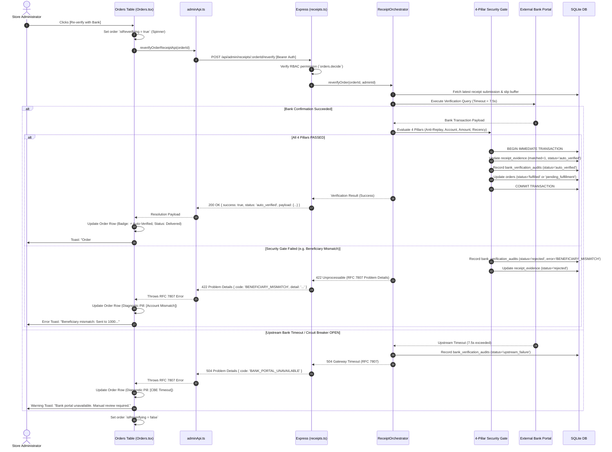

# Architectural Decision Record (ADR-002)
## Admin Dashboard Bank Verification & Audit Evidence Integration

- **Status:** Accepted
- **Date:** 2026-09-08
- **Context:** Bighabesha Shop Telegram Bot & React Admin Dashboard (`webapp/src/admin/`)
- **Deciders:** Architecture Sub-Agent (`project-architecture-planner`), Engineering Architecture Team
- **Supersedes / Extends:** [ADR-001: Native TypeScript In-Process Receipt Verification Engine](file:///C:/Users/KATANA/Documents/Intern/Bot/docs/ADR-001-RECEIPT-VERIFICATION-ENGINE.md)

---

## 1. Context & Problem Statement

Following the deployment of the native in-process bank receipt verification engine (ADR-001), over 85% of incoming customer payments via Commercial Bank of Ethiopia (CBE) and Telebirr are automatically decoded and matched through the 4-Pillar Security Gate.

However, the administrative control plane (`webapp/src/admin/AdminDashboard.tsx`) currently lacks native visualization and governance for this automated verification layer:
1. **Zero Visibility into Verification Proof**: Administrators reviewing delivered or pending orders cannot inspect whether an order was settled via automated verification or manual approval, nor can they view the extracted transaction reference, beneficiary account, or bank timestamp without querying raw SQLite tables.
2. **Opaque Manual Review Queue**: When an order drops into `pending_approval` due to upstream bank portal timeouts (e.g., CBE Port 100 unreachable), temporary proxy geoblocks (Telebirr), or blurry customer photos, administrators see a generic order row with no diagnostic indicators explaining *why* automation fell back to human review.
3. **Lack of In-Dashboard Retries**: When an upstream bank recovers from a transient outage, administrators currently have to either approve orders blindly or manually open banking apps on external mobile devices. There is no inline action to trigger an automated re-verification against bank rails directly from the dashboard.
4. **Hardcoded Engine Configuration**: Engine thresholds (master toggle, official merchant accounts, recency tolerance windows, CBE port, and circuit breaker sensitivity) are managed via backend environment variables or manual database updates rather than a unified administrative interface with validation guards and role-based permissions.

We need a unified, resilient, and high-performance UI/UX topology in `webapp/src/admin/` to configure the verification engine, surface real-time verification indicators on orders, provide 1-click bank re-verification, and expose a comprehensive Audit Evidence Drawer.

---

## 2. Considered Alternatives & UI Patterns

Three architectural patterns were evaluated for surfacing verification diagnostics, settings, and audit evidence:

### Option A: In-line Expandable Table Rows (Accordion in Orders Grid)
- **Concept**: Expand each order row in the existing 5-column orders table to show a collapsible drawer directly beneath the row with audit trail details, pillar gate checks, and reverify buttons.
- **Pros**: Keeps inspection context on the same screen without opening modals.
- **Cons**:
  - Breaks vertical rhythm and column alignment of the high-DPI data table.
  - Clutters the screen when multiple orders are inspected simultaneously.
  - Cannot cleanly host extensive diagnostic trees (e.g., 4-pillar gate cards, raw bank DOM snippets, and side-by-side slip photo previews).
  - Poor responsiveness on mobile/tablet devices used by store operators.

### Option B: Dedicated Verification Audit Tab (`activeTab === 'verification'`)
- **Concept**: Add an 8th primary navigation tab dedicated exclusively to receipt verification logs and audit evidence.
- **Pros**: Isolated workspace with dedicated tables for `receipt_evidence` and `bank_verification_audits`.
- **Cons**:
  - Breaks operator workflow: administrators reviewing orders must constantly switch between the "Orders" tab and the "Verification" tab.
  - Duplicates order search, filtering, and customer identification across two separate tabs.
  - Increases cognitive load during peak operations.

### Option C: Contextual Side-Drawer / Modal with Integrated Orders Badges & Dedicated Settings Section (Selected)
- **Concept**: 
  1. Enhance the **Settings Tab** with a dedicated "⚡ Automated Bank Verification Engine" bento-card containing the master toggle, editable bank accounts, recency window controls, CBE port selection, and circuit breaker telemetry.
  2. Enhance the **Orders Tab** with high-contrast badges (`⚡ Auto-Verified` with rail & ref, diagnostic pills like `[CBE Timeout]`, `[Amount Mismatch]`), and an inline `[Re-verify with Bank]` micro-action.
  3. Introduce a high-fidelity **Audit Evidence Drawer / Modal** (`AuditEvidenceModal.tsx` or slide-over drawer) triggered by clicking on the verification badge or order details, displaying the 4-pillar gate evaluation checklist, verified transaction payload, and raw bank diagnostics side-by-side with the uploaded slip.
- **Pros**:
  - Zero context switching: operators triage orders, review diagnostics, re-verify with bank rails, and inspect evidence in a single cohesive flow.
  - Dense, uncluttered table: the orders grid remains clean, fast, and legible.
  - Accommodates rich multi-pillar checklists, difference calculations, and raw JSON payloads.
  - Seamlessly extends the existing Obsidian Onyx / Titanium design system (`admin.css`).

---

## 3. Decision Outcome

**Chosen Alternative: Option C — Contextual Side-Drawer / Modal with Integrated Orders Badges & Dedicated Settings Section.**

### Architectural Foundations:
1. **Settings Tab Enhancement**:
   - Master toggle: `receipt_auto_verify_enabled` (Active / Paused).
   - Multi-rail Beneficiary Account Management: Form fields for CBE, Telebirr, and Bank of Abyssinia (Account Number & Holder Name).
   - Engine Tuning Parameters: Recency Window (`receipt_recency_before_mins`, `receipt_recency_after_mins`), CBE Port selector (`100` vs `443`), and Circuit Breaker sensitivity (`receipt_circuit_breaker_threshold`, `receipt_circuit_breaker_cooldown_sec`).
   - Client-side validation guards (regex tests for valid bank account lengths, numeric bounds on ports and minutes).
   - Dirty form detection with unsaved change warnings.

2. **Orders Tab Enhancement**:
   - `⚡ Auto-Verified` Badge: Displays bank rail (CBE, Telebirr, Abyssinia) and normalized transaction reference with 1-click copy.
   - Diagnostic Indicators for Manual Review: Clear semantic tags for orders in `pending_approval`:
     - `[CBE Timeout]` / `[Telebirr Timeout]` (`BANK_PORTAL_UNAVAILABLE` / `PORTAL_GEOBLOCKED`)
     - `[Account Mismatch]` (`BENEFICIARY_MISMATCH`)
     - `[Amount Mismatch]` (`AMOUNT_MISMATCH`)
     - `[Blurry QR / Unreadable]` (`QR_DECODE_FAILED`)
     - `[Replay Alert]` (`RECEIPT_ALREADY_USED`)
     - `[Stale Receipt]` (`RECEIPT_EXPIRED`)
   - Inline `[Re-verify with Bank]` Action: Triggers `POST /api/admin/receipts/:orderId/reverify`, providing immediate loading state, optimistic row update, and actionable error toasts on failure.

3. **Audit Evidence Drawer / Modal**:
   - Header with Order ID, customer handle, and verification state.
   - Bento-Grid Transaction Summary: Reference, Paid Amount vs Net Payable, Beneficiary Account & Name, Sender Identifier & Name, Bank Timestamp, and Payment Channel.
   - 4-Pillar Security Gate Checklist Card:
     1. **Anti-Replay Assertion**: Unique reference check in SQLite `receipt_evidence`.
     2. **Beneficiary Whitelist Match**: Target shop account vs actual receiver account.
     3. **Amount Check**: Net payable ETB vs bank-confirmed ETB.
     4. **Recency Window**: Order creation timestamp vs bank slip execution time within bounds.
   - Raw Bank Diagnostic Payload: Expandable JSON/DOM snippet with latency (ms), HTTP status, and attempt counter.
   - Quick Action Bar: `[Re-verify with Bank]`, `[View Slip]`, `[Approve Transfer]`, `[Reject]`.

---

## 4. Component Topology & State Architecture

### 4.1 System Component Hierarchy

```mermaid
graph TD
    subgraph AdminDashboardShell ["AdminDashboard.tsx (State Root & Router)"]
        Nav["Sidebar / Navigation Bar"]
        Toasts["Toast Notification Engine (RFC 7807)"]
        ConfirmDialog["Global Confirm Modal"]
    end

    subgraph SettingsDomain ["Settings Tab (activeTab === 'settings')"]
        SettingsContainer["Settings View Container"]
        BankAccountsCard["Official Merchant Bank Accounts Card\n(CBE, Telebirr, Abyssinia)"]
        RateEngineCard["Rate Engine & FX Card"]
        BankEngineCard["⚡ Automated Bank Verification Engine Card\n(Master Toggle, Recency Window, CBE Port, Breaker)"]
        SettingsSaveBar["Dirty State Tracker & Save Button"]
    end

    subgraph OrdersDomain ["Orders Tab (activeTab === 'orders')"]
        OrdersFilterBar["Status & Rail Filters"]
        OrdersGrid["High-DPI Orders Data Table"]
        OrderRow["Order Table Row Component"]
        ResellerPill["ResellerBadge (Gramix/iStar)"]
        AutoVerifyPill["AutoVerifiedBadge (Rail + Ref)"]
        DiagnosticPill["DiagnosticIndicatorBadge (Timeout/Mismatch)"]
        ReverifyBtn["ReverifyActionBtn ([Re-verify with Bank])"]
    end

    subgraph AuditDomain ["Audit & Inspection Subsystem"]
        AuditModal["AuditEvidenceModal / Drawer Component"]
        SlipViewer["Receipt Image / PDF Zoom & Rotate Inspector"]
        BentoSummary["Verified Transaction Bento Grid"]
        PillarsGate["4-Pillar Gate Checklist Card"]
        RawPayload["Raw Bank Telemetry & Payload Inspector"]
    end

    subgraph ApiClientLayer ["adminApi.ts (Client API Layer)"]
        FetchSettings["fetchAdminSettingsApi()"]
        UpdateSettings["updateAdminSettingsApi()"]
        FetchOrders["fetchAdminOrdersApi()"]
        ReverifyOrder["reverifyOrderReceiptApi(orderId)"]
        FetchEvidence["fetchOrderReceiptAuditApi(orderId)"]
    end

    subgraph BackendApiLayer ["Express Backend API (bot/src/api/)"]
        SettingsRoute["GET/PUT /api/admin/settings\n(admin.ts)"]
        OrdersRoute["GET /api/admin/orders\n(admin.ts)"]
        ReverifyRoute["POST /api/admin/receipts/:orderId/reverify\n(receipts.ts)"]
        AuditRoute["GET /api/receipts/status/:orderId\n(receipts.ts)"]
    end

    subgraph DatabaseLayer ["SQLite Storage (better-sqlite3)"]
        DbOrders[("orders")]
        DbSettings[("settings")]
        DbEvidence[("receipt_evidence")]
        DbAudits[("bank_verification_audits")]
    end

    %% Connections
    Nav --> SettingsDomain
    Nav --> OrdersDomain
    
    SettingsContainer --> BankAccountsCard
    SettingsContainer --> BankEngineCard
    SettingsContainer --> RateEngineCard
    SettingsContainer --> SettingsSaveBar

    OrdersGrid --> OrderRow
    OrderRow --> ResellerPill
    OrderRow --> AutoVerifyPill
    OrderRow --> DiagnosticPill
    OrderRow --> ReverifyBtn

    AutoVerifyPill -.->|Click to Inspect| AuditModal
    DiagnosticPill -.->|Click to Inspect| AuditModal
    OrderRow -.->|View Slip| SlipViewer

    AuditModal --> BentoSummary
    AuditModal --> PillarsGate
    AuditModal --> RawPayload
    AuditModal --> ReverifyBtn

    SettingsSaveBar --> UpdateSettings
    SettingsContainer --> FetchSettings
    OrdersGrid --> FetchOrders
    ReverifyBtn --> ReverifyOrder
    AuditModal --> FetchEvidence

    UpdateSettings --> SettingsRoute
    FetchSettings --> SettingsRoute
    FetchOrders --> OrdersRoute
    ReverifyOrder --> ReverifyRoute
    FetchEvidence --> AuditRoute

    SettingsRoute --> DbSettings
    OrdersRoute --> DbOrders
    ReverifyRoute --> DbEvidence
    ReverifyRoute --> DbAudits
    AuditRoute --> DbEvidence
    AuditRoute --> DbAudits
```



---

### 4.2 Re-verify with Bank Sequence Lifecycle



---

## 5. Security, RBAC, & UX Considerations

### 5.1 RBAC Permissions Matrix
The verification engine features respect the role matrix established in `AdminDashboard.tsx`:

| Administrative Role | `settings.read` | `settings.write` | `orders.view` | `orders.decide` | Capabilities |
|:---|:---:|:---:|:---:|:---:|:---|
| **superadmin** | ✅ | ✅ | ✅ | ✅ | Full control: configure engine, edit accounts, inspect audits, reverify, approve/reject. |
| **ops** | ✅ | ❌ | ✅ | ✅ | Operational triage: view settings, view all badges, inspect evidence, trigger [Re-verify], manual approve/reject. Cannot alter bank account whitelist. |
| **finance** | ✅ | ❌ | ✅ | ❌ | Financial auditing: inspect verified payloads, compare amounts, export CSVs. Cannot reverify or mutate orders. |
| **support** | ❌ | ❌ | ✅ | ❌ | Customer support: view order statuses and public badges only. Cannot view sensitive raw bank payloads or trigger reverify. |

### 5.2 Input Validation Guards & Client-Side Assertions
1. **Bank Account Numbers**:
   - CBE Account: Must be strictly 13 numeric digits (`/^\d{13}$/`).
   - Telebirr Merchant Phone: Must be 10 numeric digits starting with `09` or `07`, or international Ethiopian standard (`/^(09|07|\+2519|\+2517)\d{8}$/`).
   - Bank of Abyssinia: Must be 8 to 16 numeric digits (`/^\d{8,16}$/`).
2. **Temporal Recency Bounds**:
   - `receipt_recency_before_mins`: Integer between `5` and `1440` (24h). Default `120`.
   - `receipt_recency_after_mins`: Integer between `5` and `1440` (24h). Default `120`.
3. **CBE Port**:
   - Radio / Select choice between `100` (Direct high-speed gateway) and `443` (Standard reverse proxy/HTTPS fallback), or custom port (`1–65535`).
4. **Circuit Breaker Sensitivity**:
   - Consecutive failure threshold: Integer between `2` and `20` (Default `5`).
   - Cooldown duration: Integer between `10` and `600` seconds (Default `60`).

### 5.3 UX States & Feedback Loops
- **Dirty State Tracking**: The Settings tab monitors diffs between `settings` and initial loaded state. An unsaved changes indicator pill appears when changes are pending, with a confirmation guard if the user attempts to switch tabs.
- **Optimistic UI Feedback**: When `[Re-verify with Bank]` is tapped:
  - The button transitions to a spinning loader state (`isReverifying = true`).
  - Sibling action buttons are temporarily disabled to prevent race conditions.
  - Upon success, the badge updates with an animated glow effect (`--admin-emerald-glow`) and an informative toast confirms resolution.
  - Upon failure, an RFC 7807 toast displays both the root cause and the specific `remediation_hint`.

---

## 6. Detailed Data Models & Interface Contracts

### 6.1 Admin API Extension (`webapp/src/admin/adminApi.ts`)

```typescript
export interface VerificationEvidenceSummary {
  evidenceId: number;
  orderId: string;
  bank: 'cbe' | 'telebirr' | 'abyssinia' | 'unknown';
  reference: string;
  normalizedReference: string;
  amountEtb: number;
  verifiedAmountEtb: number | null;
  beneficiaryAccount: string | null;
  status: 'auto_verified' | 'pending_manual_review' | 'rejected' | 'upstream_failure';
  errorCode: string | null;
  securityGatePassed: boolean;
  securityGateEvaluations: SecurityPillarEvaluation[];
  createdAt: string;
}

export interface BankVerificationAuditAttempt {
  id: number;
  attemptNumber: number;
  bank: string;
  rawReference: string | null;
  normalizedReference: string;
  verifiedAmountEtb: number | null;
  senderName: string | null;
  senderIdentifier: string | null;
  beneficiaryAccount: string | null;
  beneficiaryName: string | null;
  transactionTimestamp: string | null;
  paymentChannel: string | null;
  securityGatePassed: boolean;
  securityGateEvaluations: SecurityPillarEvaluation[];
  status: string;
  errorCode: string | null;
  errorDetail: string | null;
  rawBankPayload: Record<string, unknown> | null;
  httpStatus: number | null;
  latencyMs: number | null;
  verifiedBy: string;
  createdAt: string;
}

export interface OrderVerificationStatusResponse {
  orderId: string;
  orderStatus: string;
  amountEtb: number;
  paymentRail: string;
  evidence: VerificationEvidenceSummary | null;
  attempts: BankVerificationAuditAttempt[];
}

export interface ReverifyOrderResponse {
  success: boolean;
  status: string;
  orderId: string;
  reference?: string;
  error?: {
    code: string;
    title: string;
    detail: string;
    remediation_hint: string;
  };
}

// API Functions
export async function fetchOrderReceiptStatusApi(orderId: string): Promise<OrderVerificationStatusResponse> {
  const res = await adminFetch(`${API_BASE}/api/receipts/status/${encodeURIComponent(orderId)}`);
  const data = await res.json();
  if (!res.ok) throw new Error(data.detail || data.error || 'Failed to fetch receipt verification status');
  return data;
}

export async function reverifyOrderReceiptApi(orderId: string): Promise<ReverifyOrderResponse> {
  const res = await adminFetch(`${API_BASE}/api/admin/receipts/${encodeURIComponent(orderId)}/reverify`, {
    method: 'POST',
    headers: { 'Content-Type': 'application/json' },
  });
  const data = await res.json();
  if (!res.ok) {
    const errorMsg = data.detail || data.error || data.title || 'Re-verification failed';
    const err = new Error(errorMsg) as any;
    err.problemDetails = data;
    throw err;
  }
  return data;
}
```

---

## 7. Consequences & Trade-Offs

### Positive
- **Instant Human Triage**: Store operators instantly know why an order failed automatic verification (e.g. "Amount Mismatch: 500 ETB vs 1250 ETB") without checking logs.
- **One-Click Recovery**: Transient bank connection drops can be re-tested in under 3 seconds directly from the dashboard.
- **Auditing Compliance**: Complete immutable record of bank confirmation payloads, timestamps, sender IDs, and 4-pillar gate evaluations available for any historical order.
- **Zero Hardcoded Secrets**: Bank account numbers and verification parameters can be updated in real time via the UI without bot restarts or database migrations.

### Negative / Risks & Mitigations
- **Risk**: Repeated rapid clicking of `[Re-verify with Bank]` could overwhelm upstream bank portals or exhaust Ethiopian proxy bandwidth.
  - *Mitigation*: Client-side button throttling (`isReverifying` busy state) coupled with backend rate limiting (`adminApiLimiter`) and the in-process `CircuitBreaker`.
- **Risk**: Sensitive customer bank information (sender names/phone numbers) exposed to low-privilege administrative staff.
  - *Mitigation*: Masked sender identifiers in the UI for non-finance roles; strict RBAC permission gates (`orders.view` vs `orders.decide`).
- **Risk**: Storing large raw HTML bank responses in the database inflating storage.
  - *Mitigation*: Automatic background pruning configured via `receipt_retention_days_raw_payloads` (default: 14 days), while retaining normalized structured proof in `receipt_evidence` for 365 days.
