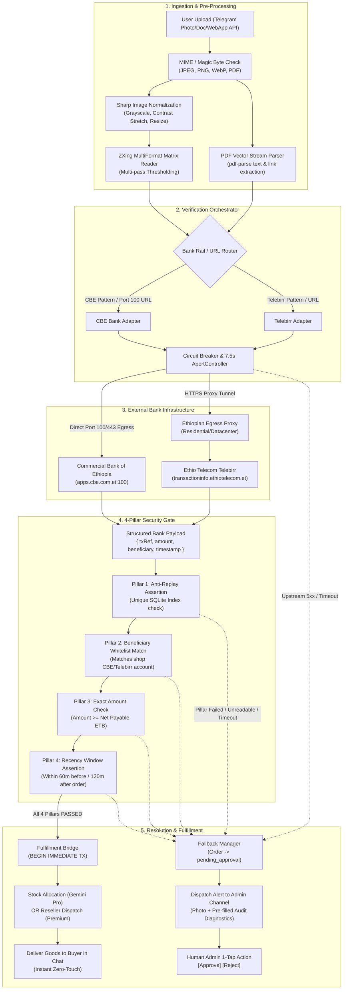
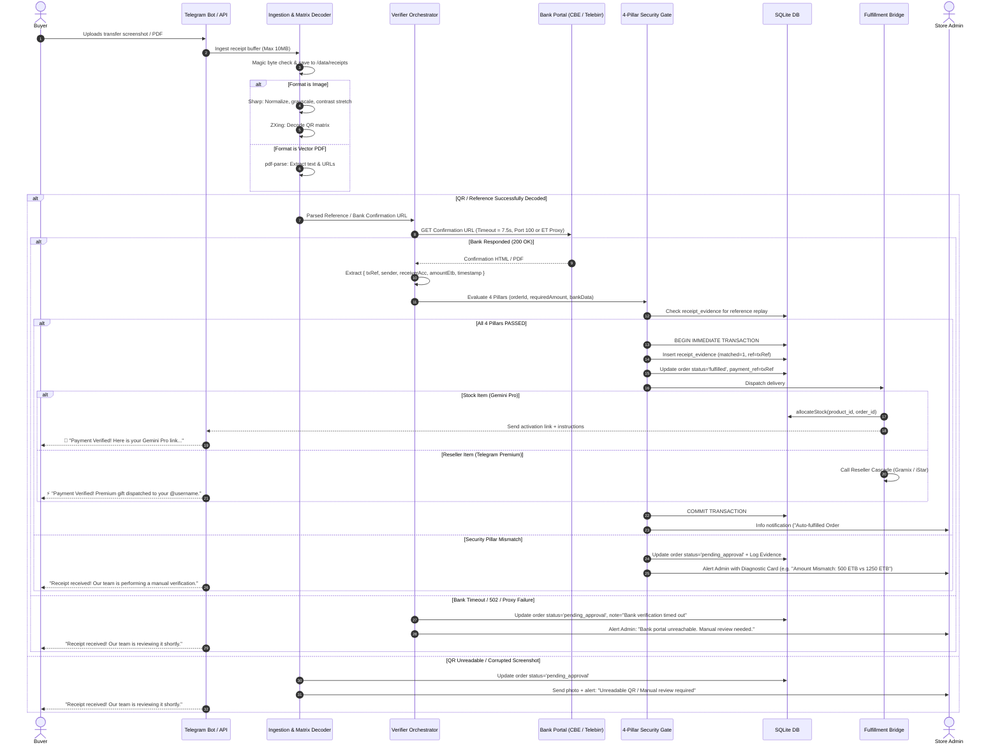

# Automated Ethiopian Bank Receipt Verification Architecture
## Native TypeScript In-Process Engine (CBE & Telebirr)

**Author:** Architecture Sub-Agent (`project-architecture-planner`)  
**Phase:** Phase 1 — System Architecture & ADR  
**Target Platform:** Node.js (v20+ ESM) / TypeScript / SQLite (`better-sqlite3`) / GramMY / Express  
**Date:** September 2026  

---

## 1. System Topology & Architecture



---

## 2. Sequence Lifecycle



---

## 3. Modular Boundaries & Directory Structure

```
bot/src/services/receipt_verifier/
├── index.ts                      # Main facade: processReceiptSubmission()
├── types.ts                      # Contracts, interfaces, and shared types
├── ingestion/
│   ├── image_preprocessor.ts    # Sharp-based image optimization
│   ├── qr_decoder.ts            # ZXing QR matrix reader with fallback
│   ├── pdf_extractor.ts         # pdf-parse text stream extractor
│   └── text_ref_parser.ts       # Raw SMS / text regex extraction
├── adapters/
│   ├── base.adapter.ts          # IBankReceiptVerifier abstract class
│   ├── cbe.adapter.ts           # Port 100 HTTPS / PDF parser
│   ├── telebirr.adapter.ts      # Ethiopian proxy scraper via cheerio
│   └── mock.adapter.ts          # Unit test mock harness
├── security_gate/
│   ├── pillars.ts               # 4-Pillar verification engine
│   └── whitelist.ts             # Account number whitelist resolver
├── fulfillment/
│   └── fulfillment_bridge.ts    # Stock & reseller dispatch bridge
└── fallback/
    └── fallback_manager.ts      # Admin review queue router & alert card generator
```

---

## 4. Key TypeScript Interfaces

```typescript
export type BankRail = 'cbe' | 'telebirr' | 'abyssinia' | 'unknown';

export interface ExtractedReceiptData {
  bank: BankRail;
  rawReference: string;
  normalizedReference: string;
  sourceUrl?: string;
  amountEtb?: number;
  extractedAt: Date;
  rawPayloadSnippet?: string;
}

export interface BankVerificationResult {
  verified: boolean;
  bank: BankRail;
  transactionReference: string;
  amountEtb: number;
  beneficiaryAccount: string;
  beneficiaryName?: string;
  senderIdentifier?: string;
  transactionTimestamp: Date;
  rawAuditTrail: Record<string, unknown>;
  failureReason?: string;
}

export interface IBankReceiptVerifier {
  readonly bankRail: BankRail;
  canHandle(data: ExtractedReceiptData): boolean;
  verify(data: ExtractedReceiptData, timeoutMs?: number): Promise<BankVerificationResult>;
}

export interface SecurityPillarEvaluation {
  passed: boolean;
  pillar: 'anti_replay' | 'account_match' | 'amount_check' | 'recency_window';
  expected: string | number;
  actual: string | number;
  message?: string;
}

export interface SecurityGateResult {
  passed: boolean;
  evaluations: SecurityPillarEvaluation[];
  failedPillar?: SecurityPillarEvaluation;
}
```

---

## 5. Security & Threat Mitigation Summary

1. **Anti-Replay**: SQLite `receipt_evidence` stores `reference` with a unique index. A database write lock (`BEGIN IMMEDIATE`) guarantees atomic single-use per transaction slip.
2. **Account Match**: Slips paid to third parties or friends are rejected; beneficiary account must strictly match store configuration (`CBE: 1000510711258`, `Telebirr: 0965579045`).
3. **Amount Check**: Verified amount must satisfy `verifiedAmount >= order.amount_etb - order.discount_etb`.
4. **Recency Window**: Slip timestamp must fall within `[order.created_at - 60m, order.created_at + 120m]`.
5. **SSRF Guard**: Strict URL validation ensures requests only target `*.cbe.com.et` (port 100 or 443) and `*.ethiotelecom.et` / `telebirr.et`. All loopback, private, and metadata IP addresses are strictly rejected.
6. **Decompression Bomb Protection**: Sharp limits image input dimensions to 16 megapixels (`limitInputPixels: 16777216`) and input buffer sizes to 10MB.
7. **Circuit Breaker & Timeouts**: 7.5s hard `AbortController` timeout on all outbound bank calls; 3 consecutive timeouts trip the breaker to `OPEN` for 120s, instantly routing incoming receipts to the admin review queue.
