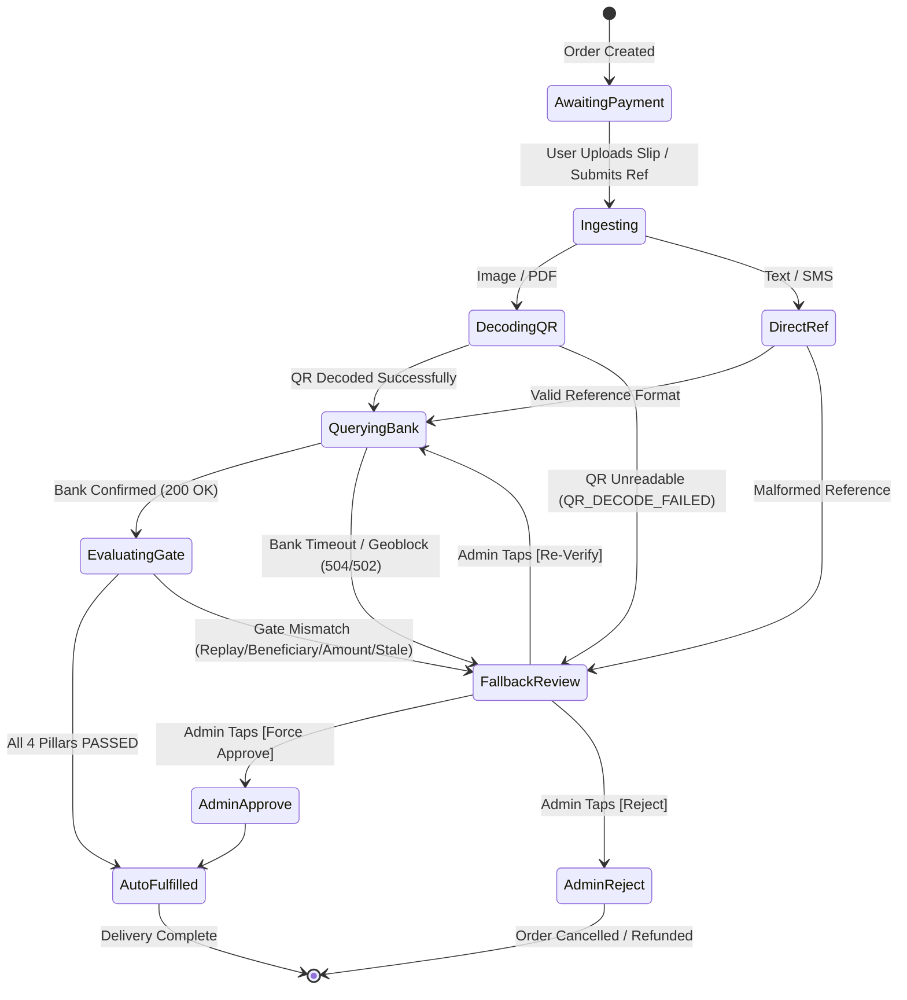

# Ethiopian Bank Receipt Verification Protocol & Error Taxonomy
## System Protocol Specification, RFC 7807 Error Models & Telegram Interaction Lifecycle

- **Author:** API Architecture Sub-Agent (`api-architect`)
- **Phase:** Phase 2 — API Contracts & Protocol Specifications
- **Status:** Approved / Contract Complete
- **Date:** September 2026
- **Aligned Documents:** [ADR-001](../ADR-001-RECEIPT-VERIFICATION-ENGINE.md) | [Architecture Spec](../ARCHITECTURE-RECEIPT-VERIFICATION.md) | [OpenAPI 3.1.0](receipt-verifier-openapi.yaml) | [TypeScript Types](../../bot/src/services/receipt_verifier/types.ts)

---

## 1. Executive Summary & Architectural Scope

This specification formalizes the communication contracts, data transfer models, error taxonomy, and Telegram session protocols for the **Bighabesha Shop Ethiopian Bank Receipt Verification Engine**.

The engine operates as an in-process TypeScript subsystem inside the Node.js ESM runtime, orchestrating:
1. **Ingestion**: 2D QR matrix decoding via Sharp and ZXing, or vector PDF stream extraction.
2. **Upstream Bank Verification**: Commercial Bank of Ethiopia (CBE Port 100 direct HTTPS / PDF parse) and Ethio Telecom Telebirr (HTML scraping via Ethiopian residential proxy).
3. **4-Pillar Security Gate**: Anti-Replay, Beneficiary Whitelist, Exact Amount, and Recency Window assertions.
4. **Resolution**: Zero-touch auto-fulfillment for passed receipts, or structured administrative fallback review for anomalies.



---

## 2. Standardized Error Taxonomy (RFC 7807 Problem Details)

All HTTP endpoints and internal error events produce standardized problem details according to **[RFC 7807](https://datatracker.ietf.org/doc/html/rfc7807)** (`application/problem+json`).

### 2.1 Core Schema Definition

```typescript
interface Rfc7807ProblemDetails {
  type: string;                  // Canonical URI identifying problem class
  title: string;                 // Human-readable summary
  status: number;                // HTTP Status code
  detail: string;                // Specific occurrence description
  instance: string;              // Endpoint URI where error was encountered
  code: VerificationFailureCode; // Machine-readable uppercase token
  details?: Record<string, any>; // Contextual diagnostic data
  remediation_hint: string;      // Actionable advice for buyer/operator
  timestamp: string;             // ISO 8601 UTC timestamp
}
```

### 2.2 Error Taxonomy Reference Matrix

| Error Code | HTTP Status | Problem Type URI | Triggering Condition | Fallback Action |
| :--- | :---: | :--- | :--- | :--- |
| `RECEIPT_ALREADY_USED` | **409** | `.../errors/receipt-already-used` | Reference already indexed in `receipt_evidence` with `matched=1` | Alert admin of replay attempt; order holds in `pending_approval` |
| `BENEFICIARY_MISMATCH` | **422** | `.../errors/beneficiary-mismatch` | Confirmed beneficiary does not match store whitelist | Alert admin with spoofing warning; order holds in `pending_approval` |
| `AMOUNT_MISMATCH` | **422** | `.../errors/amount-mismatch` | Bank confirmed amount `<` net order payable ETB | Alert admin with underpayment difference; buyer prompted to pay balance |
| `RECEIPT_EXPIRED` | **422** | `.../errors/receipt-expired` | Bank timestamp outside `[-60m, +120m]` of order creation | Alert admin of stale receipt; order holds in `pending_approval` |
| `QR_DECODE_FAILED` | **422** | `.../errors/qr-decode-failed` | ZXing fails to find QR pattern after multi-pass contrast stretching | Route image to admin review card; buyer prompted to type ref |
| `BANK_PORTAL_UNAVAILABLE` | **504** | `.../errors/bank-portal-unavailable` | Upstream bank portal exceeds 7.5s abort timeout or refuses socket | Trip circuit breaker; route receipt to admin review |
| `PORTAL_GEOBLOCKED` | **502** | `.../errors/portal-geoblocked` | Telebirr proxy egress drops or returns non-Ethiopian block page | Failover to secondary proxy or route to admin review |
| `UNSUPPORTED_BANK` | **400** | `.../errors/unsupported-bank` | Receipt from unsupported financial institution (Awash, Dashen, etc.) | Inform buyer; route to admin for manual account check |
| `CORRUPTED_FILE` | **400** | `.../errors/corrupted-file` | File failed magic-byte validation or exceeded 10MB/16MP cap | Prompt buyer to upload clear JPEG, PNG, or PDF |
| `RATE_LIMITED` | **429** | `.../errors/rate-limited` | More than 10 verification requests/min from single Telegram ID | Backoff header returned; request throttled |
| `INTERNAL_ENGINE_ERROR` | **500** | `.../errors/internal-engine-error` | Unexpected runtime exception inside verification pipeline | Log critical alert with stack trace; route order to admin |

---

### 2.3 Detailed RFC 7807 Payload Payloads

#### 1. Replay Attack Detected (`RECEIPT_ALREADY_USED` / 409)
```json
{
  "type": "https://bighabesha.shop/errors/receipt-already-used",
  "title": "Receipt Already Used",
  "status": 409,
  "detail": "Transaction reference 'FT24252Y8WQM' has already been verified and credited to another order.",
  "instance": "/api/receipts/verify",
  "code": "RECEIPT_ALREADY_USED",
  "remediation_hint": "This transfer receipt has already been used. Please submit the receipt for your current payment or contact support.",
  "timestamp": "2026-09-08T09:45:00.000Z",
  "details": {
    "reference": "FT24252Y8WQM",
    "existingOrderId": "ord_prev_99812",
    "firstUsedAt": "2026-09-07T18:22:10.000Z"
  }
}
```

#### 2. Beneficiary Mismatch (`BENEFICIARY_MISMATCH` / 422)
```json
{
  "type": "https://bighabesha.shop/errors/beneficiary-mismatch",
  "title": "Beneficiary Account Mismatch",
  "status": 422,
  "detail": "Payment was made to '1000999999999', which does not match official shop accounts.",
  "instance": "/api/receipts/verify",
  "code": "BENEFICIARY_MISMATCH",
  "remediation_hint": "The transfer was sent to an unauthorized recipient. Payments must be sent strictly to Bighabesha Shop official accounts.",
  "timestamp": "2026-09-08T09:45:00.000Z",
  "details": {
    "bank": "cbe",
    "actualBeneficiary": "1000999999999",
    "actualBeneficiaryName": "UNKNOWN RECIPIENT",
    "expectedAccounts": ["1000510711258"]
  }
}
```

#### 3. Underpayment / Amount Mismatch (`AMOUNT_MISMATCH` / 422)
```json
{
  "type": "https://bighabesha.shop/errors/amount-mismatch",
  "title": "Payment Amount Mismatch",
  "status": 422,
  "detail": "Verified bank payment of 500 ETB is less than required order total of 1250 ETB.",
  "instance": "/api/receipts/verify",
  "code": "AMOUNT_MISMATCH",
  "remediation_hint": "The transferred amount (500 ETB) is less than the required order total (1250 ETB). Please transfer the remaining balance.",
  "timestamp": "2026-09-08T09:45:00.000Z",
  "details": {
    "expectedAmountEtb": 1250,
    "actualAmountEtb": 500,
    "differenceEtb": 750
  }
}
```

#### 4. Stale / Expired Receipt (`RECEIPT_EXPIRED` / 422)
```json
{
  "type": "https://bighabesha.shop/errors/receipt-expired",
  "title": "Receipt Stale or Expired",
  "status": 422,
  "detail": "Transaction timestamp (2026-09-05T10:00:00.000Z) is outside allowed window around order creation (2026-09-08T09:30:00.000Z).",
  "instance": "/api/receipts/verify",
  "code": "RECEIPT_EXPIRED",
  "remediation_hint": "The transfer timestamp is outside the valid transaction window. Please complete transfers within 2 hours of checkout.",
  "timestamp": "2026-09-08T09:45:00.000Z",
  "details": {
    "orderCreatedAt": "2026-09-08T09:30:00.000Z",
    "txTimestamp": "2026-09-05T10:00:00.000Z",
    "windowMinutes": { "before": 60, "after": 120 }
  }
}
```

#### 5. QR Matrix Decoding Failure (`QR_DECODE_FAILED` / 422)
```json
{
  "type": "https://bighabesha.shop/errors/qr-decode-failed",
  "title": "QR Code Matrix Decoding Failed",
  "status": 422,
  "detail": "Image matrix does not contain a recognizable 2D QR code after 3 contrast threshold passes.",
  "instance": "/api/receipts/verify",
  "code": "QR_DECODE_FAILED",
  "remediation_hint": "Could not read the QR code on the receipt screenshot. Please ensure the image is clear, uncropped, and not blurry, or enter the reference code manually.",
  "timestamp": "2026-09-08T09:45:00.000Z",
  "details": {
    "passesAttempted": 3,
    "imageDimensions": { "width": 1080, "height": 1920 }
  }
}
```

#### 6. Upstream Portal Timeout (`BANK_PORTAL_UNAVAILABLE` / 504)
```json
{
  "type": "https://bighabesha.shop/errors/bank-portal-unavailable",
  "title": "Bank Confirmation Portal Unavailable",
  "status": 504,
  "detail": "Upstream verification portal for CBE timed out or failed to respond: Connection aborted after 7500ms",
  "instance": "/api/receipts/verify",
  "code": "BANK_PORTAL_UNAVAILABLE",
  "remediation_hint": "The bank confirmation portal is currently unresponsive. Your receipt has been routed to our store administrators for manual review.",
  "timestamp": "2026-09-08T09:45:00.000Z",
  "details": {
    "bank": "cbe",
    "portalUrl": "https://apps.cbe.com.et:100/customer/receipt/FT24252Y8WQM",
    "timeoutMs": 7500
  }
}
```

#### 7. Telebirr Geo-Block / Proxy Egress Drop (`PORTAL_GEOBLOCKED` / 502)
```json
{
  "type": "https://bighabesha.shop/errors/portal-geoblocked",
  "title": "Bank Portal Geoblocked or Proxy Egress Failed",
  "status": 502,
  "detail": "Access to TELEBIRR transaction verification portal was blocked or Ethiopian residential proxy failed.",
  "instance": "/api/receipts/verify",
  "code": "PORTAL_GEOBLOCKED",
  "remediation_hint": "Bank gateway routing encountered a regional network block. Receipt routed to administrator review queue for manual verification.",
  "timestamp": "2026-09-08T09:45:00.000Z",
  "details": {
    "bank": "telebirr",
    "proxyHost": "proxy-et-01.internal",
    "statusCode": 403
  }
}
```

---

## 3. Internal Telegram Session & Callback Protocols

The Telegram Bot interaction uses GramMY and SQLite session management (`bot_sessions`) to guide buyers through submission and administrators through manual resolution.

### 3.1 User Session Protocol (`bot/src/bot/session.ts`)

When a user selects **Upload Transfer Slip**, a pending action is registered:

```typescript
interface UserReceiptSession {
  type: 'user_receipt_upload';
  data: {
    orderId: string;
    rail: SupportedBank;
    expectedAmountEtb: number;
    startedAt: number;
  };
}
```

#### Session State Invariants:
1. **Ownership Guarantee**: Before accepting any input under `user_receipt_upload`, the handler validates `order.user_id === ctx.from.id`. Foreign orders cause instant session clear and 403 error.
2. **Order Status Gate**: Receipts are accepted ONLY if `order.status IN ('awaiting_payment', 'pending_approval', 'rejected', 'new')`.
3. **Session TTL**: A receipt upload session expires automatically after 15 minutes.

### 3.2 In-Chat Buyer Progress Stepper Protocol

Upon receipt of a photo, document, or text message, the bot delivers immediate feedback and updates the message in-place:

1. **Phase 1: Ingestion & Scan**
   > ⏳ **Checking payment slip for Order #ord_cbe_782910...**  
   > *Scanning QR code & extracting transaction details...*

2. **Phase 2: Bank Verification**
   > 🔍 **Verifying with Commercial Bank of Ethiopia...**  
   > *Connecting to official bank rails...*

3. **Phase 3a: Success (Instant Zero-Touch Delivery)**
   > 🎉 **Payment Confirmed! (Order #ord_cbe_782910)**  
   > Verified: **1,250 ETB** via **CBE**  
   > Ref: `FT24252Y8WQM`  
   >  
   > *Your Gemini Pro 18m activation link:*  
   > `https://google.com/...`

4. **Phase 3b: Graceful Fallback (Routed to Admin)**
   > ✅ **Receipt Received! (Order #ord_cbe_782910)**  
   > *Our automated verification encountered a bank network delay or requires manual check. Our team has been notified and will verify your transfer shortly.*

---

## 4. Administrative Inline Keyboard & Review Protocol

When an order cannot be auto-verified (e.g. unreadable QR, upstream portal timeout, or security gate mismatch), the **Fallback Manager** constructs an interactive Telegram Alert Card.

### 4.1 Admin Alert Message Schema

```
🚨 <b>Automated Verification Fallback — Order <code>${order.id}</code></b>

• <b>Buyer:</b> @${username} (<code>${user_id}</code>)
• <b>Product:</b> ${product_name}
• <b>Payable Amount:</b> <b>${orderAmount} ETB</b>
• <b>Rail:</b> ${rail.toUpperCase()}
• <b>Extracted Ref:</b> <code>${ref || 'None / Unreadable'}</code>

<b>4-Pillar Security Evaluation:</b>
${gateBreakdown}
${p1 ? '✅' : '❌'} Anti-Replay: ${p1Text}
${p2 ? '✅' : '❌'} Beneficiary Whitelist: ${p2Text}
${p3 ? '✅' : '❌'} Amount Parity: ${p3Text}
${p4 ? '✅' : '❌'} Recency Window: ${p4Text}

<b>Diagnostic Code:</b> <code>${failureCode}</code>
<b>Remediation:</b> <i>${remediationHint}</i>

<i>Select an action below to resolve this order:</i>
```

### 4.2 Inline Keyboard Action Callback Protocol

The alert message attaches an `InlineKeyboard` with structured callback queries:

| Callback Query Pattern | Action Executed | Handler Function | Required Permission |
| :--- | :--- | :--- | :--- |
| `admin_approve_${orderId}` | Force approve payment, allocate stock / dispatch reseller, deliver to buyer | `performAdminApprove()` | `orders.decide` |
| `admin_reject_${orderId}` | Prompts admin in chat to enter a rejection reason sent to buyer | `promptAdminReject()` | `orders.decide` |
| `admin_reverify_${orderId}` | Re-runs automated bank verification pipeline on demand | `handleAdminReverify()` | `orders.decide` |
| `admin_view_evidence_${orderId}` | Displays full JSON raw audit trail and bank HTML/PDF attributes in chat | `renderAdminEvidenceDetail()` | `orders.view` |

### 4.3 Atomic Approval & Race Protection Protocol

To prevent double-approvals between concurrent administrators or between an automated background retry and an admin:

```sql
BEGIN IMMEDIATE TRANSACTION;

-- 1. Check order status
SELECT status, amount_etb, user_id, product_id 
FROM orders WHERE id = :orderId;

-- Guard: Must be pending review
-- If status != 'pending_approval', ROLLBACK and abort.

-- 2. Insert or update receipt_evidence with matched = 1
INSERT INTO receipt_evidence (
    order_id, user_id, source, raw_text, amount_etb, reference, matched, status
) VALUES (
    :orderId, :userId, :source, :rawText, :amountEtb, :reference, 1, 'auto_verified'
) ON CONFLICT(order_id) DO UPDATE SET 
    matched = 1,
    status = 'auto_verified';

-- 3. Update order status
UPDATE orders 
SET status = 'fulfilled', payment_ref = :reference, updated_at = CURRENT_TIMESTAMP 
WHERE id = :orderId;

-- 4. Stock allocation or reseller dispatch occurs within the transaction
-- COMMIT TRANSACTION;
```

---

## 5. Security Invariants & Compliance Rules

1. **SSRF Boundary Enforcement**:
   - Outbound requests are strictly filtered to allow ONLY:
     - `*.cbe.com.et` on port 100 and port 443.
     - `*.ethiotelecom.et` and `telebirr.et` on port 443 via proxy.
   - All private CIDR blocks (`10.0.0.0/8`, `172.16.0.0/12`, `192.168.0.0/16`, `127.0.0.0/8`, `169.254.169.254`) are immediately aborted.
2. **Decompression Bomb Protection**:
   - Max image buffer size: **10 MB**.
   - Max Sharp input pixel cap: **16,777,216 pixels** (16 MP).
   - Global concurrency semaphore: Max **2 parallel image decodes** to preserve VPS CPU budget.
3. **Strict Whitelist Normalization**:
   - CBE account numbers are normalized to 13 digits: `1000510711258`.
   - Telebirr phone accounts are normalized to 10 digits starting with `09`: `0965579045`.
4. **Audit Immutability**:
   - All raw bank responses, extracted QR references, client IP addresses, and security evaluations are permanently retained in `receipt_evidence`.

---

## 6. Phase 2 Deliverables Summary

- [x] **TypeScript Interfaces & Contracts**: `bot/src/services/receipt_verifier/types.ts`
- [x] **OpenAPI 3.1.0 Specification**: `docs/api/receipt-verifier-openapi.yaml`
- [x] **Standardized Error Taxonomy (RFC 7807)**: Defined in `types.ts`, `openapi.yaml`, and Section 2 above.
- [x] **Telegram Protocols & Callbacks**: Formalized in Section 3 & 4 above.
