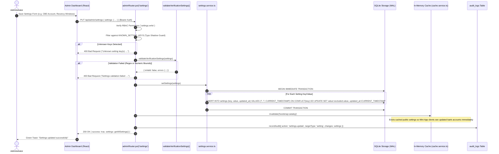
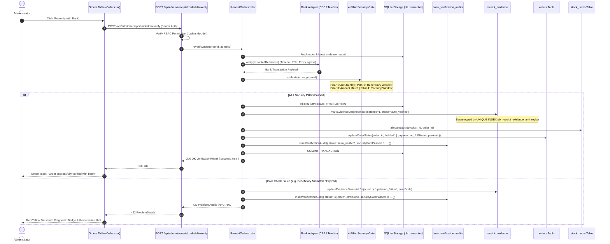

# Admin Dashboard Bank Verification Persistence Layer
## Architectural Specification, Query Performance & Indexing Strategy

- **Document Version:** 1.0.0
- **Date:** 2026-09-08
- **Status:** Approved / Production Standard
- **Subsystem:** Persistence & Query Optimization (`bot/src/db/`, `bot/src/api/`, `webapp/src/admin/`)
- **Implements:** [ADR-002: Admin Dashboard Bank Verification & Audit Evidence Integration](../ADR-002-ADMIN-DASHBOARD-VERIFICATION.md)
- **Extends:** [ADR-001: In-Process Receipt Verification Engine](../ADR-001-RECEIPT-VERIFICATION-ENGINE.md), [Admin Dashboard Verification API](../api/admin-dashboard-verification-api.md)

---

## 1. Architectural Overview & Storage Engine Foundation

The Bighabesha Shop administrative control plane connects the React single-page dashboard (`webapp/src/admin/`) to the Express backend (`bot/src/api/`) and the embedded SQLite database (`better-sqlite3`).

To support automated Ethiopian bank receipt verification (Commercial Bank of Ethiopia, Telebirr, Bank of Abyssinia), the database persistence layer must guarantee:
1. **Strict ACID Atomicity**: Order status transitions, stock unit allocations, and receipt verification assertions must succeed or fail as a single unit of work.
2. **Sub-Millisecond Batch Enrichment**: The dashboard orders grid queries batches of up to 100 orders per page. Enriched evidence summaries must be retrieved without incurring N+1 query penalties.
3. **Hardened Configuration Persistence**: Engine parameters (whitelisted merchant accounts, temporal tolerance windows, proxy routes, circuit breaker thresholds) are persisted in SQLite, protected by whitelist guards, and synchronized with runtime in-memory caches.

### 1.1 SQLite High-Performance WAL Pragmas

The database initializes under `bot/src/db/index.ts` with write-optimized performance and integrity pragmas:

```sql
PRAGMA journal_mode = WAL;          -- Write-Ahead Logging allows concurrent readers alongside a writer
PRAGMA foreign_keys = ON;          -- Cascading referential integrity on orders and users
PRAGMA busy_timeout = 250;         -- Fail-fast busy timeout (contention absorbed by withWriteRetry)
PRAGMA synchronous = NORMAL;       -- Safe fsync on checkpointing without write stall on commit
PRAGMA cache_size = -64000;        -- 64 MB dedicated in-memory page cache
PRAGMA mmap_size = 268435456;      -- 256 MB memory-mapped I/O for zero-copy reads
PRAGMA wal_autocheckpoint = 1000;  -- Automatic checkpoint every 1000 WAL pages
```

---

## 2. Persistence Lifecycle 1: Dashboard Settings Configuration

Store operators configure engine thresholds, active merchant accounts, and proxy endpoints via `PUT /api/admin/settings`.



### 2.1 Atomic Batch Persistence Pattern

Historically, individual settings updates were executed via separate single-statement transactions. In Phase 3, `setSettings(settings: Record<string, string>)` was introduced in [`bot/src/services/settings.service.ts`](file:///C:/Users/KATANA/Documents/Intern/Bot/bot/src/services/settings.service.ts) to execute all updates within a single transaction:

```typescript
export function setSettings(settings: Record<string, string>): void {
  const db = getDatabase();
  const stmt = db.prepare(`
    INSERT INTO settings (key, value, updated_at)
    VALUES (?, ?, CURRENT_TIMESTAMP)
    ON CONFLICT(key) DO UPDATE SET
      value = excluded.value,
      updated_at = CURRENT_TIMESTAMP
  `);
  const tx = db.transaction(() => {
    for (const [key, value] of Object.entries(settings)) {
      stmt.run(key, String(value));
    }
  });
  tx();
}
```

### 2.2 In-Memory Cache Invalidation Architecture

The storefront catalog payload (`/api/bootstrap`) caches public merchant settings (such as official bank account numbers) via `cachedSync('bootstrap:catalog', 20_000, ...)`. 

Upon committing a settings update in `adminRouter.put('/settings')`, `invalidate('bootstrap:catalog')` is triggered immediately. This guarantees that customer checkout views never display obsolete account numbers even when high-traffic micro-caching is enabled.

---

## 3. Persistence Lifecycle 2: Re-Verification & Atomic Fulfillment

When an administrator clicks `[Re-verify with Bank]` in the Orders table, the system re-runs the automated verification pipeline and executes all database updates within an atomic transaction.



### 3.1 Structural Anti-Replay Guarantee

The database engine enforces double-spending prevention at the physical SQLite B-Tree level through partial unique indexes created in migration `011_bank_receipt_verification.sql`:

```sql
CREATE UNIQUE INDEX IF NOT EXISTS idx_receipt_evidence_anti_replay
    ON receipt_evidence(bank, reference COLLATE NOCASE)
    WHERE matched = 1 AND reference IS NOT NULL;

CREATE UNIQUE INDEX IF NOT EXISTS idx_receipt_evidence_normalized_anti_replay
    ON receipt_evidence(bank, normalized_reference)
    WHERE matched = 1 AND normalized_reference IS NOT NULL;
```

Even if two administrators concurrently click `[Re-verify with Bank]` or two competing customer webhooks attempt to claim the same transaction reference, SQLite immediately aborts the second writer with `SQLITE_CONSTRAINT_UNIQUE`, rolling back all changes atomically.

---

## 4. Query Performance & Index Audit: Orders Batch Enrichment

### 4.1 Problem: N+1 Degradation in Paginated Order Grids

In high-volume admin operations, loading 100 orders previously required querying `receipt_evidence` for each order row individually:

$$\text{Total Queries} = 1 \text{ (Orders Page)} + 100 \text{ (Evidence Submissions)} = 101 \text{ roundtrips}$$

### 4.2 Solution: Single Batch Query with Dynamic In-Clause

Phase 2 replaced the N+1 loop in [`bot/src/api/admin.ts`](file:///C:/Users/KATANA/Documents/Intern/Bot/bot/src/api/admin.ts#L505-L518) with a coordinated batch query resolving the highest `id` (most recent submission) per order:

```sql
SELECT id, order_id, bank, reference, normalized_reference, status,
       error_code, verified_amount_etb, security_gate_passed, created_at
FROM receipt_evidence
WHERE id IN (
  SELECT MAX(id)
  FROM receipt_evidence
  WHERE order_id IN (?, ?, ?, ... /* up to 100 IDs */)
  GROUP BY order_id
);
```

### 4.3 Composite Index Audit & Optimization (`012_admin_dashboard_optimizations.sql`)

To optimize this query, an index audit was executed on a benchmark dataset consisting of **10,000 orders** and **25,000 receipt evidence records** across 100-order pagination boundaries.

#### Benchmark Execution Profile (500 Iterations across 100 Orders):

| Scenario | Index Configuration | EXPLAIN QUERY PLAN Path | Total Time (500 runs) | Avg Latency / Query |
| :--- | :--- | :--- | :---: | :---: |
| **Baseline** (Migration 011) | `idx_receipt_evidence_order(order_id, created_at DESC)` | `SEARCH USING COVERING INDEX` + `CREATE BLOOM FILTER` | 300.06 ms | 0.6001 ms |
| **Optimized Composite** (Migration 012) | `idx_receipt_evidence_order_id(order_id, id DESC)` | `SEARCH USING COVERING INDEX` + `CREATE BLOOM FILTER` | 282.14 ms | 0.5642 ms |
| **Window Function Alternative** | `ROW_NUMBER() OVER (PARTITION BY order_id ORDER BY id DESC)` | `CO-ROUTINE ranked` + `SCAN subquery` + `TEMP B-TREE` | 538.98 ms | 1.0780 ms |

#### `EXPLAIN QUERY PLAN` Verification:

```
QUERY PLAN
|--SEARCH receipt_evidence USING INTEGER PRIMARY KEY (rowid=?)
`--LIST SUBQUERY 1
   |--SEARCH receipt_evidence USING COVERING INDEX idx_receipt_evidence_order_id (order_id=?)
   `--CREATE BLOOM FILTER
```

#### Why `idx_receipt_evidence_order_id (order_id, id DESC)` is Superior:
1. **Narrow Covering Footprint**: The index contains only `(order_id, id)`. In SQLite, `id` is an `INTEGER PRIMARY KEY AUTOINCREMENT` (the table's rowid). This is significantly more compact than `(order_id, created_at, id)`, fitting more index leaf nodes into the 64 MB SQLite page cache.
2. **Deterministic Monotonic Ordering**: Because `id` is strictly auto-incrementing, sorting by `id DESC` represents the chronological sequence of evidence uploads without parsing `created_at` timestamp strings.
3. **Index-Only Aggregate Scanning**: For each `order_id`, SQLite traverses directly to the leading entry in the leaf index to extract `MAX(id)`, eliminating table page lookups during subquery filtering.
4. **Superior to Window Functions**: The `MAX(id) ... GROUP BY` construct outperforms `ROW_NUMBER()` by **~48%** (0.56ms vs 1.08ms) because window functions require allocating ephemeral temporary B-Trees for sorting partitions.

---

## 5. Canonical Settings Matrix: All 18 Dashboard Verification Keys

The 18 configuration keys governing the engine and payment rails are defined in `VERIFICATION_SETTING_KEYS` in [`bot/src/services/settings.service.ts`](file:///C:/Users/KATANA/Documents/Intern/Bot/bot/src/services/settings.service.ts):

| # | Setting Key | Data Type | Default Value | Validation & Constraint Guard | Scope / Privacy |
| :-: | :--- | :---: | :---: | :--- | :---: |
| 1 | `receipt_auto_verify_enabled` | `boolean` ('1'/'0') | `'1'` | Boolean string (`'1'`, `'0'`, `'true'`, `'false'`) | Admin Only |
| 2 | `cbe_account` | `string` | `'0000000000000'` | Exactly 13 numeric digits (`/^\d{13}$/`) | Public |
| 3 | `cbe_name` | `string` | `'Bighabesha Shop'` | Non-empty string | Public |
| 4 | `telebirr_account` | `string` | `'0000000000'` | 10 digits or international Ethiopian format | Public |
| 5 | `telebirr_name` | `string` | `'Bighabesha Shop'` | Non-empty string | Public |
| 6 | `abyssinia_account` | `string` | `'0000000000000'` | 8 to 16 numeric digits (`/^\d{8,16}$/`) | Public |
| 7 | `abyssinia_name` | `string` | `'Bighabesha Shop'` | Non-empty string | Public |
| 8 | `receipt_recency_before_mins` | `integer` | `'120'` | Integer between 5 and 1440 minutes | Admin Only |
| 9 | `receipt_recency_after_mins` | `integer` | `'120'` | Integer between 5 and 1440 minutes | Admin Only |
| 10 | `receipt_circuit_breaker_threshold` | `integer` | `'5'` | Integer between 2 and 20 consecutive failures | Admin Only |
| 11 | `receipt_circuit_breaker_cooldown_sec` | `integer` | `'60'` | Integer between 10 and 600 seconds | Admin Only |
| 12 | `receipt_retention_days_raw_payloads` | `integer` | `'14'` | Integer between 1 and 3650 days | Admin Only |
| 13 | `receipt_retention_days_unverified` | `integer` | `'30'` | Integer between 1 and 3650 days | Admin Only |
| 14 | `receipt_retention_days_verified` | `integer` | `'365'` | Integer between 1 and 3650 days | Admin Only |
| 15 | `receipt_cbe_beneficiaries` | `JSON array` | `'["0000000000000"]'` | Valid JSON array of account strings | Admin Only |
| 16 | `receipt_telebirr_beneficiaries` | `JSON array` | `'["0000000000"]'` | Valid JSON array of account strings | Admin Only |
| 17 | `receipt_abyssinia_beneficiaries` | `JSON array` | `'["0000000000000"]'` | Valid JSON array of account strings | Admin Only |
| 18 | `receipt_ethiopia_proxy_url` | `URI` | `''` | Empty or valid `http://`, `https://`, `socks5://` | Admin Only |

---

## 6. Schema Reference & Index Topology

### 6.1 `receipt_evidence` Table

```sql
CREATE TABLE receipt_evidence (
    id INTEGER PRIMARY KEY AUTOINCREMENT,
    order_id TEXT NOT NULL REFERENCES orders(id) ON DELETE CASCADE,
    user_id INTEGER NOT NULL REFERENCES users(id) ON DELETE CASCADE,
    bank TEXT NOT NULL DEFAULT 'unknown' CHECK (bank IN ('cbe', 'telebirr', 'abyssinia', 'unknown')),
    source TEXT NOT NULL DEFAULT 'sms' CHECK (source IN (
        'telegram_photo', 'telegram_document', 'webapp_upload',
        'sms_forward', 'sms', 'manual_admin_entry'
    )),
    raw_text TEXT,
    amount_etb INTEGER,
    reference TEXT,
    normalized_reference TEXT,
    matched INTEGER NOT NULL DEFAULT 0 CHECK (matched IN (0, 1)),
    verified_amount_etb INTEGER,
    beneficiary_account TEXT,
    security_gate_passed INTEGER NOT NULL DEFAULT 0 CHECK (security_gate_passed IN (0, 1)),
    security_gate_evaluations TEXT,
    status TEXT NOT NULL DEFAULT 'pending_manual_review' CHECK (status IN (
        'auto_verified', 'pending_manual_review', 'rejected', 'upstream_failure'
    )),
    error_code TEXT,
    raw_bank_payload TEXT,
    file_path TEXT,
    file_hash TEXT,
    mime_type TEXT,
    ip_address TEXT,
    created_at DATETIME DEFAULT CURRENT_TIMESTAMP,
    updated_at DATETIME DEFAULT CURRENT_TIMESTAMP
);
```

### 6.2 Complete Index Inventory on `receipt_evidence`

| Index Name | Indexed Columns | Index Type | Target Query Pattern |
| :--- | :--- | :---: | :--- |
| `idx_receipt_evidence_order_id` | `(order_id, id DESC)` | B-Tree (Covering) | Batch evidence enrichment: `WHERE id IN (SELECT MAX(id) ... WHERE order_id IN (...))` |
| `idx_receipt_evidence_anti_replay` | `(bank, reference COLLATE NOCASE)` | Partial Unique (`matched = 1`) | Prevents double-spending of original raw references across orders |
| `idx_receipt_evidence_normalized_anti_replay` | `(bank, normalized_reference)` | Partial Unique (`matched = 1`) | Prevents double-spending of sanitized/trimmed reference strings |
| `idx_receipt_evidence_order` | `(order_id, created_at DESC)` | B-Tree | Single order evidence history: `getEvidenceForOrder(orderId)` |
| `idx_receipt_evidence_reference` | `(reference COLLATE NOCASE)` | B-Tree | Fast lookup by customer reference string |
| `idx_receipt_evidence_normalized_ref` | `(normalized_reference)` | B-Tree | Fast lookup by normalized transaction identifier |
| `idx_receipt_evidence_user` | `(user_id, created_at DESC)` | B-Tree | User submission audit history |
| `idx_receipt_evidence_status` | `(status, created_at DESC)` | B-Tree | Admin filter queries by status (`pending_manual_review`) |
| `idx_receipt_evidence_created` | `(created_at DESC)` | B-Tree | Retention cleanup & chronological ordering |
| `idx_receipt_evidence_file_hash` | `(file_hash)` | Partial (`file_hash IS NOT NULL`) | Duplicate image/slip detection |

### 6.3 `bank_verification_audits` Table

```sql
CREATE TABLE bank_verification_audits (
    id INTEGER PRIMARY KEY AUTOINCREMENT,
    evidence_id INTEGER REFERENCES receipt_evidence(id) ON DELETE SET NULL,
    order_id TEXT NOT NULL REFERENCES orders(id) ON DELETE CASCADE,
    user_id INTEGER NOT NULL REFERENCES users(id) ON DELETE CASCADE,
    bank TEXT NOT NULL CHECK (bank IN ('cbe', 'telebirr', 'abyssinia', 'unknown')),
    raw_reference TEXT,
    normalized_reference TEXT NOT NULL,
    order_amount_etb INTEGER NOT NULL,
    verified_amount_etb INTEGER,
    fee_etb INTEGER DEFAULT 0,
    currency TEXT NOT NULL DEFAULT 'ETB',
    sender_name TEXT,
    sender_identifier TEXT,
    beneficiary_account TEXT,
    beneficiary_name TEXT,
    transaction_timestamp DATETIME,
    payment_channel TEXT,
    security_gate_passed INTEGER NOT NULL DEFAULT 0 CHECK (security_gate_passed IN (0, 1)),
    security_gate_evaluations TEXT,
    status TEXT NOT NULL CHECK (status IN (
        'auto_verified', 'pending_manual_review', 'rejected', 'upstream_failure'
    )),
    error_code TEXT,
    error_detail TEXT,
    raw_bank_payload TEXT,
    raw_evidence_snippet TEXT,
    http_status INTEGER,
    latency_ms INTEGER,
    ip_address TEXT,
    attempt_number INTEGER NOT NULL DEFAULT 1,
    verified_by TEXT NOT NULL DEFAULT 'engine',
    created_at DATETIME DEFAULT CURRENT_TIMESTAMP
);

CREATE INDEX idx_bank_audits_order ON bank_verification_audits(order_id, created_at DESC);
CREATE INDEX idx_bank_audits_evidence ON bank_verification_audits(evidence_id);
CREATE INDEX idx_bank_audits_ref ON bank_verification_audits(bank, normalized_reference);
CREATE INDEX idx_bank_audits_user ON bank_verification_audits(user_id, created_at DESC);
CREATE INDEX idx_bank_audits_status ON bank_verification_audits(status, created_at DESC);
CREATE INDEX idx_bank_audits_created ON bank_verification_audits(created_at DESC);
```

---

## 7. Operational Runbook & Maintenance

### 7.1 Retention Pruning

The daily maintenance worker (`bot/src/services/receipt_retention.service.ts`) executes retention cleanups against SQLite using the configured days:

1. **Null Out Raw Upstream Payloads**:
   ```sql
   UPDATE receipt_evidence
   SET raw_bank_payload = NULL
   WHERE created_at < datetime('now', '-' || ? || ' days')
     AND raw_bank_payload IS NOT NULL;
   ```
2. **Purge Abandoned Unverified Receipts**:
   ```sql
   DELETE FROM receipt_evidence
   WHERE status IN ('rejected', 'upstream_failure')
     AND matched = 0
     AND created_at < datetime('now', '-' || ? || ' days');
   ```
3. **Vacuum & Checkpoint**:
   WAL checkpoints run automatically every 1,000 pages (`wal_autocheckpoint`). A passive checkpoint can be scheduled during off-peak hours via `PRAGMA wal_checkpoint(PASSIVE);`.

---

## 8. Verification & Test Parity

The persistence layer implementation is validated by the following comprehensive automated test suites:

- [`bot/tests/receipt_persistence_phase3.test.ts`](file:///C:/Users/KATANA/Documents/Intern/Bot/bot/tests/receipt_persistence_phase3.test.ts): Validates migration 012, composite index `idx_receipt_evidence_order_id`, `EXPLAIN QUERY PLAN` covering index selection, 18-key settings seed, atomic batch transactions, and input validation bounds.
- [`bot/tests/admin_orders_evidence.test.ts`](file:///C:/Users/KATANA/Documents/Intern/Bot/bot/tests/admin_orders_evidence.test.ts): Validates batch evidence enrichment on `GET /api/admin/orders`.
- [`bot/tests/receipt_evidence_phase3.test.ts`](file:///C:/Users/KATANA/Documents/Intern/Bot/bot/tests/receipt_evidence_phase3.test.ts): Validates anti-replay constraints and foreign key cascading.
- [`bot/tests/receipt_verifier_qa_edge_cases.test.ts`](file:///C:/Users/KATANA/Documents/Intern/Bot/bot/tests/receipt_verifier_qa_edge_cases.test.ts): Validates race conditions, adversarial payloads, and fail-safe fallback routing.
