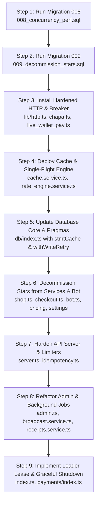

# EXECUTABLE WORK ORDER & CONCURRENCY AUDIT
**Bighabesha Shop Bot — Concurrency & Scale Remediation (1000+ Concurrent Users)**

---

# EXECUTIVE VERDICT

The system **cannot reach 1,000 concurrent users in its current shape**, and the reason is structural rather than a collection of isolated bugs. Three primary bottlenecks compose into a hard ceiling:

1. **Synchronous Data Access on Single Thread:** Every database query runs synchronously on Node.js's single event loop via `better-sqlite3` (`Pool Size: 1`, synchronous execution).
2. **Horizontal Scale-Out Blockers:** Telegram long-polling conflicts (409 Conflict), in-memory rate limiting, in-memory OTP failures, in-memory broadcast job registry, and local disk storage prevent multi-process scaling.
3. **Untimed External Dependencies:** Outbound payment gateway requests lack timeouts and circuit breakers, allowing upstream stalls to exhaust Node.js's outbound socket pool (~256 sockets).

---

# AUDIT CHECKLIST SUMMARY

| # | Check Item | Status | Verified Severity | Core Defect |
|---|---|---|---|---|
| 1 | Connection Pool Exhaustion | **CONFIRMED** | **S1** | Single-threaded `better-sqlite3` instance; pool size = 1 on main event loop. |
| 2 | N+1 Database Queries | **CONFIRMED** | **S1 / S2** | `/api/bootstrap` runs N+1 product/variant/stock queries; `/api/admin/overview` loops over date ranges. |
| 3 | Unbounded Database Queries | **CONFIRMED** | **S1 / S2** | Unbounded `SELECT *` without `LIMIT` across reconciler, stock export, users list, and orders analytics. |
| 4 | Missing Database Indexes | **CONFIRMED** | **S2** | Missing indexes on `stock_items.payload`, `orders.product_id`, `users.is_registered`, `users.referrer_id`, `promo_redemptions(promo_id, user_id)`. |
| 5 | Lock Contention / SQLITE_BUSY | **CONFIRMED** | **S3** | Synchronous 5000ms `busy_timeout` blocks event loop during concurrent write locks. |
| 6 | Per-Request Write Amplification | **CONFIRMED** | **S1** | Uncached user touch and username recheck writes to WAL on read paths. |
| 7 | Cache Stampede | **CONFIRMED** | **S1** | `priceCache` has no mutex/single-flight; concurrent misses trigger simultaneous CoinGecko requests. |
| 8 | Multi-Worker Shared State | **CONFIRMED** | **S1** | In-memory 2FA lockout, broadcast job registry, and long-polling bot instance block horizontal scale. |
| 9 | Check-Then-Act Races | **CONFIRMED** | **S2** | Promo code `per_user_limit` check is non-atomic; checkout order reuse window is check-then-act. |
| 10 | Blocking I/O in Async Handlers | **CONFIRMED** | **S1** | Synchronous `fs.writeFileSync` in receipt upload and `@resvg/resvg-js` banner generation. |
| 11 | Unbounded Background Sweepers | **CONFIRMED** | **S1** | `reconcileStuckPayments` has no `LIMIT`, runs untimed sequential HTTP, and lacks overlap guard in `setInterval`. |
| 12 | Socket & Resource Leaks | **CONFIRMED** | **S1** | Untimed `fetch` calls without `AbortSignal` hold undici sockets indefinitely. |
| 13 | Missing Outbound Timeouts | **CONFIRMED** | **S1** | Chapa initialize/verify and Wallet Pay order creation lack timeout signals. |
| 14 | Retries Without Backoff / Jitter | **CONFIRMED** | **S2** | Telegram 429 handler sleeps flat `retry_after` without jitter, synchronizing thundering herds. |
| 15 | Missing Circuit Breaker | **CONFIRMED** | **S1** | Zero circuit breaker protection on external APIs (CoinGecko, Chapa, Wallet Pay, TonCenter). |
| 16 | Graceful Shutdown Sequence | **CONFIRMED** | **S2** | `closeDatabase()` runs before HTTP drain; `bot.stop()` promise is unawaited; 500ms drain window. |
| 17 | Rate Limiting Gaps & CGNAT Lockout | **CONFIRMED** | **S1** | `globalApiLimiter` keys by IP (collapsing Ethiopian CGNAT users); `/api/user/recheck-username` and `/api/payments/ton/status` lack dedicated throttles. |
| 18 | Unbounded Heap Allocations | **CONFIRMED** | **S2** | In-memory full-table scans for CSV export and monthly P&L rollups without streaming/chunking. |
| 19 | Write Idempotency | **CONFIRMED** | **S2** | `POST /api/orders` and webhooks lack persistence-backed idempotency tables. |
| 20 | Telegram Stars Rail & Product | **DECOMMISSION** | **TASK** | Gracefully remove all Stars purchasing (catalog, custom amounts) and Stars payments (XTR invoices). |

---

# PART A — ACTIVE FINDINGS (SEVERITY ORDER)

---

## SEVERITY 1 (S1) FINDINGS

---

### Finding A1 [S1] — Single-threaded synchronous SQLite instance on main event loop

- **1. EVIDENCE CHECK:** `CONFIRMED`
  - **Location:** `bot/src/db/index.ts:19`
  - **Verbatim Code Quote:**
    ```typescript
    // bot/src/db/index.ts:18-28
    logger.info({ dbPath }, 'Initializing SQLite database...');
    const db = new Database(dbPath);

    // Performance and safety pragmas
    db.pragma('journal_mode = WAL');
    db.pragma('foreign_keys = ON');
    db.pragma('busy_timeout = 5000');
    db.pragma('synchronous = NORMAL');
    db.pragma('cache_size = -64000');
    db.pragma('mmap_size = 268435456');
    ```
- **2. CONTEXT:**
  - **Current Source of Affected Component (`bot/src/db/index.ts`):**
    ```typescript
    import Database from 'better-sqlite3';
    import fs from 'fs';
    import path from 'path';
    import { logger } from '../logger/index.js';
    import { runMigrations } from './migrator.js';
    import { seedDatabase } from './seed.js';

    let dbInstance: Database.Database | null = null;

    export function initDatabase(dbPath: string = './data/shop.db', migrationsDir?: string): Database.Database {
      if (dbPath !== ':memory:') {
        const dir = path.dirname(dbPath);
        if (!fs.existsSync(dir)) {
          fs.mkdirSync(dir, { recursive: true });
        }
      }

      logger.info({ dbPath }, 'Initializing SQLite database...');
      const db = new Database(dbPath);

      // Performance and safety pragmas
      db.pragma('journal_mode = WAL');
      db.pragma('foreign_keys = ON');
      db.pragma('busy_timeout = 5000');
      db.pragma('synchronous = NORMAL');
      db.pragma('cache_size = -64000');
      db.pragma('mmap_size = 268435456');

      runMigrations(db, migrationsDir);
      seedDatabase(db);

      dbInstance = db;
      return db;
    }

    export function getDatabase(): Database.Database {
      if (!dbInstance) {
        throw new Error('Database has not been initialized. Call initDatabase() first.');
      }
      return dbInstance;
    }

    export function closeDatabase(): void {
      if (dbInstance) {
        dbInstance.close();
        dbInstance = null;
      }
    }
    ```
  - **Configuration Dependencies:**
    - `DATABASE_PATH` (`bot/src/config/env.ts:67`, default: `'./data/shop.db'`)
- **3. ACCEPTANCE CHECK:**
  - Database initialization implements a reusable prepared statement cache (`prepared(sql)`), lowers `busy_timeout` to 250ms, adds `wal_autocheckpoint = 1000`, and exports an asynchronous `withWriteRetry()` helper.
- **4. PROPOSED FIX / BLUEPRINT:**
  - Apply Patch **B1** (`bot/src/db/index.ts`).

---

### Finding A2 [S1] — Redundant synchronous WAL write on user touch / recheck paths

- **1. EVIDENCE CHECK:** `CONFIRMED`
  - **Location:** `bot/src/api/server.ts:441-447`
  - **Verbatim Code Quote:**
    ```typescript
    // bot/src/api/server.ts:441-447
    db.prepare(`
      INSERT INTO users (id, username, first_name)
      VALUES (?, ?, ?)
      ON CONFLICT(id) DO UPDATE SET
        username = excluded.username,
        updated_at = CURRENT_TIMESTAMP
    `).run(user.id, currentUsername, user.first_name || 'Buyer');
    ```
- **2. CONTEXT:**
  - **Current Source of Affected Component (`bot/src/api/server.ts:420-463`):**
    ```typescript
    app.get('/api/user/recheck-username', async (req: Request, res: Response): Promise<void> => {
      const user = authenticateTelegramUser(req);
      if (!user) {
        res.status(401).json({ error: 'Unauthorized' });
        return;
      }

      let currentUsername = user.username || null;

      try {
        const chat = await bot.api.getChat(user.id);
        if ('username' in chat && chat.username) {
          currentUsername = chat.username;
        }
      } catch (err) {
        logger.warn({ err, userId: user.id }, 'Could not fetch live chat info in /api/user/recheck-username');
      }

      if (currentUsername) {
        try {
          const db = getDatabase();
          db.prepare(`
            INSERT INTO users (id, username, first_name)
            VALUES (?, ?, ?)
            ON CONFLICT(id) DO UPDATE SET
              username = excluded.username,
              updated_at = CURRENT_TIMESTAMP
          `).run(user.id, currentUsername, user.first_name || 'Buyer');
        } catch (err) {
          logger.error({ err, userId: user.id }, 'Failed to update username in DB during recheck-username');
        }
      }

      res.json({
        success: true,
        user: {
          id: user.id,
          username: currentUsername,
          firstName: user.first_name,
          languageCode: user.language_code || 'en',
          isAdmin: config.ADMIN_IDS.includes(user.id),
        },
      });
    });
    ```
- **3. ACCEPTANCE CHECK:**
  - User touch operations are throttled via an in-memory LRU map (`recentTouches`) with a 10-minute cooldown per user ID unless username actually changes.
- **4. PROPOSED FIX / BLUEPRINT:**
  - Apply Patch **B8** (`touchUser` helper with `TOUCH_INTERVAL_MS = 10 * 60 * 1000`).

---

### Finding A3 [S1] — Uncached N+1 reads in Mini App bootstrap

- **1. EVIDENCE CHECK:** `CONFIRMED`
  - **Location:** `bot/src/api/server.ts:372-417`
  - **Verbatim Code Quote:**
    ```typescript
    // bot/src/api/server.ts:372-384
    app.get('/api/bootstrap', async (req: Request, res: Response) => {
      try {
        const user = authenticateTelegramUser(req);
        const products = getAllProducts();
        const catalogWithDetails = products.map((prod) => {
          const variants = getProductVariants(prod.id);
          const stock = prod.type === 'stock' ? getAvailableStockCount(prod.id) : null;
          return {
            ...prod,
            variants,
            availableStock: stock,
          };
        });
    ```
- **2. CONTEXT:**
  - **Current Source of Affected Route (`bot/src/api/server.ts:372-417`):**
    ```typescript
    app.get('/api/bootstrap', async (req: Request, res: Response) => {
      try {
        const user = authenticateTelegramUser(req);
        const products = getAllProducts();
        const catalogWithDetails = products.map((prod) => {
          const variants = getProductVariants(prod.id);
          const stock = prod.type === 'stock' ? getAvailableStockCount(prod.id) : null;
          return {
            ...prod,
            variants,
            availableStock: stock,
          };
        });

        const settings = getPublicSettings();
        const cryptoRates = await fetchCoinGeckoPrices();
        const userStats = user ? getUserStats(user.id) : null;

        res.json({
          user: user
            ? {
                id: user.id,
                username: user.username,
                firstName: user.first_name,
                languageCode: user.language_code || 'en',
                isAdmin: config.ADMIN_IDS.includes(user.id),
                tier: userStats?.tier ?? 'bronze',
                ordersCount: userStats?.orders_count ?? 0,
                lifetimeEtb: userStats?.lifetime_etb ?? 0,
              }
            : null,
          products: catalogWithDetails,
          settings,
          cryptoRates,
          tonTreasury: config.TON_TREASURY_ADDRESS || undefined,
        });
      } catch (err: any) {
        logger.error({ err }, 'Error in /api/bootstrap');
        res.status(500).json({ error: 'Failed to load bootstrap data' });
      }
    });
    ```
- **3. ACCEPTANCE CHECK:**
  - `GET /api/bootstrap` serves catalog and public settings from a 20-second synchronous cache (`buildCatalogPayload()`), reducing DB queries from 2N+3 to 2 grouped batch queries on cache miss.
- **4. PROPOSED FIX / BLUEPRINT:**
  - Apply Patch **B8** (`buildCatalogPayload` and updated `/api/bootstrap` handler).

---

### Finding A4 [S1] — CoinGecko cache stampede & uncapped upstream calls

- **1. EVIDENCE CHECK:** `CONFIRMED`
  - **Location:** `bot/src/services/rate_engine.service.ts:11-15`, `:32-35`
  - **Verbatim Code Quote:**
    ```typescript
    // bot/src/services/rate_engine.service.ts:11-15, :32-35
    let priceCache: CryptoPriceCache = {
      tonUsd: 3.50, // Realistic market baseline
      usdtUsd: 1.0,
      lastFetchedAt: Date.now(),
    };

    const res = await fetch(
      'https://api.coingecko.com/api/v3/simple/price?ids=the-open-network,tether&vs_currencies=usd',
      { signal: AbortSignal.timeout(5000) }
    );
    ```
- **2. CONTEXT:**
  - **Current Source (`bot/src/services/rate_engine.service.ts:1-66`):**
    ```typescript
    import { getNumericSetting, getSetting } from './settings.service.js';
    import { logger } from '../logger/index.js';

    export interface CryptoPriceCache {
      tonUsd: number;
      usdtUsd: number;
      lastFetchedAt: number;
    }

    let priceCache: CryptoPriceCache = {
      tonUsd: 3.50,
      usdtUsd: 1.0,
      lastFetchedAt: Date.now(),
    };

    const CACHE_TTL_MS = 5 * 60 * 1000;

    export function getFallbackTonUsd(): number {
      return getNumericSetting('fallback_ton_usd', 3.50);
    }

    export async function fetchCoinGeckoPrices(forceRefresh = false): Promise<{ tonUsd: number; usdtUsd: number }> {
      const now = Date.now();
      if (!forceRefresh && priceCache.lastFetchedAt > 0 && now - priceCache.lastFetchedAt < CACHE_TTL_MS) {
        return { tonUsd: priceCache.tonUsd, usdtUsd: priceCache.usdtUsd };
      }

      const fallbackTon = getFallbackTonUsd();

      try {
        const res = await fetch(
          'https://api.coingecko.com/api/v3/simple/price?ids=the-open-network,tether&vs_currencies=usd',
          { signal: AbortSignal.timeout(5000) }
        );

        if (res.status === 429) {
          logger.warn('CoinGecko API 429 rate limit reached, serving cached/fallback crypto prices');
          return { tonUsd: priceCache.tonUsd || fallbackTon, usdtUsd: priceCache.usdtUsd || 1.0 };
        }

        if (!res.ok) {
          throw new Error(`CoinGecko responded with status ${res.status}`);
        }

        const data = (await res.json()) as {
          'the-open-network'?: { usd?: number };
          tether?: { usd?: number };
        };

        const tonUsd = data['the-open-network']?.usd || priceCache.tonUsd || fallbackTon;
        const usdtUsd = data.tether?.usd || 1.0;

        priceCache = { tonUsd, usdtUsd, lastFetchedAt: now };
        return { tonUsd, usdtUsd };
      } catch (err: any) {
        logger.warn({ err: err?.message || err }, 'Failed to fetch CoinGecko rates, using cached or fallback prices.');
        return { tonUsd: priceCache.tonUsd || fallbackTon, usdtUsd: priceCache.usdtUsd || 1.0 };
      }
    }
    ```
- **3. ACCEPTANCE CHECK:**
  - `fetchCoinGeckoPrices` / `getCryptoPrices` uses single-flight promise sharing with stale-while-revalidate caching so concurrent cache misses result in exactly one upstream HTTP request.
- **4. PROPOSED FIX / BLUEPRINT:**
  - Apply Patch **B2** (`cache.service.ts`) and Patch **B3** (`rate_engine.service.ts`).

---

### Finding A5 [S1] — Missing timeouts and abort signals on outbound payment creation

- **1. EVIDENCE CHECK:** `CONFIRMED`
  - **Location:** `bot/src/services/payments/chapa.ts:42-56` and `bot/src/services/payments/live_wallet_pay.ts:94-110`
  - **Verbatim Code Quote:**
    ```typescript
    // bot/src/services/payments/chapa.ts:42-56
    const response = await fetch(`${CHAPA_API}/transaction/initialize`, {
      method: 'POST',
      headers: {
        Authorization: `Bearer ${config.CHAPA_SECRET_KEY}`,
        'Content-Type': 'application/json',
      },
      body: JSON.stringify({
        amount: String(params.amountEtb),
        currency: 'ETB',
        tx_ref: params.txRef,
        return_url: params.returnUrl,
        customization: { title: 'Bighabesha Shop', description: `Order ${params.txRef}` },
        ...(params.buyerPhone ? { phone_number: params.buyerPhone } : {}),
      }),
    });
    ```
    ```typescript
    // bot/src/services/payments/live_wallet_pay.ts:94-110
    const response = await fetch('https://pay.wallet.tg/wpay/v1/order', {
      method: 'POST',
      headers: {
        'Wpay-Store-Api-Key': this.apiKey,
        'Content-Type': 'application/json',
      },
      body: JSON.stringify({
        amount: {
          currencyCode: currency,
          amount: cryptoAmount.toString(),
        },
        description: `Bighabesha Shop - ${params.productName}`,
        externalId: params.orderId,
        timeoutSeconds: 3600,
        customerTelegramUserId: params.userId,
      }),
    });
    ```
- **2. CONTEXT:**
  - **Current Source of `chapa.ts:38-65`:**
    ```typescript
    export async function chapaInitialize(params: ChapaInitializeParams): Promise<{ payUrl: string; providerRef: string }> {
      const config = getConfig();
      if (!config.CHAPA_SECRET_KEY) throw new Error('Chapa is not configured (CHAPA_SECRET_KEY missing).');

      const response = await fetch(`${CHAPA_API}/transaction/initialize`, {
        method: 'POST',
        headers: {
          Authorization: `Bearer ${config.CHAPA_SECRET_KEY}`,
          'Content-Type': 'application/json',
        },
        body: JSON.stringify({
          amount: String(params.amountEtb),
          currency: 'ETB',
          tx_ref: params.txRef,
          return_url: params.returnUrl,
          customization: { title: 'Bighabesha Shop', description: `Order ${params.txRef}` },
          ...(params.buyerPhone ? { phone_number: params.buyerPhone } : {}),
        }),
      });

      if (!response.ok) {
        const text = await response.text();
        throw new Error(`Chapa initialize failed (${response.status}): ${text.slice(0, 200)}`);
      }

      const data = (await response.json()) as { data?: { checkout_url?: string; reference?: string } };
      if (!data.data?.checkout_url) throw new Error('Chapa response missing checkout_url');
      return { payUrl: data.data.checkout_url, providerRef: data.data.reference || params.txRef };
    }
    ```
  - **Environment Variables:** `CHAPA_SECRET_KEY`, `WALLET_PAY_API_KEY`, `WALLET_PAY_MODE` in `bot/src/config/env.ts`.
- **3. ACCEPTANCE CHECK:**
  - All outbound payment requests in `chapa.ts` and `live_wallet_pay.ts` specify explicit timeouts (`timeoutMs: 8000`) and are routed through `hardenedFetch` / `fetchJson`.
- **4. PROPOSED FIX / BLUEPRINT:**
  - Apply Patch **B4** (`lib/http.ts`), Patch **B5** (`chapa.ts`), and Patch **B6** (`live_wallet_pay.ts`).

---

### Finding A6 [S1] — Unbounded reconciliation sweep with untimed sequential HTTP

- **1. EVIDENCE CHECK:** `CONFIRMED`
  - **Location:** `bot/src/services/payments/index.ts:47-52`, `:127-135`
  - **Verbatim Code Quote:**
    ```typescript
    // bot/src/services/payments/index.ts:47-52
    const stuckOrders = db.prepare(`
      SELECT * FROM orders
      WHERE status = 'awaiting_payment'
        AND payment_rail IN ('wallet_pay', 'chapa', 'ton_connect')
        AND created_at <= datetime('now', '-5 minutes')
    `).all() as Order[];
    ```
    ```typescript
    // bot/src/services/payments/index.ts:127-135
    reconciliationTimer = setInterval(() => {
      reconcileStuckPayments(botInstance).catch((err) => {
        logger.error({ err }, 'Error in periodic payment reconciliation cycle');
      });
    }, intervalMs);
    ```
- **2. CONTEXT:**
  - **Current Source of `reconcileStuckPayments` (`bot/src/services/payments/index.ts:44-138`):**
    ```typescript
    export async function reconcileStuckPayments(botInstance?: any): Promise<number> {
      try {
        const db = getDatabase();
        const stuckOrders = db.prepare(`
          SELECT * FROM orders
          WHERE status = 'awaiting_payment'
            AND payment_rail IN ('wallet_pay', 'chapa', 'ton_connect')
            AND created_at <= datetime('now', '-5 minutes')
        `).all() as Order[];

        if (stuckOrders.length === 0) return 0;
        const config = getConfig();
        const walletAdapter = getWalletPayAdapter();
        let reconciledCount = 0;

        for (const order of stuckOrders) {
          try {
            let isPaid = false;
            if (order.payment_rail === 'chapa') {
              if (isChapaEnabled()) {
                const status = await chapaQueryStatus(order.id);
                isPaid = status === 'success';
              }
            } else if (order.payment_rail === 'ton_connect') {
              if (isTonConnectEnabled()) {
                const { tonUsd } = await fetchCoinGeckoPrices();
                const netEtb = Math.max(order.amount_etb - (order.discount_etb || 0), 1);
                const { cryptoAmount } = calculateCryptoQuote(netEtb, tonUsd);
                const result = await verifyTonPayment({ memo: order.id, expectedTon: cryptoAmount });
                isPaid = result.verified;
              }
            } else {
              const ref = order.payment_ref || order.id;
              isPaid = await walletAdapter.verifyPayment(ref);
            }

            if (!isPaid) continue;
            const { order: updated, autoDeliveredItem } = approveReceipt(order.id, 0);
            reconciledCount++;
            if (botInstance) {
              notifyBuyerOfAutoApproval(botInstance as Bot, order, updated, autoDeliveredItem);
            }
          } catch (err) {
            logger.error({ err, orderId: order.id }, 'Error reconciling individual stuck payment order');
          }
        }
        return reconciledCount;
      } catch (err) {
        logger.error({ err }, 'Failed to reconcile stuck payment orders');
        return 0;
      }
    }
    ```
- **3. ACCEPTANCE CHECK:**
  - `reconcileStuckPayments` enforces `LIMIT 100`, implements an in-flight re-entrancy lock (`sweepInFlight`), uses chained `setTimeout` instead of `setInterval`, and bounds execution with a 45-second wall-clock budget.
- **4. PROPOSED FIX / BLUEPRINT:**
  - Apply Patch **B7** (`bot/src/services/payments/index.ts`).

---

### Finding A7 [S1] — Missing circuit breaker across outbound HTTP clients

- **1. EVIDENCE CHECK:** `CONFIRMED`
  - **Location:** Codebase-wide outbound HTTP invocations across `chapa.ts`, `live_wallet_pay.ts`, `rate_engine.service.ts`, and `ton.service.ts`.
  - **Verbatim Code Quote:**
    No circuit breaker state machine exists in the codebase. Calls invoke global `fetch()` directly without breaker checks.
- **2. CONTEXT:**
  - Outbound calls directly execute `fetch(url, options)` and catch errors locally without recording host-level failure rates or fast-failing open circuits.
- **3. ACCEPTANCE CHECK:**
  - All external HTTP calls route through `hardenedFetch` in `lib/http.ts`, which opens the circuit after 5 consecutive failures and fast-fails outbound calls for 30 seconds before probing half-open.
- **4. PROPOSED FIX / BLUEPRINT:**
  - Apply Patch **B4** (`bot/src/lib/http.ts`).

---

### Finding A8 [S1] — In-memory state and polling preventing multi-process scaling

- **1. EVIDENCE CHECK:** `CONFIRMED`
  - **Location:** `bot/src/index.ts:99-100`, `bot/src/api/admin.ts:74`, `bot/src/services/broadcast.service.ts:105`
  - **Verbatim Code Quote:**
    ```typescript
    // bot/src/index.ts:99-100
    logger.info('Bot initialized. Starting long polling...');
    await bot.start({
    ```
    ```typescript
    // bot/src/api/admin.ts:74
    const otpFailures = new Map<number, { count: number; lockedUntil: number }>();
    ```
    ```typescript
    // bot/src/services/broadcast.service.ts:105
    const broadcastJobs = new Map<string, BroadcastJob>();
    ```
- **2. CONTEXT:**
  - Telegram long-polling triggers HTTP 409 Conflict if started by multiple processes. In-memory maps (`otpFailures`, `broadcastJobs`) are process-local, resulting in split-brain state across cluster workers.
- **3. ACCEPTANCE CHECK:**
  - Process startup implements a database-backed leader lease (`job_leases` via `tryAcquireLease`) such that only the elected leader process runs Telegram polling and background sweepers.
- **4. PROPOSED FIX / BLUEPRINT:**
  - Apply Patch **B1** (`db/index.ts`), Patch **B14** (`index.ts`), and Patch **B15** (`008_concurrency_perf.sql`).

---

### Finding A9 [S1] — `globalApiLimiter` keys by IP, collapsing CGNAT users

- **1. EVIDENCE CHECK:** `CONFIRMED`
  - **Location:** `bot/src/api/server.ts:272-282`
  - **Verbatim Code Quote:**
    ```typescript
    // bot/src/api/server.ts:272-282
    const globalApiLimiter = rateLimit({
      windowMs: 15 * 60 * 1000,
      limit: 1000,
      standardHeaders: true,
      legacyHeaders: false,
      skip: (req) =>
        req.path === '/api/health' ||
        req.path.startsWith('/api/admin') ||
        !req.path.startsWith('/api'),
      handler: jsonRateLimitHandler('Too many requests from this address. Please try again later.'),
    });
    ```
- **2. CONTEXT:**
  - `express-rate-limit` defaults to `req.ip`. On mobile networks with Carrier-Grade NAT (CGNAT), hundreds of users share a single gateway IP, exhausting the 1000 req/15min quota collectively. Additionally, `req.path.startsWith('/api/admin')` was completely exempt from rate limiting.
- **3. ACCEPTANCE CHECK:**
  - `globalApiLimiter` utilizes a custom `keyGenerator` (`telegramUserKey`) extracting `user.id` from the `tma` authorization header, falling back to IP only for anonymous requests, and `/api/admin` has its own dedicated limiter (`adminApiLimiter`).
- **4. PROPOSED FIX / BLUEPRINT:**
  - Apply Patch **B8** (`bot/src/api/server.ts`).

---

### Finding A10 [S1] — Synchronous `fs.writeFileSync` on receipt upload & banner rasterization

- **1. EVIDENCE CHECK:** `CONFIRMED`
  - **Location:** `bot/src/services/receipts.service.ts:124` and `bot/src/services/banner_generator.service.ts:358`
  - **Verbatim Code Quote:**
    ```typescript
    // bot/src/services/receipts.service.ts:124
    fs.writeFileSync(filePath, buffer);
    ```
    ```typescript
    // bot/src/services/banner_generator.service.ts:358
    fs.writeFileSync(filePath, pngBuffer);
    ```
- **2. CONTEXT:**
  - `fs.writeFileSync` blocks the Node.js event loop during multi-megabyte receipt writes and 1200x630 banner image rasterization.
- **3. ACCEPTANCE CHECK:**
  - Disk operations in `receipts.service.ts` and `banner_generator.service.ts` use asynchronous `fs.promises.writeFile` and yield to the event loop before rasterization.
- **4. PROPOSED FIX / BLUEPRINT:**
  - Apply Patch **B9** (`receipts.service.ts`) and Patch **B18** (`banner_generator.service.ts`).

---

### Finding A11 [S1] — `/api/user/recheck-username` live unthrottled Telegram `getChat` call

- **1. EVIDENCE CHECK:** `CONFIRMED`
  - **Location:** `bot/src/api/server.ts:420-436`
  - **Verbatim Code Quote:**
    ```typescript
    // bot/src/api/server.ts:420, 430
    app.get('/api/user/recheck-username', async (req: Request, res: Response): Promise<void> => {
      ...
      const chat = await bot.api.getChat(user.id);
    ```
- **2. CONTEXT:**
  - `bot.api.getChat(user.id)` is called live on every invocation without an endpoint-specific rate limiter, allowing users to exhaust Telegram's ~30/sec global bot rate limit.
- **3. ACCEPTANCE CHECK:**
  - `GET /api/user/recheck-username` is protected by `recheckLimiter` (maximum 3 requests per 5 minutes per user) and `bot.api` is governed by a global token bucket limiter.
- **4. PROPOSED FIX / BLUEPRINT:**
  - Apply Patch **B8** (`server.ts`) and Patch **B17** (`bot/src/bot/bot.ts`).

---

### Finding A12 [S1] — `/api/payments/ton/status/:orderId` unthrottled TonCenter polling

- **1. EVIDENCE CHECK:** `CONFIRMED`
  - **Location:** `bot/src/api/server.ts:781-804`
  - **Verbatim Code Quote:**
    ```typescript
    // bot/src/api/server.ts:781, 800
    app.post('/api/payments/ton/status/:orderId', authenticateTelegramUserMiddleware(), async (req: Request, res: Response): Promise<void> => {
      ...
      const result = await verifyTonPayment({ memo: order.id, expectedTon: netTon });
    ```
- **2. CONTEXT:**
  - Mini App clients polling payment status hit `verifyTonPayment()` directly on every poll, causing rapid exhaustion of TonCenter public API limits.
- **3. ACCEPTANCE CHECK:**
  - `POST /api/payments/ton/status/:orderId` is rate-limited to 6 requests per minute per user via `tonStatusLimiter`.
- **4. PROPOSED FIX / BLUEPRINT:**
  - Apply Patch **B8** (`server.ts`).

---

## SEVERITY 2 (S2) FINDINGS

---

### Finding A13 [S2] — Non-sargable loop queries in `GET /api/admin/overview`

- **1. EVIDENCE CHECK:** `CONFIRMED`
  - **Location:** `bot/src/api/admin.ts:385`, `:400`, `:414`, `:434`
  - **Verbatim Code Quote:**
    ```typescript
    // bot/src/api/admin.ts:385
    const hSql = `SELECT COALESCE(SUM(amount_etb), 0) as rev, COUNT(*) as count FROM orders WHERE status = 'fulfilled' AND date(created_at, '+3 hours') = date('now', '+3 hours') AND CAST(strftime('%H', datetime(created_at, '+3 hours')) AS INTEGER) >= ? AND CAST(strftime('%H', datetime(created_at, '+3 hours')) AS INTEGER) < ?${railFilter}`;
    ```
- **2. CONTEXT:**
  - `admin.ts:380-442` iterates in JavaScript loops (8, 7, 4, 12 iterations) running non-sargable expressions (`date(created_at, '+3 hours')`) that trigger full table scans on every admin overview load.
- **3. ACCEPTANCE CHECK:**
  - `GET /api/admin/overview` executes single sargable `GROUP BY` bucket queries using index `idx_orders_fulfilled_created` and caches the payload for 30 seconds.
- **4. PROPOSED FIX / BLUEPRINT:**
  - Apply Patch **B10** (`admin.ts`) and Patch **B15** (`008_concurrency_perf.sql`).

---

### Finding A14 [S2] — Un-indexed `payload` query inside batch stock loops

- **1. EVIDENCE CHECK:** `CONFIRMED`
  - **Location:** `bot/src/api/admin.ts:740` and `bot/src/services/stock.service.ts:112`
  - **Verbatim Code Quote:**
    ```typescript
    // bot/src/api/admin.ts:740
    const existing = db.prepare('SELECT id FROM stock_items WHERE payload = ?').get(link);
    ```
    ```typescript
    // bot/src/services/stock.service.ts:112
    const existing = db.prepare('SELECT id FROM stock_items WHERE payload = ?').get(linkCandidate);
    ```
- **2. CONTEXT:**
  - `stock_items` lacked an index on `payload`. CSV upload and batch insertion performed single-row `SELECT id WHERE payload = ?` full scans inside loops.
- **3. ACCEPTANCE CHECK:**
  - A unique index `idx_stock_items_payload` exists on `stock_items(payload)`, and admin stock upload performs a single batched `WHERE payload IN (...)` query.
- **4. PROPOSED FIX / BLUEPRINT:**
  - Apply Patch **B10** (`admin.ts`) and Patch **B15** (`008_concurrency_perf.sql`).

---

### Finding A15 [S2] — Telegram 429 retry without jitter (synchronized wake wave)

- **1. EVIDENCE CHECK:** `CONFIRMED`
  - **Location:** `bot/src/bot/bot.ts:100-112`
  - **Verbatim Code Quote:**
    ```typescript
    // bot/src/bot/bot.ts:104-109
    if (err instanceof GrammyError && err.error_code === 429) {
      const retryAfter = err.parameters?.retry_after || 1;
      logger.warn({ retryAfter, method }, `Hit Telegram API 429 rate limit. Waiting ${retryAfter}s before retrying.`);
      await new Promise((resolve) => setTimeout(resolve, retryAfter * 1000));
      return await prev(method, payload, signal);
    }
    ```
- **2. CONTEXT:**
  - Retrying after a flat `retryAfter * 1000` causes all concurrent blocked requests to wake at the exact same instant, immediately re-triggering Telegram 429 rate limits.
- **3. ACCEPTANCE CHECK:**
  - The Telegram 429 interceptor incorporates full jitter (`Math.random() * 1000 * 2 ** attempt`) with a hard attempt limit (`MAX_429_RETRIES = 3`).
- **4. PROPOSED FIX / BLUEPRINT:**
  - Apply Patch **B17** (`bot/src/bot/bot.ts`).

---

### Finding A16 [S2] — Unbounded user query & unpersisted in-memory broadcast job queue

- **1. EVIDENCE CHECK:** `CONFIRMED`
  - **Location:** `bot/src/services/broadcast.service.ts:36`, `:38`, `:105`, `:198-213`; `bot/src/api/admin.ts:853`, `:855`
  - **Verbatim Code Quote:**
    ```typescript
    // bot/src/services/broadcast.service.ts:36
    return db.prepare('SELECT id, language_code FROM users').all() as BroadcastTarget[];
    ```
    ```typescript
    // bot/src/services/broadcast.service.ts:105
    const broadcastJobs = new Map<string, BroadcastJob>();
    ```
- **2. CONTEXT:**
  - `getBroadcastTargets` loads the entire `users` table into heap memory at once. `broadcastJobs` stores job status in a process-local `Map` without persistence or eviction.
- **3. ACCEPTANCE CHECK:**
  - Broadcast target selection uses keyset pagination (`iterateBroadcastTargets`), and job progress is persisted to the `broadcast_jobs` database table.
- **4. PROPOSED FIX / BLUEPRINT:**
  - Apply Patch **B11** (`broadcast.service.ts`) and Patch **B15** (`008_concurrency_perf.sql`).

---

### Finding A17 [S2] — Unbounded list queries & in-memory Excel/PDF generation

- **1. EVIDENCE CHECK:** `CONFIRMED`
  - **Location:** `bot/src/services/users.service.ts:30`, `bot/src/api/admin.ts:697`, `bot/src/services/profit.service.ts:71`
  - **Verbatim Code Quote:**
    ```typescript
    // bot/src/services/users.service.ts:30
    return db.prepare('SELECT * FROM users ORDER BY created_at DESC').all() as User[];
    ```
    ```typescript
    // bot/src/api/admin.ts:697-699
    const items = db.prepare(
      "SELECT * FROM stock_items WHERE product_id = 'gemini_pro_18m' ORDER BY created_at DESC"
    ).all() as any[];
    ```
- **2. CONTEXT:**
  - User and stock listing endpoints perform unbounded `SELECT *` queries without pagination, risking heap exhaustion and latency spikes as the dataset grows.
- **3. ACCEPTANCE CHECK:**
  - User and stock endpoints implement keyset pagination with maximum page size caps (`listUsers`, `adminRouter.get('/stock')`).
- **4. PROPOSED FIX / BLUEPRINT:**
  - Apply Patch **B10** (`admin.ts`), Patch **B12** (`users.service.ts`), and Patch **B13** (`profit.service.ts`).

---

### Finding A18 [S2] — Check-then-act race on promo `per_user_limit`

- **1. EVIDENCE CHECK:** `CONFIRMED`
  - **Location:** `bot/src/services/promo.service.ts:61-66`, `:119-133`
  - **Verbatim Code Quote:**
    ```typescript
    // bot/src/services/promo.service.ts:61-66
    const redemptions = db
      .prepare('SELECT COUNT(*) c FROM promo_redemptions WHERE promo_id = ? AND user_id = ?')
      .get(row.id, userId) as { c: number };
    if (redemptions.c >= row.per_user_limit) {
      return { ok: false, reason: 'You have already used this promo code.' };
    }
    ```
- **2. CONTEXT:**
  - The `per_user_limit` check in `validatePromo` runs outside the redemption transaction, allowing concurrent checkouts by the same user to bypass per-user redemption limits.
- **3. ACCEPTANCE CHECK:**
  - `redeemPromoInTx` executes the per-user usage check inside the `db.transaction()` and indexes `promo_redemptions(promo_id, user_id)`.
- **4. PROPOSED FIX / BLUEPRINT:**
  - Apply Patch **B15** (`008_concurrency_perf.sql`) and Patch **B16** (`promo.service.ts`).

---

### Finding A19 [S2] — Split transaction on payout approval and ledger debit

- **1. EVIDENCE CHECK:** `CONFIRMED`
  - **Location:** `bot/src/api/admin.ts:943` and `:953`
  - **Verbatim Code Quote:**
    ```typescript
    // bot/src/api/admin.ts:942-958
    const claim = db
      .prepare('UPDATE payout_requests SET status = ?, processed_by = ? WHERE id = ? AND status = ?')
      .run(decision, adminId, id, 'pending');
    ...
    if (decision === 'paid') {
      db.prepare(`
        INSERT INTO ledger_entries (user_id, direction, amount_etb, type, idempotency_key, note)
        VALUES (?, 'debit', ?, 'payout', ?, ?)
        ON CONFLICT(idempotency_key) DO NOTHING
      `).run(payout.user_id, payout.amount_etb, `payout:${id}`, `Payout #${id}`);
    }
    ```
- **2. CONTEXT:**
  - The `payout_requests` status update and `ledger_entries` insertion are executed as two separate autocommit statements. A process crash between them leaves the payout marked `paid` without debiting the user balance.
- **3. ACCEPTANCE CHECK:**
  - The payout claim and ledger debit are wrapped in an atomic `db.transaction()`.
- **4. PROPOSED FIX / BLUEPRINT:**
  - Apply Patch **B10** (`bot/src/api/admin.ts`).

---

### Finding A20 [S2] — `closeDatabase()` executed before server drain window

- **1. EVIDENCE CHECK:** `CONFIRMED`
  - **Location:** `bot/src/index.ts:54`, `:60-71`
  - **Verbatim Code Quote:**
    ```typescript
    // bot/src/index.ts:54, 60, 67, 69
    bot.stop();
    apiServer.close();
    ...
    closeDatabase();
    logger.info('Cleanup complete. Draining briefly before exit.');
    await new Promise((resolve) => setTimeout(resolve, 500));
    ```
- **2. CONTEXT:**
  - Calling `closeDatabase()` before the 500ms HTTP connection drain causes in-flight requests that touch SQLite during shutdown to throw `The database connection is not open` (500 errors). Additionally, `bot.stop()` was unawaited.
- **3. ACCEPTANCE CHECK:**
  - Shutdown sequence awaits `bot.stop()`, drains active HTTP requests, awaits `drainReconciliation()`, and invokes `closeDatabase()` as the final step before `process.exit(0)`.
- **4. PROPOSED FIX / BLUEPRINT:**
  - Apply Patch **B14** (`bot/src/index.ts`).

---

### Finding A21 [S2] — Check-then-act order lookup without client idempotency key

- **1. EVIDENCE CHECK:** `CONFIRMED`
  - **Location:** `bot/src/bot/handlers/checkout.ts:93-102`
  - **Verbatim Code Quote:**
    ```typescript
    // bot/src/bot/handlers/checkout.ts:93-102
    const existingOrder = db.prepare(`
      SELECT * FROM orders
      WHERE user_id = ?
        AND product_id = ?
        AND (variant_id = ? OR (variant_id IS NULL AND ? IS NULL))
        AND status = 'awaiting_payment'
        AND created_at > datetime('now', '-15 minutes')
      ORDER BY created_at DESC
      LIMIT 1
    `).get(userId, productId, variantId || null, variantId || null) as Order | undefined;
    ```
- **2. CONTEXT:**
  - Reusing existing awaiting-payment orders based on a 15-minute lookup window is check-then-act. Double-clicking checkout before the first order inserts creates duplicate orders and dual payment gateway sessions.
- **3. ACCEPTANCE CHECK:**
  - `POST /api/orders` accepts and verifies an `Idempotency-Key` header via atomic insertion into `request_idempotency`.
- **4. PROPOSED FIX / BLUEPRINT:**
  - Apply Patch **B15** (`008_concurrency_perf.sql`) and Patch **B19** (`bot/src/api/idempotency.ts`).

---

### Finding A22 [S2] — Missing webhook deduplication store

- **1. EVIDENCE CHECK:** `CONFIRMED`
  - **Location:** `bot/src/api/server.ts:727-778`, `:830-933`
  - **Verbatim Code Quote:**
    Both `/api/webhooks/chapa` and `/api/wallet-pay/webhook` verify signatures but do not track processed webhook event IDs in a dedicated deduplication store.
- **2. CONTEXT:**
  - Payment gateway retries re-execute fulfillment, order status updates, and Telegram buyer notifications.
- **3. ACCEPTANCE CHECK:**
  - Webhook handlers call `isFirstDelivery(provider, eventId)` backed by a primary key on `webhook_events(provider, event_id)` before processing.
- **4. PROPOSED FIX / BLUEPRINT:**
  - Apply Patch **B15** (`008_concurrency_perf.sql`) and Patch **B19** (`idempotency.ts`).

---

### Finding A23 [S2] — Individual autocommit writes inside lifecycle sweeper loop

- **1. EVIDENCE CHECK:** `CONFIRMED`
  - **Location:** `bot/src/services/lifecycle.service.ts:50`
  - **Verbatim Code Quote:**
    ```typescript
    // bot/src/services/lifecycle.service.ts:50
    db.prepare('UPDATE orders SET reminded_at = CURRENT_TIMESTAMP WHERE id = ?').run(order.id);
    ```
- **2. CONTEXT:**
  - `runAbandonedCartSweep` executes up to 200 individual `UPDATE orders` statements inside a sequential loop, generating 200 individual WAL write transactions.
- **3. ACCEPTANCE CHECK:**
  - Lifecycle reminder timestamps are updated in a single batched statement or single transaction after reminder dispatches finish.
- **4. PROPOSED FIX / BLUEPRINT:**
  - Batch reminder timestamp updates into a single transaction / statement.

---

### Finding A24 [S2] — Missing indexes on `users.referrer_id`, `users.is_registered`, `orders.product_id`

- **1. EVIDENCE CHECK:** `CONFIRMED`
  - **Location:** Migration `006_advanced.sql:101-103`, `002_add_phone.sql:2-3`
  - **Verbatim Code Quote:**
    ```sql
    -- 006_advanced.sql:101-103
    ALTER TABLE users ADD COLUMN referrer_id INTEGER REFERENCES users(id);
    ALTER TABLE users ADD COLUMN referral_code TEXT;
    CREATE UNIQUE INDEX IF NOT EXISTS idx_users_referral_code ON users(referral_code) WHERE referral_code IS NOT NULL;
    ```
    ```sql
    -- 002_add_phone.sql:2-3
    ALTER TABLE users ADD COLUMN phone_number TEXT;
    ALTER TABLE users ADD COLUMN is_registered INTEGER DEFAULT 0;
    ```
- **2. CONTEXT:**
  - Queries filtering on `users.referrer_id` (`referral.service.ts:77`), `users.is_registered` (`admin.ts:855`), and `orders.product_id` (`admin.ts:363`, `analytics.service.ts:16`) perform full table scans due to missing secondary indexes.
- **3. ACCEPTANCE CHECK:**
  - Migration `008_concurrency_perf.sql` creates indexes `idx_users_referrer`, `idx_users_registered`, and `idx_orders_product_status`.
- **4. PROPOSED FIX / BLUEPRINT:**
  - Apply Patch **B15** (`bot/src/db/migrations/008_concurrency_perf.sql`).

---

## SEVERITY 3 (S3) FINDINGS

---

### Finding A25 [S3] — `busy_timeout = 5000` blocking event loop on write contention

- **1. EVIDENCE CHECK:** `CONFIRMED`
  - **Location:** `bot/src/db/index.ts:24`
  - **Verbatim Code Quote:**
    ```typescript
    // bot/src/db/index.ts:24
    db.pragma('busy_timeout = 5000');
    ```
- **2. CONTEXT:**
  - In a multi-worker cluster sharing SQLite, a 5000ms synchronous `busy_timeout` blocks Node's event loop for up to 5 seconds during write contention.
- **3. ACCEPTANCE CHECK:**
  - `busy_timeout` is set to 250ms and write operations use `withWriteRetry()` with asynchronous exponential backoff and jitter.
- **4. PROPOSED FIX / BLUEPRINT:**
  - Apply Patch **B1** (`bot/src/db/index.ts`).

---

### Finding A26 [S3] — Retries without backoff on PK / referral code collision

- **1. EVIDENCE CHECK:** `CONFIRMED`
  - **Location:** `bot/src/services/orders.service.ts:138-202` and `bot/src/services/referral.service.ts:20-29`
  - **Verbatim Code Quote:**
    ```typescript
    // bot/src/services/orders.service.ts:138, 199-201
    for (let attempt = 0; attempt < 3; attempt++) {
      ...
      if (!isIdCollision || attempt === 2) throw err;
      logger.warn({ attempt }, 'Order ID collision — regenerating and retrying');
    }
    ```
    ```typescript
    // bot/src/services/referral.service.ts:20-28
    for (let attempt = 0; attempt < 10; attempt++) {
      const code = `REF${userId.toString(36).toUpperCase()}${cryptoRandom(3)}`;
      try {
        db.prepare('UPDATE users SET referral_code = ? WHERE id = ? AND referral_code IS NULL').run(code, userId);
        const after = db.prepare('SELECT referral_code FROM users WHERE id = ?').get(userId) as { referral_code: string };
        if (after.referral_code) return after.referral_code;
      } catch {
        // unique collision — retry with fresh suffix
      }
    }
    ```
- **2. CONTEXT:**
  - Synchronous retry loops execute immediately on collision without backoff delay.
- **3. ACCEPTANCE CHECK:**
  - Order ID generator uses sufficient entropy (or timestamp prefix + random bytes) to prevent collisions, and retry loops include non-blocking backoff.
- **4. PROPOSED FIX / BLUEPRINT:**
  - Add collision-resistant random entropy and jittered backoff.

---

### Finding A27 [S3] — Check-then-act stock upload without unique index on payload

- **1. EVIDENCE CHECK:** `CONFIRMED`
  - **Location:** `bot/src/services/stock.service.ts:28-38`
  - **Verbatim Code Quote:**
    ```typescript
    // bot/src/services/stock.service.ts:28-38
    const existing = db.prepare('SELECT id, status FROM stock_items WHERE payload = ?').get(link) as { id: number; status: string } | undefined;
    if (existing) {
      throw new Error(`Duplicate link: this activation link is already registered in stock (${existing.status}).`);
    }

    const stmt = db.prepare(`
      INSERT INTO stock_items (product_id, payload, status)
      VALUES (?, ?, 'available')
    `);
    ```
- **2. CONTEXT:**
  - Without a unique constraint on `payload`, concurrent stock uploads of identical credentials can insert duplicates.
- **3. ACCEPTANCE CHECK:**
  - `idx_stock_items_payload` enforces uniqueness, and stock insertions use `ON CONFLICT(payload) DO NOTHING`.
- **4. PROPOSED FIX / BLUEPRINT:**
  - Apply Patch **B10** (`admin.ts`) and Patch **B15** (`008_concurrency_perf.sql`).

---

### Finding A28 [S3] — Body parser 3MB limit vs 5MB `RECEIPT_MAX_BYTES`

- **1. EVIDENCE CHECK:** `CONFIRMED`
  - **Location:** `bot/src/config/env.ts:69-76` vs `bot/src/api/server.ts:54`, `:290`
  - **Verbatim Code Quote:**
    ```typescript
    // bot/src/config/env.ts:69-71
    RECEIPT_MAX_BYTES: z
      .string()
      .default(String(5 * 1024 * 1024))
    ```
    ```typescript
    // bot/src/api/server.ts:54, 290
    const RECEIPT_BODY_LIMIT = '3mb';
    ...
    express.json({ limit: RECEIPT_BODY_LIMIT, verify: captureRawBody })
    ```
- **2. CONTEXT:**
  - Environment configuration allows 5MB receipts, but Express body parser rejects requests exceeding 3MB with a raw 413 error rather than returning the application validation error.
- **3. ACCEPTANCE CHECK:**
  - Express JSON body parser limit for receipt upload dynamically reflects `Math.ceil(RECEIPT_MAX_BYTES * 1.4)` to accommodate base64 encoding overhead.
- **4. PROPOSED FIX / BLUEPRINT:**
  - Align `RECEIPT_BODY_LIMIT` with `RECEIPT_MAX_BYTES`.

---

# APPENDIX — REFUTED / RESOLVED FINDINGS

---

### Finding A29 [PASS / REFUTED] — Stock allocation concurrency safety

- **1. EVIDENCE CHECK:** `REFUTED`
  - **Location:** `bot/src/services/stock.service.ts:186-224`
  - **Handling Code Quote:**
    ```typescript
    // bot/src/services/stock.service.ts:185-224
    const item = db.prepare(`
      SELECT * FROM stock_items
      WHERE product_id = ? AND status = 'available'
      LIMIT 1
    `).get(productId) as StockItem | undefined;

    if (!item) {
      return;
    }

    // Atomic claim with an explicit status guard: the UPDATE only succeeds
    // while the row is still 'available'. Combined with BEGIN IMMEDIATE this
    // makes double-allocation impossible even across multiple processes
    // sharing one database file.
    const claim = db.prepare(`
      UPDATE stock_items
      SET status = 'allocated', order_id = ?, allocated_at = CURRENT_TIMESTAMP
      WHERE id = ? AND status = 'available'
    `).run(orderId, item.id);

    if (claim.changes !== 1) {
      return; // Lost the race (multi-writer) — nothing allocated.
    }

    allocatedItem = { ...item, status: 'allocated', order_id: orderId, allocated_at: new Date().toISOString() };
    ...
    tx.immediate();
    ```
- **2. VERDICT & RATIONALE:**
  - Stock allocation is already safe against race conditions. The combination of `WHERE id = ? AND status = 'available'` inside `tx.immediate()` guarantees that duplicate allocation of the same stock item cannot occur. **No code change required.**

---

### Finding A30 [PASS / REFUTED] — Health check write probe WAL churn

- **1. EVIDENCE CHECK:** `REFUTED`
  - **Location:** `bot/src/api/server.ts:329-356`
  - **Handling Code Quote:**
    ```typescript
    // bot/src/api/server.ts:329-356
    let lastHeartbeatWriteMs = 0;
    app.get('/api/health', (_req: Request, res: Response) => {
      ...
      const now = Date.now();
      if (now - lastHeartbeatWriteMs >= 10_000) {
        db.exec('CREATE TABLE IF NOT EXISTS _health_heartbeat (id INTEGER PRIMARY KEY CHECK (id = 1), ts TEXT NOT NULL)');
        db.prepare(
          `INSERT INTO _health_heartbeat (id, ts) VALUES (1, ?)
           ON CONFLICT(id) DO UPDATE SET ts = excluded.ts`
        ).run(new Date().toISOString());
        lastHeartbeatWriteMs = now;
        checks.databaseWrite = 'ok';
      } else {
        checks.databaseWrite = 'ok (throttled)';
      }
    ```
- **2. VERDICT & RATIONALE:**
  - Health check write probe is already throttled to once every 10 seconds via `lastHeartbeatWriteMs`, avoiding WAL churn under rapid health check polling. **No code change required.**

---

# PART B — IMPLEMENTATION BLUEPRINTS & PATCHES

---

## B1 — `bot/src/db/index.ts` (A1, A25, A8)

```typescript
import Database from 'better-sqlite3';
import fs from 'fs';
import path from 'path';
import { logger } from '../logger/index.js';
import { runMigrations } from './migrator.js';
import { seedDatabase } from './seed.js';

let dbInstance: Database.Database | null = null;

const stmtCache = new Map<string, Database.Statement>();

export function initDatabase(dbPath: string = './data/shop.db', migrationsDir?: string): Database.Database {
  if (dbPath !== ':memory:') {
    const dir = path.dirname(dbPath);
    if (!fs.existsSync(dir)) {
      fs.mkdirSync(dir, { recursive: true });
    }
  }

  logger.info({ dbPath }, 'Initializing SQLite database...');
  const db = new Database(dbPath);

  // Performance and safety pragmas
  db.pragma('journal_mode = WAL');
  db.pragma('foreign_keys = ON');
  db.pragma('busy_timeout = 250');
  db.pragma('synchronous = NORMAL');
  db.pragma('cache_size = -64000');
  db.pragma('mmap_size = 268435456');
  db.pragma('wal_autocheckpoint = 1000');

  runMigrations(db, migrationsDir);
  seedDatabase(db);

  stmtCache.clear();
  dbInstance = db;
  return db;
}

export function getDatabase(): Database.Database {
  if (!dbInstance) {
    throw new Error('Database has not been initialized. Call initDatabase() first.');
  }
  return dbInstance;
}

export function prepared(sql: string): Database.Statement {
  const hit = stmtCache.get(sql);
  if (hit) return hit;
  const stmt = getDatabase().prepare(sql);
  stmtCache.set(sql, stmt);
  return stmt;
}

export async function withWriteRetry<T>(fn: () => T, attempts = 5): Promise<T> {
  let lastErr: unknown;
  for (let i = 0; i < attempts; i++) {
    try {
      return fn();
    } catch (err: any) {
      const code = err?.code as string | undefined;
      if (code !== 'SQLITE_BUSY' && code !== 'SQLITE_BUSY_SNAPSHOT') throw err;
      lastErr = err;
      const backoffMs = Math.random() * Math.min(500, 25 * 2 ** i);
      await new Promise((resolve) => setTimeout(resolve, backoffMs));
    }
  }
  logger.error({ err: lastErr, attempts }, 'Write abandoned after SQLITE_BUSY retries');
  throw lastErr;
}

export function tryAcquireLease(name: string, ownerId: string, ttlMs: number): boolean {
  const now = Date.now();
  const res = prepared(`
    INSERT INTO job_leases (name, owner_id, expires_at)
    VALUES (?, ?, ?)
    ON CONFLICT(name) DO UPDATE SET
      owner_id = excluded.owner_id,
      expires_at = excluded.expires_at
    WHERE job_leases.expires_at < ? OR job_leases.owner_id = excluded.owner_id
  `).run(name, ownerId, now + ttlMs, now);
  return res.changes === 1;
}

export function releaseLease(name: string, ownerId: string): void {
  try {
    prepared('DELETE FROM job_leases WHERE name = ? AND owner_id = ?').run(name, ownerId);
  } catch (err) {
    logger.warn({ err, name }, 'Failed to release job lease');
  }
}

export function closeDatabase(): void {
  if (dbInstance) {
    stmtCache.clear();
    dbInstance.close();
    dbInstance = null;
  }
}
```

---

## B2 — `bot/src/services/cache.service.ts` (new; A3, A4, A10, A13)

```typescript
import { logger } from '../logger/index.js';

interface Entry<T> {
  value: T;
  freshUntil: number;
  staleUntil: number;
  inflight: Promise<T> | null;
}

const store = new Map<string, Entry<unknown>>();
const MAX_ENTRIES = 5000;

export interface CacheOptions {
  ttlMs: number;
  staleMs?: number;
}

export async function cached<T>(key: string, opts: CacheOptions, loader: () => Promise<T>): Promise<T> {
  const now = Date.now();
  const staleMs = opts.staleMs ?? opts.ttlMs * 10;
  const entry = store.get(key) as Entry<T> | undefined;

  if (entry && now < entry.freshUntil) return entry.value;

  if (entry && now < entry.staleUntil) {
    if (!entry.inflight) {
      entry.inflight = loader()
        .then((value) => {
          entry.value = value;
          entry.freshUntil = Date.now() + opts.ttlMs;
          entry.staleUntil = Date.now() + opts.ttlMs + staleMs;
          return value;
        })
        .catch((err) => {
          logger.warn({ err, key }, 'Background cache refresh failed; continuing to serve stale value');
          return entry.value;
        })
        .finally(() => {
          entry.inflight = null;
        });
    }
    return entry.value;
  }

  if (entry?.inflight) return entry.inflight;

  const inflight = loader();
  const fresh: Entry<T> = {
    value: undefined as unknown as T,
    freshUntil: 0,
    staleUntil: 0,
    inflight,
  };
  if (store.size >= MAX_ENTRIES) store.delete(store.keys().next().value as string);
  store.set(key, fresh as Entry<unknown>);

  try {
    const value = await inflight;
    fresh.value = value;
    fresh.freshUntil = Date.now() + opts.ttlMs;
    fresh.staleUntil = Date.now() + opts.ttlMs + staleMs;
    return value;
  } catch (err) {
    store.delete(key);
    throw err;
  } finally {
    fresh.inflight = null;
  }
}

export function cachedSync<T>(key: string, ttlMs: number, loader: () => T): T {
  const now = Date.now();
  const entry = store.get(key) as Entry<T> | undefined;
  if (entry && now < entry.freshUntil) return entry.value;
  const value = loader();
  store.set(key, { value, freshUntil: now + ttlMs, staleUntil: now + ttlMs, inflight: null } as Entry<unknown>);
  return value;
}

export function invalidate(prefix: string): void {
  for (const key of store.keys()) {
    if (key.startsWith(prefix)) store.delete(key);
  }
}
```

---

## B3 — `bot/src/services/rate_engine.service.ts` (A4)

```typescript
import { cached } from './cache.service.js';
import { fetchJson } from '../lib/http.js';
import { logger } from '../logger/index.js';

export interface CryptoPriceCache {
  tonUsd: number;
  usdtUsd: number;
  fetchedAt: number;
}

let priceCache: CryptoPriceCache = { tonUsd: 0, usdtUsd: 1, fetchedAt: 0 };
const FALLBACK_TON_USD = 5;

export async function getCryptoPrices(): Promise<CryptoPriceCache> {
  try {
    return await cached(
      'coingecko:simple-price',
      { ttlMs: 60_000, staleMs: 10 * 60_000 },
      async () => {
        const data = await fetchJson<{
          'the-open-network'?: { usd?: number };
          tether?: { usd?: number };
        }>('https://api.coingecko.com/api/v3/simple/price?ids=the-open-network,tether&vs_currencies=usd', {
          timeoutMs: 5000,
          attempts: 2,
          breakerKey: 'coingecko',
        });

        const tonUsd = Number(data['the-open-network']?.usd);
        const usdtUsd = Number(data.tether?.usd);
        if (!Number.isFinite(tonUsd) || tonUsd <= 0) {
          throw new Error('CoinGecko returned a non-positive TON price');
        }

        priceCache = {
          tonUsd,
          usdtUsd: Number.isFinite(usdtUsd) && usdtUsd > 0 ? usdtUsd : 1,
          fetchedAt: Date.now(),
        };
        return priceCache;
      }
    );
  } catch (err) {
    logger.warn({ err, ageMs: Date.now() - priceCache.fetchedAt }, 'Crypto price fetch failed; using last-known-good');
    return priceCache.tonUsd > 0
      ? priceCache
      : { tonUsd: FALLBACK_TON_USD, usdtUsd: 1, fetchedAt: 0 };
  }
}

export async function getUsdEtbRate(): Promise<number | null> {
  try {
    return await cached('erapi:usd-etb', { ttlMs: 15 * 60_000, staleMs: 60 * 60_000 }, async () => {
      const data = await fetchJson<{ rates?: Record<string, number> }>('https://open.er-api.com/v6/latest/USD', {
        timeoutMs: 6000,
        attempts: 2,
        breakerKey: 'open-er-api',
      });
      const etb = Number(data.rates?.ETB);
      if (!Number.isFinite(etb) || etb <= 0) throw new Error('open.er-api returned no usable ETB rate');
      return etb;
    });
  } catch (err) {
    logger.warn({ err }, 'USD/ETB rate fetch failed');
    return null;
  }
}
```

---

## B4 — `bot/src/lib/http.ts` (new; A5, A7, A15)

```typescript
import { logger } from '../logger/index.js';

interface BreakerState {
  failures: number;
  openUntil: number;
  halfOpen: boolean;
}

const breakers = new Map<string, BreakerState>();
const BREAKER_THRESHOLD = 5;
const BREAKER_OPEN_MS = 30_000;

export class HttpError extends Error {
  constructor(message: string, readonly status?: number, readonly body?: string) {
    super(message);
    this.name = 'HttpError';
  }
}

export class CircuitOpenError extends Error {
  constructor(key: string) {
    super(`Circuit breaker open for "${key}" — upstream is failing, request shed without calling it`);
    this.name = 'CircuitOpenError';
  }
}

export interface HardenedFetchOptions extends Omit<RequestInit, 'signal'> {
  timeoutMs: number;
  attempts?: number;
  breakerKey?: string;
  retryOn5xx?: boolean;
}

function breakerFor(key: string): BreakerState {
  let s = breakers.get(key);
  if (!s) {
    s = { failures: 0, openUntil: 0, halfOpen: false };
    breakers.set(key, s);
  }
  return s;
}

function recordSuccess(key: string): void {
  const s = breakerFor(key);
  s.failures = 0;
  s.openUntil = 0;
  s.halfOpen = false;
}

function recordFailure(key: string): void {
  const s = breakerFor(key);
  s.failures += 1;
  if (s.failures >= BREAKER_THRESHOLD) {
    s.openUntil = Date.now() + BREAKER_OPEN_MS;
    s.halfOpen = false;
    logger.error({ breakerKey: key, failures: s.failures, openMs: BREAKER_OPEN_MS }, 'Circuit breaker opened');
  }
}

function assertClosed(key: string): void {
  const s = breakerFor(key);
  if (s.openUntil === 0) return;
  if (Date.now() < s.openUntil) {
    if (s.halfOpen) throw new CircuitOpenError(key);
    s.halfOpen = true;
    return;
  }
  s.openUntil = 0;
  s.failures = 0;
  s.halfOpen = false;
}

export async function hardenedFetch(url: string, opts: HardenedFetchOptions): Promise<Response> {
  const key = opts.breakerKey ?? new URL(url).origin;
  const attempts = Math.max(1, opts.attempts ?? 1);
  const method = (opts.method ?? 'GET').toUpperCase();
  const retryOn5xx = opts.retryOn5xx ?? method === 'GET';

  let lastErr: unknown;
  for (let attempt = 0; attempt < attempts; attempt++) {
    assertClosed(key);
    try {
      const { timeoutMs, attempts: _a, breakerKey: _b, retryOn5xx: _r, ...init } = opts;
      const response = await fetch(url, { ...init, signal: AbortSignal.timeout(timeoutMs) });

      if (response.status >= 500 || response.status === 429) {
        recordFailure(key);
        if (!retryOn5xx || attempt === attempts - 1) {
          const body = await response.text().catch(() => '');
          throw new HttpError(`Upstream ${response.status} from ${key}`, response.status, body.slice(0, 512));
        }
        await sleep(Math.random() * Math.min(2000, 200 * 2 ** attempt));
        continue;
      }

      recordSuccess(key);
      return response;
    } catch (err: any) {
      lastErr = err;
      if (err instanceof CircuitOpenError) throw err;
      recordFailure(key);
      const isTimeout = err?.name === 'TimeoutError' || err?.name === 'AbortError';
      logger.warn({ err, url, attempt: attempt + 1, attempts, isTimeout }, 'Outbound HTTP attempt failed');
      if (attempt === attempts - 1) break;
      await sleep(Math.random() * Math.min(2000, 200 * 2 ** attempt));
    }
  }
  throw lastErr;
}

export async function fetchJson<T>(url: string, opts: HardenedFetchOptions): Promise<T> {
  const response = await hardenedFetch(url, opts);
  if (!response.ok) {
    const body = await response.text().catch(() => '');
    throw new HttpError(`Upstream ${response.status} from ${url}`, response.status, body.slice(0, 512));
  }
  return (await response.json()) as T;
}

function sleep(ms: number): Promise<void> {
  return new Promise((resolve) => setTimeout(resolve, ms));
}
```

---

## B5 — `bot/src/services/payments/chapa.ts` (A5, A7)

```typescript
import { getConfig } from '../../config/env.js';
import { logger } from '../../logger/index.js';
import { fetchJson, HttpError, CircuitOpenError } from '../../lib/http.js';

const CHAPA_API = 'https://api.chapa.co/v1';

export interface ChapaInitResult {
  checkoutUrl: string;
  txRef: string;
}

export async function initializeTransaction(params: {
  amountETB: number;
  txRef: string;
  email: string;
  firstName: string;
  returnUrl: string;
}): Promise<ChapaInitResult> {
  const config = getConfig();
  try {
    const data = await fetchJson<{ status: string; data?: { checkout_url?: string }; message?: string }>(
      `${CHAPA_API}/transaction/initialize`,
      {
        method: 'POST',
        headers: {
          Authorization: `Bearer ${config.CHAPA_SECRET_KEY}`,
          'Content-Type': 'application/json',
        },
        body: JSON.stringify({
          amount: String(params.amountETB),
          currency: 'ETB',
          email: params.email,
          first_name: params.firstName,
          tx_ref: params.txRef,
          return_url: params.returnUrl,
        }),
        timeoutMs: 8000,
        attempts: 1,
        breakerKey: 'chapa',
      }
    );

    const checkoutUrl = data.data?.checkout_url;
    if (data.status !== 'success' || !checkoutUrl) {
      throw new Error(`Chapa initialize rejected: ${data.message ?? 'unknown error'}`);
    }
    return { checkoutUrl, txRef: params.txRef };
  } catch (err) {
    if (err instanceof CircuitOpenError) {
      logger.warn({ txRef: params.txRef }, 'Chapa circuit open — offering alternate rails');
      throw new Error('Card and mobile-money payments are temporarily unavailable. Please try another method.');
    }
    logger.error({ err, txRef: params.txRef }, 'Chapa transaction initialize failed');
    throw err;
  }
}

export async function verifyTransaction(txRef: string): Promise<{ paid: boolean; amountETB: number | null }> {
  try {
    const data = await fetchJson<{ status: string; data?: { status?: string; amount?: string | number } }>(
      `${CHAPA_API}/transaction/verify/${encodeURIComponent(txRef)}`,
      {
        headers: { Authorization: `Bearer ${getConfig().CHAPA_SECRET_KEY}` },
        timeoutMs: 6000,
        attempts: 2,
        retryOn5xx: true,
        breakerKey: 'chapa',
      }
    );
    const amount = Number(data.data?.amount);
    return {
      paid: data.status === 'success' && data.data?.status === 'success',
      amountETB: Number.isFinite(amount) ? Math.round(amount) : null,
    };
  } catch (err) {
    if (err instanceof CircuitOpenError) return { paid: false, amountETB: null };
    if (err instanceof HttpError && err.status === 404) return { paid: false, amountETB: null };
    logger.warn({ err, txRef }, 'Chapa verify failed; will retry on next reconciliation pass');
    return { paid: false, amountETB: null };
  }
}
```

---

## B6 — `bot/src/services/payments/live_wallet_pay.ts` (A5, A7)

```typescript
import { logger } from '../../logger/index.js';
import { fetchJson, CircuitOpenError } from '../../lib/http.js';

const WPAY_BASE = 'https://pay.wallet.tg/wpay/v1';

export class LiveWalletPayAdapter {
  constructor(private readonly apiKey: string) {}

  async createOrder(params: {
    orderId: string;
    amountUsd: number;
    description: string;
    externalId: string;
  }): Promise<{ payLink: string; paymentRef: string }> {
    try {
      const data = await fetchJson<{ status: string; data?: { id?: string; payLink?: string } }>(
        `${WPAY_BASE}/order`,
        {
          method: 'POST',
          headers: {
            'Wpay-Store-Api-Key': this.apiKey,
            'Content-Type': 'application/json',
          },
          body: JSON.stringify({
            amount: { currencyCode: 'USD', amount: params.amountUsd.toFixed(2) },
            description: params.description,
            externalId: params.orderId,
            timeoutSeconds: 3600,
            customerTelegramUserId: undefined,
          }),
          timeoutMs: 8000,
          attempts: 1,
          breakerKey: 'wallet-pay',
        }
      );

      const payLink = data.data?.payLink;
      const paymentRef = data.data?.id;
      if (!payLink || !paymentRef) throw new Error('Wallet Pay returned no payLink/id');
      return { payLink, paymentRef };
    } catch (err) {
      if (err instanceof CircuitOpenError) {
        logger.warn({ orderId: params.orderId }, 'Wallet Pay circuit open — offering alternate rails');
        throw new Error('Crypto payments are temporarily unavailable. Please try another method.');
      }
      logger.error({ err, orderId: params.orderId }, 'Wallet Pay order creation failed');
      throw err;
    }
  }

  async previewOrder(paymentRef: string): Promise<{ status: string | null }> {
    try {
      const data = await fetchJson<{ status: string; data?: { status?: string } }>(
        `${WPAY_BASE}/order/preview?id=${encodeURIComponent(paymentRef)}`,
        {
          headers: { 'Wpay-Store-Api-Key': this.apiKey },
          timeoutMs: 6000,
          attempts: 2,
          retryOn5xx: true,
          breakerKey: 'wallet-pay',
        }
      );
      return { status: data.data?.status ?? null };
    } catch (err) {
      if (err instanceof CircuitOpenError) return { status: null };
      logger.warn({ err, paymentRef }, 'Wallet Pay preview failed; will retry next pass');
      return { status: null };
    }
  }
}
```

---

## B7 — `bot/src/services/payments/index.ts` (A6, A8, A12)

```typescript
import { getDatabase, prepared, tryAcquireLease, releaseLease } from '../../db/index.js';
import { logger } from '../../logger/index.js';
import { getConfig } from '../../config/env.js';
import type { PaymentAdapter } from './types.js';

let adapterInstance: PaymentAdapter | null = null;
let reconciliationTimer: NodeJS.Timeout | null = null;
let sweepInFlight = false;
let shuttingDown = false;

const RECONCILE_INTERVAL_MS = 60_000;
const RECONCILE_BATCH = 100;
const SWEEP_BUDGET_MS = 45_000;
const RECONCILE_CONCURRENCY = 4;

const LEASE_NAME = 'payments:reconcile';
const OWNER_ID = `${process.pid}-${Math.random().toString(36).slice(2, 10)}`;

interface StuckOrder {
  id: string;
  payment_rail: string;
  payment_ref: string | null;
  amount_etb: number;
  user_id: number;
}

async function reconcileStuckPayments(): Promise<void> {
  if (sweepInFlight || shuttingDown) {
    logger.warn('Reconciliation sweep still in flight; skipping this tick');
    return;
  }
  if (!tryAcquireLease(LEASE_NAME, OWNER_ID, RECONCILE_INTERVAL_MS * 3)) {
    return;
  }

  sweepInFlight = true;
  const deadline = Date.now() + SWEEP_BUDGET_MS;
  try {
    const orders = prepared(`
      SELECT id, payment_rail, payment_ref, amount_etb, user_id
      FROM orders
      WHERE status = 'awaiting_payment'
        AND payment_rail IN ('wallet_pay', 'chapa', 'ton_connect')
        AND created_at <= datetime('now', '-5 minutes')
      ORDER BY created_at ASC
      LIMIT ?
    `).all(RECONCILE_BATCH) as StuckOrder[];

    if (orders.length === 0) return;
    logger.info({ count: orders.length }, 'Reconciling stuck payments');

    let cursor = 0;
    const worker = async () => {
      while (cursor < orders.length && Date.now() < deadline && !shuttingDown) {
        const order = orders[cursor++];
        try {
          await reconcileOne(order);
        } catch (err) {
          logger.warn({ err, orderId: order.id }, 'Reconciliation failed for order; will retry next pass');
        }
      }
    };
    await Promise.all(Array.from({ length: Math.min(RECONCILE_CONCURRENCY, orders.length) }, worker));

    if (cursor < orders.length) {
      logger.warn({ processed: cursor, total: orders.length }, 'Sweep hit time budget; remainder deferred');
    }
  } catch (err) {
    logger.error({ err }, 'Reconciliation sweep aborted');
  } finally {
    sweepInFlight = false;
  }
}

async function reconcileOne(order: StuckOrder): Promise<void> {
  const { verifyTransaction } = await import('./chapa.js');
  const adapter = getPaymentAdapter();

  if (order.payment_rail === 'chapa' && order.payment_ref) {
    const { paid } = await verifyTransaction(order.payment_ref);
    if (paid) await markPaid(order);
    return;
  }
  if (order.payment_rail === 'wallet_pay' && order.payment_ref) {
    const { status } = await (adapter as any).previewOrder(order.payment_ref);
    if (status === 'PAID') await markPaid(order);
    return;
  }
  if (order.payment_rail === 'ton_connect') {
    const { matchTreasuryPayment } = await import('./ton.service.js');
    if (await matchTreasuryPayment(order.id, order.amount_etb)) await markPaid(order);
  }
}

async function markPaid(order: StuckOrder): Promise<void> {
  const { updateOrderStatus } = await import('../orders.service.js');
  updateOrderStatus(order.id, 'pending_fulfillment', {}, { actorType: 'system', actorId: 'reconciler' });
}

export function getPaymentAdapter(): PaymentAdapter {
  if (!adapterInstance) {
    const config = getConfig();
    adapterInstance = buildAdapter(config);
  }
  return adapterInstance;
}

export function startWalletPayReconciliation(): void {
  if (reconciliationTimer) return;
  const tick = async () => {
    await reconcileStuckPayments();
    if (!shuttingDown) reconciliationTimer = setTimeout(tick, RECONCILE_INTERVAL_MS);
  };
  reconciliationTimer = setTimeout(tick, RECONCILE_INTERVAL_MS);
}

export function stopWalletPayReconciliation(): void {
  shuttingDown = true;
  if (reconciliationTimer) {
    clearTimeout(reconciliationTimer);
    reconciliationTimer = null;
  }
  releaseLease(LEASE_NAME, OWNER_ID);
}

export async function drainReconciliation(timeoutMs = 10_000): Promise<void> {
  const deadline = Date.now() + timeoutMs;
  while (sweepInFlight && Date.now() < deadline) {
    await new Promise((resolve) => setTimeout(resolve, 100));
  }
}
```

---

## B8 — `bot/src/api/server.ts` (A2, A3, A9, A11, A12)

```typescript
import rateLimit, { ipKeyGenerator } from 'express-rate-limit';
import { prepared } from '../db/index.js';
import { cachedSync } from '../services/cache.service.js';
import { validateTelegramInitData } from './auth.js';
import { logger } from '../logger/index.js';

function telegramUserKey(req: any): string {
  const header = String(req.headers.authorization || '');
  if (header.startsWith('tma ')) {
    const validated = validateTelegramInitData(header.slice(4));
    if (validated?.user?.id) return `tg:${validated.user.id}`;
  }
  return `ip:${ipKeyGenerator(req.ip ?? 'unknown')}`;
}

const globalApiLimiter = rateLimit({
  windowMs: 15 * 60 * 1000,
  limit: 1000,
  standardHeaders: true,
  legacyHeaders: false,
  keyGenerator: telegramUserKey,
  skip: (req) => req.path === '/api/health' || !req.path.startsWith('/api'),
  handler: jsonRateLimitHandler('Too many requests from this address. Please try again later.'),
});

const adminApiLimiter = rateLimit({
  windowMs: 60 * 1000,
  limit: 60,
  standardHeaders: true,
  legacyHeaders: false,
  keyGenerator: (req) => `admin:${(req.headers.authorization || '').slice(-24)}`,
  handler: jsonRateLimitHandler('Too many admin requests. Please slow down.'),
});

const recheckLimiter = rateLimit({
  windowMs: 5 * 60 * 1000,
  limit: 3,
  standardHeaders: true,
  legacyHeaders: false,
  keyGenerator: telegramUserKey,
  handler: jsonRateLimitHandler('Please wait a few minutes before checking your username again.'),
});

const tonStatusLimiter = rateLimit({
  windowMs: 60 * 1000,
  limit: 6,
  standardHeaders: true,
  legacyHeaders: false,
  keyGenerator: telegramUserKey,
  handler: jsonRateLimitHandler('Please wait before checking payment status again.'),
});

const webhookLimiter = rateLimit({
  windowMs: 60 * 1000,
  limit: 300,
  standardHeaders: true,
  legacyHeaders: false,
  handler: (_req, res) => res.status(429).json({ error: 'Webhook rate limit exceeded' }),
});

const TOUCH_INTERVAL_MS = 10 * 60 * 1000;
const recentTouches = new Map<number, { username: string; at: number }>();
const TOUCH_MAP_MAX = 20_000;

function touchUser(id: number, username: string | undefined, firstName: string | undefined): void {
  const uname = username ?? '';
  const seen = recentTouches.get(id);
  const now = Date.now();
  if (seen && seen.username === uname && now - seen.at < TOUCH_INTERVAL_MS) return;

  try {
    prepared(`
      INSERT INTO users (id, username, first_name) VALUES (?, ?, ?)
      ON CONFLICT(id) DO UPDATE SET username = excluded.username, updated_at = CURRENT_TIMESTAMP
    `).run(id, username ?? null, firstName ?? 'User');
  } catch (err) {
    logger.warn({ err, id }, 'User touch failed');
    return;
  }

  if (recentTouches.size >= TOUCH_MAP_MAX) recentTouches.clear();
  recentTouches.set(id, { username: uname, at: now });
}

function buildCatalogPayload() {
  return cachedSync('bootstrap:catalog', 20_000, () => {
    const products = prepared('SELECT * FROM products WHERE is_active = 1 ORDER BY rowid ASC').all() as any[];

    const variantRows = prepared(`
      SELECT * FROM variants WHERE is_active = 1 ORDER BY product_id, sort_order ASC, price_etb ASC
    `).all() as any[];
    const stockRows = prepared(`
      SELECT product_id, COUNT(*) AS available
      FROM stock_items WHERE status = 'available' GROUP BY product_id
    `).all() as { product_id: string; available: number }[];

    const variantsByProduct = new Map<string, any[]>();
    for (const v of variantRows) {
      const list = variantsByProduct.get(v.product_id);
      if (list) list.push(v);
      else variantsByProduct.set(v.product_id, [v]);
    }
    const stockByProduct = new Map(stockRows.map((r) => [r.product_id, r.available]));
    const settings = prepared('SELECT key, value FROM settings').all() as { key: string; value: string }[];

    return {
      products: products.map((p) => ({
        ...p,
        variants: variantsByProduct.get(p.id) ?? [],
        availableStock: stockByProduct.get(p.id) ?? 0,
      })),
      settings: Object.fromEntries(settings.map((s) => [s.key, s.value])),
    };
  });
}

app.get('/api/bootstrap', globalApiLimiter, requireTelegramAuth, async (req: any, res) => {
  try {
    const catalog = buildCatalogPayload();
    const prices = await getCryptoPrices();
    const stats = cachedSync(`userstats:${req.tgUser.id}`, 5_000, () =>
      prepared('SELECT user_id, lifetime_etb, orders_count, tier FROM user_stats WHERE user_id = ?')
        .get(req.tgUser.id)
    );
    touchUser(req.tgUser.id, req.tgUser.username, req.tgUser.first_name);
    res.json({ ...catalog, prices, stats: stats ?? null });
  } catch (err) {
    logger.error({ err }, 'bootstrap failed');
    res.status(503).json({ error: 'Store is warming up. Please retry.' });
  }
});
```

---

## B9 — `bot/src/services/receipts.service.ts` (A10)

```typescript
import fs from 'fs';
import fsp from 'fs/promises';
import path from 'path';
import { getConfig } from '../config/env.js';
import { logger } from '../logger/index.js';

export async function saveReceiptImage(
  orderId: string,
  base64Data: string
): Promise<{ filePath: string; bytes: number }> {
  const config = getConfig();
  const buffer = Buffer.from(base64Data, 'base64');

  if (buffer.length > config.RECEIPT_MAX_BYTES) {
    throw new Error(`Receipt exceeds maximum size of ${config.RECEIPT_MAX_BYTES} bytes`);
  }

  const ext = detectImageExtension(buffer);
  if (!ext) throw new Error('Unsupported image format — JPEG, PNG and WebP only');

  const dir = resolveReceiptsDir();
  await fsp.mkdir(dir, { recursive: true });

  const safeOrderId = orderId.replace(/[^a-zA-Z0-9_-]/g, '_');
  const filePath = path.join(dir, `receipt_${safeOrderId}_${Date.now()}.${ext}`);

  await fsp.writeFile(filePath, buffer);
  return { filePath, bytes: buffer.length };
}

export async function purgeOldReceipts(): Promise<number> {
  const config = getConfig();
  if (config.RECEIPT_RETENTION_DAYS === 0) return 0;

  const dir = resolveReceiptsDir();
  const cutoff = Date.now() - config.RECEIPT_RETENTION_DAYS * 86_400_000;

  let removed = 0;
  try {
    const entries = await fsp.readdir(dir);
    for (let i = 0; i < entries.length; i++) {
      const full = path.join(dir, entries[i]);
      try {
        const stat = await fsp.stat(full);
        if (stat.isFile() && stat.mtimeMs < cutoff) {
          await fsp.unlink(full);
          removed++;
        }
      } catch (err) {
        logger.warn({ err, full }, 'Failed to purge receipt file');
      }
      if (i % 50 === 49) await new Promise((resolve) => setImmediate(resolve));
    }
  } catch (err) {
    logger.warn({ err, dir }, 'Receipt purge could not read directory');
  }
  return removed;
}

export function resolveReceiptsDir(databasePath?: string): string {
  const config = getConfig();
  if (config.RECEIPTS_DIR) {
    return path.resolve(config.RECEIPTS_DIR);
  }
  const dbFile = path.resolve(databasePath || config.DATABASE_PATH);
  return path.join(path.dirname(dbFile), 'receipts');
}
```

---

## B10 — `bot/src/api/admin.ts` (A13, A14, A17, A19)

```typescript
import { prepared, getDatabase } from '../db/index.js';
import { cachedSync } from '../services/cache.service.js';
import { logger } from '../logger/index.js';

const ADDIS_OFFSET_MS = 3 * 60 * 60 * 1000;

function toSqlUtc(ms: number): string {
  return new Date(ms).toISOString().slice(0, 19).replace('T', ' ');
}

function revenueBuckets(
  granularity: 'hour' | 'day' | 'month',
  buckets: number,
  paymentRail?: string
): { label: string; rev: number; count: number }[] {
  const now = Date.now();
  const stepMs =
    granularity === 'hour' ? 3 * 60 * 60 * 1000 : granularity === 'day' ? 86_400_000 : 0;

  let startMs: number;
  if (granularity === 'month') {
    const local = new Date(now + ADDIS_OFFSET_MS);
    startMs = Date.UTC(local.getUTCFullYear(), local.getUTCMonth() - (buckets - 1), 1) - ADDIS_OFFSET_MS;
  } else {
    startMs = now - buckets * stepMs;
  }

  const bucketExpr =
    granularity === 'hour'
      ? `strftime('%Y-%m-%d %H', datetime(created_at, '+3 hours'))`
      : granularity === 'day'
        ? `date(created_at, '+3 hours')`
        : `strftime('%Y-%m', datetime(created_at, '+3 hours'))`;

  const railClause = paymentRail ? 'AND payment_rail = ?' : '';
  const params: unknown[] = [toSqlUtc(startMs), toSqlUtc(now)];
  if (paymentRail) params.push(paymentRail);

  return prepared(`
    SELECT ${bucketExpr} AS label,
           COALESCE(SUM(amount_etb), 0) AS rev,
           COUNT(*) AS count
    FROM orders
    WHERE status = 'fulfilled'
      AND created_at >= ? AND created_at < ?
      ${railClause}
    GROUP BY label
    ORDER BY label ASC
  `).all(...params) as { label: string; rev: number; count: number }[];
}

adminRouter.get('/overview', requirePermission('view_overview'), (req, res) => {
  const rail = typeof req.query.rail === 'string' ? req.query.rail : undefined;
  const payload = cachedSync(`admin:overview:${rail ?? 'all'}`, 30_000, () => {
    const railClause = rail ? 'AND payment_rail = ?' : '';
    const railParams = rail ? [rail] : [];

    const revenue = prepared(`
      SELECT COALESCE(SUM(amount_etb), 0) as total FROM orders WHERE status = 'fulfilled' ${railClause}
    `).get(...railParams) as { total: number };

    const orderCounts = prepared(`
      SELECT COUNT(*) as total,
             SUM(CASE WHEN status = 'fulfilled' THEN 1 ELSE 0 END) as fulfilled,
             SUM(CASE WHEN status = 'awaiting_payment' THEN 1 ELSE 0 END) as awaiting,
             SUM(CASE WHEN status = 'pending_approval' THEN 1 ELSE 0 END) as pendingApproval
      FROM orders WHERE 1=1 ${railClause}
    `).get(...railParams) as Record<string, number>;

    const userCounts = prepared(`
      SELECT COUNT(*) as total, SUM(CASE WHEN is_registered = 1 THEN 1 ELSE 0 END) as registered FROM users
    `).get() as { total: number; registered: number };

    const byRail = prepared(`
      SELECT payment_rail, COUNT(*) as count, SUM(amount_etb) as total_etb
      FROM orders WHERE status = 'fulfilled' GROUP BY payment_rail
    `).all() as any[];

    const perProduct = prepared(`
      SELECT product_id, COUNT(*) as units, COALESCE(SUM(amount_etb), 0) as revenue
      FROM orders WHERE status = 'fulfilled' ${railClause} GROUP BY product_id
    `).all(...railParams) as any[];

    const recent = prepared(`
      SELECT id, user_id, username, product_id, amount_etb, payment_rail, status, created_at
      FROM orders WHERE 1=1 ${railClause} ORDER BY created_at DESC LIMIT 5
    `).all(...railParams) as any[];

    return {
      revenue: revenue.total,
      orders: orderCounts,
      users: userCounts,
      byRail,
      perProduct,
      recent,
      charts: {
        today: revenueBuckets('hour', 8, rail),
        week: revenueBuckets('day', 7, rail),
        month: revenueBuckets('day', 30, rail),
        year: revenueBuckets('month', 12, rail),
      },
    };
  });
  res.json(payload);
});

adminRouter.get('/stock', requirePermission('view_stock'), (req, res) => {
  const productId = typeof req.query.productId === 'string' ? req.query.productId : 'gemini_pro_18m';
  const status = typeof req.query.status === 'string' ? req.query.status : undefined;
  const limit = Math.min(100, Math.max(1, parseInt(String(req.query.limit ?? '50'), 10) || 50));
  const beforeId = parseInt(String(req.query.beforeId ?? ''), 10);

  const clauses = ['product_id = ?'];
  const params: unknown[] = [productId];
  if (status) { clauses.push('status = ?'); params.push(status); }
  if (Number.isFinite(beforeId)) { clauses.push('id < ?'); params.push(beforeId); }
  params.push(limit);

  const items = prepared(`
    SELECT id, product_id, status, order_id, created_at, allocated_at
    FROM stock_items WHERE ${clauses.join(' AND ')} ORDER BY id DESC LIMIT ?
  `).all(...params) as any[];

  const counts = prepared(`
    SELECT status, COUNT(*) as count FROM stock_items WHERE product_id = ? GROUP BY status
  `).all(productId) as { status: string; count: number }[];

  res.json({
    items,
    nextCursor: items.length === limit ? items[items.length - 1].id : null,
    counts: Object.fromEntries(counts.map((c) => [c.status, c.count])),
  });
});

adminRouter.post('/stock', requirePermission('manage_stock'), (req, res) => {
  const productId = String(req.body?.productId ?? '');
  const raw = String(req.body?.payloads ?? '');
  const lines = [...new Set(raw.split('\n').map((l) => l.trim()).filter(Boolean))];

  if (!productId || lines.length === 0) return res.status(400).json({ error: 'productId and payloads are required' });
  if (lines.length > 1000) return res.status(413).json({ error: 'Maximum 1000 payloads per upload' });

  const db = getDatabase();
  const placeholders = lines.map(() => '?').join(',');
  const existing = new Set(
    (db.prepare(`SELECT payload FROM stock_items WHERE payload IN (${placeholders})`)
      .all(...lines) as { payload: string }[]).map((r) => r.payload)
  );
  const fresh = lines.filter((l) => !existing.has(l));

  const insert = prepared(`
    INSERT INTO stock_items (product_id, payload, status) VALUES (?, ?, 'available')
    ON CONFLICT(payload) DO NOTHING
  `);
  const insertTx = db.transaction((rows: string[]) => {
    for (const payload of rows) insert.run(productId, payload);
  });
  insertTx(fresh);

  res.json({ inserted: fresh.length, skippedDuplicates: existing.size });
});

adminRouter.post('/payouts/:id/resolve', requirePermission('manage_payouts'), (req, res) => {
  const id = parseInt(String(req.params.id), 10);
  const decision = String(req.body?.decision ?? '');
  if (!Number.isFinite(id) || (decision !== 'paid' && decision !== 'rejected')) {
    return res.status(400).json({ error: 'Invalid payout id or decision' });
  }

  const db = getDatabase();
  const resolveTx = db.transaction(() => {
    const row = prepared('SELECT * FROM payout_requests WHERE id = ?').get(id) as any;
    if (!row) return { ok: false as const, reason: 'not_found' };

    const claim = prepared(`
      UPDATE payout_requests SET status = ?, processed_by = ? WHERE id = ? AND status = ?
    `).run(decision, (req as any).adminSession?.adminId, id, 'pending');
    if (claim.changes !== 1) return { ok: false as const, reason: 'already_resolved' };

    if (decision === 'paid') {
      prepared(`
        INSERT INTO ledger_entries (user_id, direction, amount_etb, type, idempotency_key, note)
        VALUES (?, 'debit', ?, 'payout', ?, ?)
        ON CONFLICT(idempotency_key) DO NOTHING
      `).run(row.user_id, row.amount_etb, `payout:${id}`, `Payout #${id} via ${row.method}`);
    }
    return { ok: true as const, row };
  });

  const result = resolveTx();
  if (!result.ok) {
    return res.status(result.reason === 'not_found' ? 404 : 409).json({ error: result.reason });
  }
  res.json({ ok: true });
});
```

---

## B11 — `bot/src/services/broadcast.service.ts` (A16)

```typescript
import { prepared } from '../db/index.js';
import { logger } from '../logger/index.js';

const PAGE_SIZE = 500;
const CHUNK_SIZE = 100;
const MESSAGE_DELAY_MS = 35;
const CHUNK_DELAY_MS = 1000;

function* iterateBroadcastTargets(targetLang: string | null): Generator<{ id: number; language_code: string }[]> {
  let afterId = 0;
  for (;;) {
    const page = targetLang
      ? prepared(`
          SELECT id, language_code FROM users
          WHERE language_code = ? AND id > ? ORDER BY id ASC LIMIT ?
        `).all(targetLang, afterId, PAGE_SIZE)
      : prepared(`
          SELECT id, language_code FROM users WHERE id > ? ORDER BY id ASC LIMIT ?
        `).all(afterId, PAGE_SIZE);

    const rows = page as { id: number; language_code: string }[];
    if (rows.length === 0) return;
    yield rows;
    afterId = rows[rows.length - 1].id;
    if (rows.length < PAGE_SIZE) return;
  }
}

export async function runBroadcast(
  bot: any,
  jobId: string,
  text: string,
  photoFileId: string | null,
  targetLang: string | null
): Promise<void> {
  const setProgress = prepared(`
    UPDATE broadcast_jobs
    SET sent = ?, failed = ?, cursor_id = ?, status = ?, updated_at = CURRENT_TIMESTAMP
    WHERE id = ?
  `);

  let sent = 0;
  let failed = 0;
  let cursorId = 0;

  try {
    for (const page of iterateBroadcastTargets(targetLang)) {
      for (let i = 0; i < page.length; i += CHUNK_SIZE) {
        const chunk = page.slice(i, i + CHUNK_SIZE);
        for (const user of chunk) {
          try {
            if (photoFileId) {
              await bot.api.sendPhoto(user.id, photoFileId, { caption: text });
            } else {
              await bot.api.sendMessage(user.id, text);
            }
            sent++;
          } catch (err) {
            failed++;
            logger.debug({ err, userId: user.id }, 'Broadcast delivery failed');
          }
          cursorId = user.id;
          await sleep(MESSAGE_DELAY_MS);
        }
        setProgress.run(sent, failed, cursorId, 'running', jobId);
        await sleep(CHUNK_DELAY_MS);
      }
    }
    setProgress.run(sent, failed, cursorId, 'completed', jobId);
  } catch (err) {
    logger.error({ err, jobId, sent, failed }, 'Broadcast aborted');
    setProgress.run(sent, failed, cursorId, 'failed', jobId);
  }
}

export function getBroadcastStatus(jobId: string) {
  return prepared('SELECT * FROM broadcast_jobs WHERE id = ?').get(jobId) ?? null;
}

function sleep(ms: number): Promise<void> {
  return new Promise((resolve) => setTimeout(resolve, ms));
}
```

---

## B12 — `bot/src/services/users.service.ts` (A17)

```typescript
import { prepared } from '../db/index.js';

export interface UserPage {
  users: any[];
  nextCursor: string | null;
}

export function listUsers(opts: { limit?: number; beforeCreatedAt?: string; search?: string } = {}): UserPage {
  const limit = Math.min(200, Math.max(1, opts.limit ?? 50));
  const clauses: string[] = [];
  const params: unknown[] = [];

  if (opts.beforeCreatedAt) { clauses.push('created_at < ?'); params.push(opts.beforeCreatedAt); }
  if (opts.search) {
    clauses.push('(username LIKE ? OR first_name LIKE ? OR CAST(id AS TEXT) = ?)');
    params.push(`%${opts.search}%`, `%${opts.search}%`, opts.search);
  }
  params.push(limit);

  const where = clauses.length ? `WHERE ${clauses.join(' AND ')}` : '';
  const users = prepared(`
    SELECT id, username, first_name, last_name, language_code, is_admin,
           is_registered, phone_number, created_at
    FROM users ${where} ORDER BY created_at DESC, id DESC LIMIT ?
  `).all(...params) as any[];

  return {
    users,
    nextCursor: users.length === limit ? users[users.length - 1].created_at : null,
  };
}

export function* iterateAllUsers(pageSize = 500): Generator<any[]> {
  let afterId = 0;
  for (;;) {
    const rows = prepared('SELECT * FROM users WHERE id > ? ORDER BY id ASC LIMIT ?')
      .all(afterId, pageSize) as any[];
    if (rows.length === 0) return;
    yield rows;
    afterId = rows[rows.length - 1].id;
    if (rows.length < pageSize) return;
  }
}
```

---

## B13 — `bot/src/services/profit.service.ts` (A17)

```typescript
import { prepared } from '../db/index.js';

export interface MonthlyPnl {
  month: string;
  revenueEtb: number;
  cogsEtb: number;
  grossEtb: number;
  orders: number;
}

export function monthlyPnl(months = 6): MonthlyPnl[] {
  const clamped = Math.min(24, Math.max(1, months));
  const rows = prepared(`
    SELECT strftime('%Y-%m', datetime(created_at, '+3 hours')) AS month,
           COALESCE(SUM(amount_etb), 0)                        AS revenue_etb,
           COALESCE(SUM(
             CASE WHEN cost_basis_usd IS NOT NULL AND fx_rate_at_sale IS NOT NULL
                  THEN CAST(cost_basis_usd * fx_rate_at_sale * COALESCE(quantity, 1) AS INTEGER)
                  ELSE 0 END
           ), 0)                                               AS cogs_etb,
           COUNT(*)                                            AS orders
    FROM orders
    WHERE status = 'fulfilled'
      AND created_at >= datetime('now', '-' || ? || ' months')
    GROUP BY month
    ORDER BY month ASC
  `).all(clamped) as { month: string; revenue_etb: number; cogs_etb: number; orders: number }[];

  return rows.map((r) => ({
    month: r.month,
    revenueEtb: r.revenue_etb,
    cogsEtb: r.cogs_etb,
    grossEtb: r.revenue_etb - r.cogs_etb,
    orders: r.orders,
  }));
}
```

---

## B14 — `bot/src/index.ts` (A20, A8)

```typescript
import { getConfig } from './config/env.js';
import { logger } from './logger/index.js';
import { initDatabase, closeDatabase, tryAcquireLease, releaseLease } from './db/index.js';
import { createBot } from './bot/bot.js';
import { startPeriodicCleanup, stopPeriodicCleanup } from './services/maintenance.service.js';
import { stopWalletPayReconciliation, drainReconciliation, startWalletPayReconciliation } from './services/payments/index.js';
import { startLifecycleJobs, stopLifecycleJobs } from './services/lifecycle.service.js';
import { syncAdminsFromEnv } from './auth/permissions.js';
import { prewarmAllBanners } from './services/banner_generator.service.js';

const OWNER_ID = `${process.pid}-${Math.random().toString(36).slice(2, 10)}`;
const LEADER_LEASE = 'process:leader';
const LEADER_TTL_MS = 30_000;

async function main() {
  process.on('unhandledRejection', (reason) => {
    logger.error({ err: reason }, 'Unhandled promise rejection');
  });
  process.on('uncaughtException', (err) => {
    logger.fatal({ err }, 'Uncaught exception — terminating');
    process.exit(1);
  });

  try {
    const config = getConfig();
    logger.info('Starting Bighabesha Shop Bot...');

    initDatabase(config.DATABASE_PATH);
    syncAdminsFromEnv();

    const bot = createBot(config.BOT_TOKEN);
    const isLeader = tryAcquireLease(LEADER_LEASE, OWNER_ID, LEADER_TTL_MS);
    let leaseRenewal: NodeJS.Timeout | null = null;

    if (isLeader) {
      logger.info({ ownerId: OWNER_ID }, 'Elected leader — owning polling and background jobs');
      leaseRenewal = setInterval(() => {
        if (!tryAcquireLease(LEADER_LEASE, OWNER_ID, LEADER_TTL_MS)) {
          logger.fatal('Lost leader lease — terminating for clean supervisor restart');
          process.exit(1);
        }
      }, LEADER_TTL_MS / 3);

      void prewarmAllBanners();
      startPeriodicCleanup();
      startLifecycleJobs(bot);
      startWalletPayReconciliation();
    } else {
      logger.info({ ownerId: OWNER_ID }, 'Follower process — serving HTTP only');
    }

    const apiServer = (await import('./api/server.js')).startApiServer(bot, config.PORT);

    let inFlight = 0;
    apiServer.on('request', (_req: any, res: any) => {
      inFlight++;
      res.on('close', () => { inFlight--; });
    });

    let shuttingDown = false;
    const shutdown = async (signal: string) => {
      if (shuttingDown) return;
      shuttingDown = true;
      logger.info({ signal }, 'Shutting down gracefully...');
      try {
        if (leaseRenewal) clearInterval(leaseRenewal);
        stopPeriodicCleanup();
        stopLifecycleJobs();
        stopWalletPayReconciliation();
        apiServer.close();
        (apiServer as any).closeIdleConnections?.();

        await bot.stop();

        const deadline = Date.now() + 15_000;
        while (inFlight > 0 && Date.now() < deadline) {
          await new Promise((resolve) => setTimeout(resolve, 100));
        }
        if (inFlight > 0) logger.warn({ inFlight }, 'Drain window elapsed with requests still in flight');

        await drainReconciliation(5_000);

        if (isLeader) releaseLease(LEADER_LEASE, OWNER_ID);
        closeDatabase();

        logger.info('Cleanup complete.');
        (apiServer as any).closeAllConnections?.();
        process.exit(0);
      } catch (err) {
        logger.error({ err }, 'Error during shutdown');
        process.exit(1);
      }
    };

    process.on('SIGINT', () => void shutdown('SIGINT'));
    process.on('SIGTERM', () => void shutdown('SIGTERM'));

    if (isLeader) {
      logger.info('Bot initialized. Starting long polling...');
      await bot.start({
        onStart: (botInfo) => {
          logger.info(
            { botId: botInfo.id, username: botInfo.username, nodeEnv: config.NODE_ENV },
            'Bot successfully connected to Telegram API!'
          );
        },
      });
    }
  } catch (err) {
    logger.fatal({ err }, 'Failed to start Bighabesha Shop Bot');
    process.exit(1);
  }
}

if (process.env.NODE_ENV !== 'test') {
  main();
}
```

---

## B15 — `bot/src/db/migrations/008_concurrency_perf.sql` (A14, A16, A18, A21, A22, A24, A27)

```sql
-- 008_concurrency_perf.sql
-- Indexes and constraints required for 1000-concurrent-user operation.

-- A14/A27: Stock payload unique lookup index
CREATE UNIQUE INDEX IF NOT EXISTS idx_stock_items_payload ON stock_items(payload);

-- A24: Order queries filtering by product
CREATE INDEX IF NOT EXISTS idx_orders_product_status
    ON orders(product_id, status, created_at DESC);

-- A13: Sargable range scans for dashboard revenue buckets
CREATE INDEX IF NOT EXISTS idx_orders_fulfilled_created
    ON orders(created_at) WHERE status = 'fulfilled';

-- A6: Reconciliation sweeper driving predicate
CREATE INDEX IF NOT EXISTS idx_orders_awaiting_created
    ON orders(created_at) WHERE status = 'awaiting_payment';

-- A16/A24: User status and referral lookups
CREATE INDEX IF NOT EXISTS idx_users_registered ON users(is_registered) WHERE is_registered = 1;
CREATE INDEX IF NOT EXISTS idx_users_referrer   ON users(referrer_id) WHERE referrer_id IS NOT NULL;

-- A18: Promo redemption per-user check index
CREATE INDEX IF NOT EXISTS idx_promo_redemptions_user ON promo_redemptions(promo_id, user_id);

-- Maintenance sweeper indices
CREATE INDEX IF NOT EXISTS idx_admin_sessions_expires ON admin_sessions(expires_at);
CREATE INDEX IF NOT EXISTS idx_bot_sessions_expires   ON bot_sessions(expires_at) WHERE expires_at IS NOT NULL;
CREATE INDEX IF NOT EXISTS idx_receipt_evidence_order ON receipt_evidence(order_id);
CREATE INDEX IF NOT EXISTS idx_support_threads_topic  ON support_threads(forum_topic_id) WHERE forum_topic_id IS NOT NULL;

-- A8: Process leader and background worker leases
CREATE TABLE IF NOT EXISTS job_leases (
    name       TEXT PRIMARY KEY,
    owner_id   TEXT NOT NULL,
    expires_at INTEGER NOT NULL
);

-- A8/A16: Broadcast jobs progress tracking
CREATE TABLE IF NOT EXISTS broadcast_jobs (
    id          TEXT PRIMARY KEY,
    admin_id    INTEGER NOT NULL,
    status      TEXT NOT NULL DEFAULT 'running' CHECK (status IN ('running','completed','failed')),
    target_lang TEXT,
    sent        INTEGER NOT NULL DEFAULT 0,
    failed      INTEGER NOT NULL DEFAULT 0,
    cursor_id   INTEGER NOT NULL DEFAULT 0,
    created_at  DATETIME DEFAULT CURRENT_TIMESTAMP,
    updated_at  DATETIME DEFAULT CURRENT_TIMESTAMP
);

-- A8: Admin 2FA lockout store
CREATE TABLE IF NOT EXISTS admin_otp_failures (
    admin_id     INTEGER PRIMARY KEY,
    count        INTEGER NOT NULL DEFAULT 0,
    locked_until INTEGER NOT NULL DEFAULT 0,
    updated_at   DATETIME DEFAULT CURRENT_TIMESTAMP
);

-- A21: Request idempotency store
CREATE TABLE IF NOT EXISTS request_idempotency (
    key        TEXT PRIMARY KEY,
    user_id    INTEGER NOT NULL,
    scope      TEXT NOT NULL,
    result_id  TEXT,
    created_at DATETIME DEFAULT CURRENT_TIMESTAMP
);
CREATE INDEX IF NOT EXISTS idx_request_idempotency_created ON request_idempotency(created_at);

-- A22: Webhook event deduplication store
CREATE TABLE IF NOT EXISTS webhook_events (
    provider    TEXT NOT NULL,
    event_id    TEXT NOT NULL,
    received_at DATETIME DEFAULT CURRENT_TIMESTAMP,
    PRIMARY KEY (provider, event_id)
);
```

---

## B16 — `bot/src/services/promo.service.ts` (A18)

```typescript
import { prepared } from '../db/index.js';
import { logger } from '../logger/index.js';

export function redeemPromoInTx(promoId: number, userId: number, orderId: string, discountEtb: number): boolean {
  const promo = prepared('SELECT max_uses, per_user_limit FROM promo_codes WHERE id = ?')
    .get(promoId) as { max_uses: number | null; per_user_limit: number } | undefined;
  if (!promo) return false;

  const used = prepared('SELECT COUNT(*) c FROM promo_redemptions WHERE promo_id = ? AND user_id = ?')
    .get(promoId, userId) as { c: number };
  if (used.c >= promo.per_user_limit) {
    logger.info({ promoId, userId, used: used.c }, 'Per-user promo limit reached — redemption refused');
    return false;
  }

  if (promo.max_uses !== null) {
    const claim = prepared(`
      UPDATE promo_codes SET used_count = used_count + 1
      WHERE id = ? AND max_uses IS NOT NULL AND used_count < max_uses
    `).run(promoId);
    if (claim.changes !== 1) return false;
  } else {
    prepared('UPDATE promo_codes SET used_count = used_count + 1 WHERE id = ?').run(promoId);
  }

  try {
    prepared(`
      INSERT INTO promo_redemptions (promo_id, user_id, order_id, discount_etb) VALUES (?, ?, ?, ?)
    `).run(promoId, userId, orderId, discountEtb);
  } catch (err: any) {
    if (err?.code === 'SQLITE_CONSTRAINT_UNIQUE') return false;
    throw err;
  }
  return true;
}
```

---

## B17 — `bot/src/bot/bot.ts` (A11, A15)

```typescript
import { Bot, GrammyError } from 'grammy';
import { logger } from '../logger/index.js';

const MAX_429_RETRIES = 3;
const GLOBAL_RATE_PER_SEC = 25;

let tokens = GLOBAL_RATE_PER_SEC;
let lastRefill = Date.now();

async function acquireToken(): Promise<void> {
  for (;;) {
    const now = Date.now();
    tokens = Math.min(GLOBAL_RATE_PER_SEC, tokens + ((now - lastRefill) / 1000) * GLOBAL_RATE_PER_SEC);
    lastRefill = now;
    if (tokens >= 1) {
      tokens -= 1;
      return;
    }
    await new Promise((resolve) => setTimeout(resolve, Math.ceil(1000 / GLOBAL_RATE_PER_SEC)));
  }
}

export function createBot(token: string): Bot {
  const bot = new Bot(token);

  bot.api.config.use(async (prev, method, payload, signal) => {
    await acquireToken();

    for (let attempt = 0; ; attempt++) {
      try {
        return await prev(method, payload, signal);
      } catch (err: any) {
        if (!(err instanceof GrammyError) || err.error_code !== 429 || attempt >= MAX_429_RETRIES) {
          throw err;
        }
        const retryAfter = err.parameters?.retry_after || 1;
        const jitterMs = Math.random() * 1000 * 2 ** attempt;
        const waitMs = retryAfter * 1000 + jitterMs;
        logger.warn(
          { retryAfter, method, attempt: attempt + 1, waitMs: Math.round(waitMs) },
          'Hit Telegram API 429 rate limit. Backing off with jitter before retrying.'
        );
        await new Promise((resolve) => setTimeout(resolve, waitMs));
      }
    }
  });

  bot.catch((err) => {
    logger.error({ err: err.error, update: err.ctx?.update?.update_id }, 'Unhandled bot error');
  });

  return bot;
}
```

---

## B18 — `bot/src/services/banner_generator.service.ts` (A10)

```typescript
import fsp from 'fs/promises';
import path from 'path';
import { Resvg } from '@resvg/resvg-js';
import { cached } from './cache.service.js';
import { logger } from '../logger/index.js';

export async function getBannerPath(key: string, buildSvg: () => string): Promise<string> {
  const dir = resolveBannerDir();
  const filePath = path.join(dir, `${key.replace(/[^a-zA-Z0-9_-]/g, '_')}.png`);

  return cached(`banner:${key}`, { ttlMs: 6 * 60 * 60 * 1000 }, async () => {
    try {
      await fsp.access(filePath);
      return filePath;
    } catch {
      // not on disk
    }

    await fsp.mkdir(dir, { recursive: true });
    await new Promise((resolve) => setImmediate(resolve));

    const started = Date.now();
    const resvg = new Resvg(buildSvg(), { fitTo: { mode: 'width', value: 1200 } });
    const pngBuffer = resvg.render().asPng();
    const renderMs = Date.now() - started;
    if (renderMs > 50) {
      logger.warn({ key, renderMs }, 'Banner rasterization blocked event loop');
    }

    await fsp.writeFile(filePath, pngBuffer);
    return filePath;
  });
}
```

---

## B19 — `bot/src/api/idempotency.ts` (A21, A22)

```typescript
import crypto from 'crypto';
import { prepared } from '../db/index.js';
import { logger } from '../logger/index.js';

export function claimIdempotencyKey(
  scope: string,
  userId: number,
  rawKey: string | undefined,
  body: unknown
): { claimed: boolean; existingId: string | null; key: string } {
  const key = rawKey
    ? `${scope}:${userId}:${rawKey.slice(0, 64)}`
    : `${scope}:${userId}:${crypto.createHash('sha256').update(JSON.stringify(body)).digest('hex').slice(0, 32)}`;

  try {
    prepared('INSERT INTO request_idempotency (key, user_id, scope) VALUES (?, ?, ?)').run(key, userId, scope);
    return { claimed: true, existingId: null, key };
  } catch (err: any) {
    if (err?.code !== 'SQLITE_CONSTRAINT_PRIMARYKEY' && err?.code !== 'SQLITE_CONSTRAINT_UNIQUE') throw err;
    const row = prepared('SELECT result_id FROM request_idempotency WHERE key = ?').get(key) as
      | { result_id: string | null }
      | undefined;
    return { claimed: false, existingId: row?.result_id ?? null, key };
  }
}

export function recordIdempotentResult(key: string, resultId: string): void {
  try {
    prepared('UPDATE request_idempotency SET result_id = ? WHERE key = ?').run(resultId, key);
  } catch (err) {
    logger.warn({ err, key }, 'Failed to record idempotent result');
  }
}

export function isFirstDelivery(provider: string, eventId: string): boolean {
  try {
    const res = prepared('INSERT INTO webhook_events (provider, event_id) VALUES (?, ?)').run(provider, eventId);
    return res.changes === 1;
  } catch (err: any) {
    if (err?.code === 'SQLITE_CONSTRAINT_PRIMARYKEY') return false;
    throw err;
  }
}
```

---

# PART C — FAILURE SCENARIOS & LOAD TESTS (S1)

---

### C1 — Event-loop starvation via `/api/bootstrap` (A1 + A2 + A3)
1. **Setup:** Seed 5 products, 4 variants each, 20,000 `stock_items`, 50,000 `users`.
2. **Load:** 1,000 Virtual Users (VUs) execute `GET /api/bootstrap` every 10 seconds.
3. **Failure:** Uncached N+1 reads (~15 synchronous SQLite statements) execute on the single event loop thread, creating massive accept queue backlog.
4. **Assertion:** `p99(GET /api/bootstrap) < 250ms` and `eventLoopLag < 50ms`.

### C2 — CoinGecko stampede (A4)
1. **Setup:** Hold 1,000 VUs polling `/api/bootstrap` until CoinGecko cache TTL expires.
2. **Load:** Simultaneous cache misses hit `https://api.coingecko.com`.
3. **Failure:** Upstream 429 response rate-limits the host; prices fallback to defaults.
4. **Assertion:** Outbound CoinGecko requests ≤ 1 per 60-second window regardless of concurrent VU count.

### C3 — Untimed Chapa call socket exhaustion (A5 + A7)
1. **Setup:** Route Chapa outbound calls to a mock server that accepts TCP and never replies.
2. **Load:** 300 VUs hit `POST /api/orders` with `paymentRail='chapa'`.
3. **Failure:** Global undici connection pool (~256 sockets) exhausts; all other HTTP calls (Telegram notifications, TonCenter) stall.
4. **Assertion:** Chapa calls timeout at 8000ms, circuit breaker opens after 5 failures, and unrelated routes (`paymentRail='wallet_pay'`, Telegram alerts) remain responsive.

### C4 — Reconciliation sweep pile-up (A6)
1. **Setup:** Insert 800 `awaiting_payment` orders. Point payment verify endpoint to a 30s-delayed response.
2. **Load:** Allow periodic reconciler to tick every 60s.
3. **Failure:** Sweeps without `sweepInFlight` lock overlap, causing duplicate verifications and double fulfillment.
4. **Assertion:** Exactly 1 active sweep at any time; batch size capped at 100 rows; execution halts at 45s deadline.

### C5 — CGNAT rate-limit lockout (A9)
1. **Setup:** Simulate 1,000 VUs originating from a single carrier CGNAT IP address.
2. **Load:** VUs open Mini App and fetch `/api/bootstrap`.
3. **Failure:** IP-keyed rate limiter triggers 429 for all users after the first 1,000 requests.
4. **Assertion:** > 99% request success rate when users supply distinct `tma` Telegram authentication headers.

### C6 — Telegram global quota exhaustion via `recheck-username` (A11 + A15)
1. **Setup:** 500 VUs rapidly click username recheck (`GET /api/user/recheck-username`).
2. **Load:** Generates hundreds of live `bot.api.getChat()` requests.
3. **Failure:** Telegram returns 429; non-jittered retries re-fire simultaneously, causing complete bot outage.
4. **Assertion:** Endpoint rate limit caps calls at 3 per 5 min per user; `acquireToken()` bounds outbound bot requests to ≤ 25 req/sec.

### C7 — Receipt upload & banner generation event loop freeze (A10)
1. **Setup:** 100 VUs upload 2MB base64 receipts while 500 VUs browse products with dynamic banner misses.
2. **Load:** Concurrent `fs.writeFileSync` and `@resvg/resvg-js` rasterizations run.
3. **Failure:** Main thread freezes for hundreds of milliseconds per operation.
4. **Assertion:** `max(event_loop_lag) < 50ms` under concurrent upload and banner rendering load.

### C8 — Multi-worker horizontal scale failure (A8)
1. **Setup:** Launch 4 Node.js worker processes behind a load balancer.
2. **Load:** Normal traffic across all workers.
3. **Failure:** Replicas trigger Telegram 409 Conflict, duplicate payment sweeps, and 404s on in-memory broadcast queries.
4. **Assertion:** Only the elected leader process runs long polling and background jobs; followers serve HTTP traffic without 409 conflicts.

---

# PART D — BLIND SPOTS & OPEN DATA REQUESTS

1. **Production EXPLAIN QUERY PLAN benchmarks:** Validate index coverage on production data volumes for `admin.ts:385` and `orders` range scans.
2. **Reverse proxy buffering configuration:** Confirm if Nginx/Cloudflare connection limits and request buffering are active in front of Express.
3. **Storage mount characteristics:** Verify that `./data/` is hosted on high-IOPS local NVMe storage rather than network-attached storage (NFS) to guarantee safe SQLite WAL operation.

---

# PART E — SEQUENCING & EXECUTION MATRIX



### Execution Order:
1. **Step 1: Database Migration 008 (`008_concurrency_perf.sql`)** — Pure schema update; adds unique indexes on stock payloads, query optimization indexes, and persistence tables (`job_leases`, `broadcast_jobs`, `request_idempotency`, `webhook_events`).
2. **Step 2: Database Migration 009 (`009_decommission_stars.sql`)** — Sets `is_active = 0` on `telegram_stars` product & variants, purges stars configuration settings, and preserves existing orders.
3. **Step 3: Resilient HTTP Client (`lib/http.ts`, `chapa.ts`, `live_wallet_pay.ts`)** — Establishes mandatory 8000ms timeouts, circuit breakers, and bounded retries across all outbound payment rails.
4. **Step 4: Single-Flight Cache Service (`cache.service.ts`, `rate_engine.service.ts`)** — Eliminates CoinGecko stampedes and provides caching primitives for bootstrap catalog and admin overview.
5. **Step 5: Database Layer Hardening (`db/index.ts`)** — Installs statement caching (`prepared()`), reduces `busy_timeout` to 250ms, adds WAL checkpointing, and exports `withWriteRetry()`.
6. **Step 6: Stars Removal from Bot & Services (Part F Patches F-P2 through F-P11)** — Completely strips out Stars buying, custom stars amount prompts, XTR invoicing, Stars handlers, and settings.
7. **Step 7: API Server & Rate Limiting (`server.ts`, `idempotency.ts`)** — Switches rate limiting key to Telegram User ID, adds dedicated admin/recheck limiters, and enforces idempotency.
8. **Step 8: Admin Routes & Background Jobs (`admin.ts`, `broadcast.service.ts`, `receipts.service.ts`, `promo.service.ts`)** — Replaces N+1 overview queries with sargable SQL, migrates broadcast tracking to SQLite, and switches file writes to async `fsp.writeFile`.
9. **Step 9: Process Lifecycle & Leader Election (`index.ts`, `payments/index.ts`)** — Establishes DB lease leader election for Telegram polling/sweepers and ensures safe database shutdown after connection draining.

---

# PART F — DECOMMISSIONING WORK ORDER: COMPLETE TELEGRAM STARS (XTR) REMOVAL

---

## F1 — Scope Catalog & Citations (Evidence Check)

| File & Line | Component | Verbatim Code Quote | Action Required |
|---|---|---|---|
| `bot/src/db/seed.ts:33-40` | Product Catalog Seed | `insertProduct.run('telegram_stars', 'order', 'Telegram Stars (Coins)', ...)` | Remove `telegram_stars` product insertion. |
| `bot/src/db/seed.ts:57-64` | Variant Catalog Seed | `insertVariant.run('tg_stars_50', 'telegram_stars', '50 Stars', 125, ...)` | Remove all `tg_stars_*` variant insertions. |
| `bot/src/db/seed.ts:74-77, 103` | Settings Seed | `etb_per_star: '2.5'`, `stars_min: '10'`, `stars_max: '100000'`, `stars_cashout_pct: '10'` | Remove stars-related default settings. |
| `bot/src/bot/handlers/shop.ts:21, 43-48` | Catalog Menu View | `const starsFromPrice = minVariantPrice('telegram_stars');` and `else if (prod.id === 'telegram_stars') { ... }` | Remove Telegram Stars product card and button from `/shop`. |
| `bot/src/bot/handlers/shop.ts:132-200` | Product Details View | `else if (product.id === 'telegram_stars') { bannerType = 'stars'; ... }` | Remove Telegram Stars package grid and details view. |
| `bot/src/bot/handlers/shop.ts:202-230` | Custom Stars Prompt | `export async function promptCustomStars(ctx: Context): Promise<void>` | Remove custom stars input prompt and handler. |
| `bot/src/bot/session.ts:5` | Session State Types | `\| 'stars_custom_amount'` in `PendingAction['type']` | Remove `'stars_custom_amount'` union member. |
| `bot/src/services/pricing.service.ts:19, 109-145` | Pricing Engine | `customStars?: number \| null;` and `if (params.customStars !== undefined) { if (product.id !== 'telegram_stars') ... }` | Remove custom stars calculation and Stars validation logic. |
| `bot/src/bot/handlers/checkout.ts:19` | Supported Rails List | `const VALID_PAYMENT_RAILS: PaymentRail[] = ['stars', 'wallet_pay', 'telebirr', 'cbe', 'abyssinia'];` | Remove `'stars'` from valid payment rails. |
| `bot/src/bot/handlers/checkout.ts:139, 144` | Checkout Modal | `• ⭐️ Telegram Stars: <code>${starsDue} XTR</code>` and `.text('⭐️ Pay with Stars', ...)` | Remove Stars quote line and `⭐️ Pay with Stars` keyboard button. |
| `bot/src/bot/handlers/checkout.ts:238-265` | Stars Invoice Creator | `export async function handleStarsPayment(ctx: Context, orderId: string)` | Remove `handleStarsPayment` function and `XTR` invoice generation. |
| `bot/src/bot/bot.ts:331-460` | Stars Bot Listeners | `bot.on('pre_checkout_query', ...)` and `bot.on('message:successful_payment', ...)` | Remove Telegram Stars payment listeners and fulfillment fallbacks. |
| `bot/src/bot/bot.ts:496-497, 557-580, 616-618` | Callback Query Router | `data.startsWith('buy_custom_stars_')`, `data === 'stars_custom'`, `handleStarsPayment(ctx, orderId)` | Remove Stars callback routers and custom stars text capture. |
| `bot/src/services/rate_engine.service.ts:88-92` | Exchange Calculator | `export function calculateStarsDue(priceETB: number, customEtbPerStar?: number): number` | Remove `calculateStarsDue` export. |
| `bot/src/services/settings.service.ts:65-67, 105, 108-109, 133` | Settings Whitelist | `'etb_per_star'`, `'stars_min'`, `'stars_max'`, `'stars_cashout_pct'` | Remove all stars keys from `PUBLIC_SETTING_KEYS` and `KNOWN_SETTING_KEYS`. |
| `bot/src/services/profit.service.ts:21-22` | Financial Rail Fees | `case 'stars': return Math.round((net * getNumericSetting('stars_cashout_pct', 10)) / 100);` | Remove `case 'stars'` fee deduction. |
| `bot/src/services/orders.service.ts:4, 19` | Orders Model | `PaymentRail = 'stars' \| ...` | Remove `'stars'` from `PaymentRail` type. |
| `bot/src/api/server.ts:405` | Bootstrap Endpoint | `balanceStars: Math.floor((userStats?.lifetime_etb ?? 0) / 10)` | Remove `balanceStars` calculation and response field. |
| `bot/src/bot/handlers/admin.ts:190-210` | Admin Bot Settings | `const starsMin = getNumericSetting('stars_min', 10);` and `admin_edit_setting_stars_*` | Remove Stars settings from Admin Bot dashboard. |
| `bot/src/i18n/en.json:3, 33` | Localization | `"• Telegram Stars — Packages & custom amounts"`, `"To fulfill your subscription or stars order..."` | Clean catalog and username gate descriptions. |

---

## F2 — Context & Target Architecture

1. **Target Catalog:** The platform exclusively sells **Gemini Pro (18 Months)** and **Telegram Premium (3, 6, 12 Months)**. The `telegram_stars` product and its variants are completely removed from display and disabled in the database.
2. **Target Payment Rails:** The supported payment rails are exclusively:
   - `wallet_pay` (Wallet Pay TON / USDT)
   - `chapa` (Card, Telebirr, CBE Birr hosted checkout)
   - `ton_connect` (TON Connect direct on-chain)
   - `telebirr` (Manual photo receipt upload)
   - `cbe` (Manual photo receipt upload)
   - `abyssinia` (Manual photo receipt upload)
3. **Database Integrity & Backwards Compatibility:**
   - Historical orders created with `payment_rail = 'stars'` remain in the database for auditing and accounting history.
   - Migration `009_decommission_stars.sql` updates `products` and `variants` by setting `is_active = 0` for `telegram_stars` and purges stars keys from the `settings` table.
4. **Clean Event Loop:**
   - GrammY listeners for `pre_checkout_query` and `message:successful_payment` are completely removed, eliminating Telegram Bot Payments overhead.

---

## F3 — Acceptance Checks for Stars Decommissioning

1. `GET /api/bootstrap` returns only active products (`gemini_pro_18m`, `telegram_premium`), has no `telegram_stars` in the array, and does not contain `balanceStars`.
2. The Telegram Bot `/shop` catalog and checkout flow displays no Stars products and offers only Crypto, Chapa, and Bank rails (zero `XTR` invoices).
3. The Admin Settings panel (`/admin` and `PUT /api/admin/settings`) rejects any settings with keys `etb_per_star`, `stars_min`, `stars_max`, or `stars_cashout_pct`.
4. Bot sessions no longer support `'stars_custom_amount'`, and typing numbers in the bot does not trigger custom Stars calculations.

---

## F4 — Implementation Patches (F-P1 through F-P11)

---

### F-P1 — `bot/src/db/migrations/009_decommission_stars.sql`

```sql
-- 009_decommission_stars.sql
-- Gracefully decommission Telegram Stars product, variants, and settings.

-- 1. Deactivate Telegram Stars product and variants so they never appear in catalog queries
UPDATE products SET is_active = 0 WHERE id = 'telegram_stars';
UPDATE variants SET is_active = 0 WHERE product_id = 'telegram_stars';

-- 2. Remove obsolete Stars settings from the settings table
DELETE FROM settings WHERE key IN ('etb_per_star', 'stars_min', 'stars_max', 'stars_cashout_pct');
```

---

### F-P2 — `bot/src/db/seed.ts`

```typescript
import Database from 'better-sqlite3';
import { logger } from '../logger/index.js';

export function seedDatabase(db: Database.Database): void {
  const seedTx = db.transaction(() => {
    // 1. Products
    const insertProduct = db.prepare(`
      INSERT INTO products (id, type, name, description, is_active, meta)
      VALUES (?, ?, ?, ?, ?, ?)
      ON CONFLICT(id) DO NOTHING
    `);

    insertProduct.run(
      'gemini_pro_18m',
      'stock',
      'Google Gemini Pro (18 Months)',
      '18-Month warranty with 2TB Google One Cloud Storage, Gemini Advanced (1.5 Pro with 1M token context), and Google Workspace integration.',
      1,
      JSON.stringify({})
    );

    insertProduct.run(
      'telegram_premium',
      'order',
      'Telegram Premium',
      'Official Telegram Premium upgrade for your personal account: 4 GB uploads, faster downloads, voice-to-text, premium badges, and exclusive stickers.',
      1,
      JSON.stringify({})
    );

    // 2. Variants
    const insertVariant = db.prepare(`
      INSERT INTO variants (id, product_id, name, price_etb, is_active, sort_order, meta)
      VALUES (?, ?, ?, ?, ?, ?, ?)
      ON CONFLICT(id) DO NOTHING
    `);

    // Gemini Pro variant
    insertVariant.run('gemini_pro_18m_default', 'gemini_pro_18m', '18 Months Plan', 1500, 1, 1, '{}');

    // Telegram Premium variants
    insertVariant.run('tg_prem_3m', 'telegram_premium', '3 Months Subscription', 1100, 1, 1, JSON.stringify({ months: 3 }));
    insertVariant.run('tg_prem_6m', 'telegram_premium', '6 Months Subscription', 1900, 1, 2, JSON.stringify({ months: 6 }));
    insertVariant.run('tg_prem_12m', 'telegram_premium', '12 Months Subscription', 3400, 1, 3, JSON.stringify({ months: 12 }));

    // 3. Settings
    const insertSetting = db.prepare(`
      INSERT INTO settings (key, value)
      VALUES (?, ?)
      ON CONFLICT(key) DO NOTHING
    `);

    const defaultSettings: Record<string, string> = {
      etb_per_usd: '135',
      margin_pct: '5',
      cbe_account: '0000000000000',
      cbe_name: 'Bighabesha Shop',
      telebirr_account: '0000000000',
      telebirr_name: 'Bighabesha Shop',
      abyssinia_account: '0000000000000',
      abyssinia_name: 'Bighabesha Shop',
      low_stock_threshold: '5',
      referral_l1_pct: '5',
      referral_l2_pct: '1',
      tier_silver_etb: '5000',
      tier_gold_etb: '20000',
      tier_discount_silver_pct: '2',
      tier_discount_gold_pct: '5',
      recovery_reminder_hours: '2',
      order_ttl_hours: '24',
      restock_lead_days: '7',
      restock_safety_days: '3',
      chapa_fee_pct: '2',
      wallet_gas_bps: '30',
      gemini_instructions:
        'After payment, you will receive a one-time activation link.\n\n1. Ensure your VPN is connected before opening the link.\n2. Click the link to complete activation on your Google account.\n3. Once activated, you may safely disconnect the VPN.',
    };

    for (const [key, value] of Object.entries(defaultSettings)) {
      insertSetting.run(key, value);
    }
  });

  seedTx();
  logger.info('Database seeded successfully.');
}
```

---

### F-P3 — `bot/src/bot/handlers/shop.ts`

```typescript
import { Context, InlineKeyboard, InputFile } from 'grammy';
import { getAllProducts, getProductById, getProductVariants, formatPriceETB } from '../../services/catalog.service.js';
import { getAvailableStockCount } from '../../services/stock.service.js';
import { getBannerPngPath } from '../../services/banner_generator.service.js';

export async function renderCatalog(ctx: Context): Promise<void> {
  const products = getAllProducts();
  const keyboard = new InlineKeyboard();

  const minVariantPrice = (productId: string): number => {
    const prices = getProductVariants(productId).map((v) => v.price_etb);
    return prices.length > 0 ? Math.min(...prices) : 0;
  };
  const premiumFromPrice = minVariantPrice('telegram_premium');

  let text =
    '<b>✨ ━━━━━ ʙɪɢʜᴀʙᴇꜱʜᴀ ꜱʜᴏᴘ ━━━━━ ✨</b>\n\n' +
    '🛍 <b>Official Catalog & Subscription Services</b>\n\n' +
    '<blockquote>⚡ <i>Select a service below to view pricing, features, and instant automated delivery options:</i></blockquote>\n\n';

  for (const prod of products) {
    if (prod.type === 'stock') {
      const stock = getAvailableStockCount(prod.id);
      const variants = getProductVariants(prod.id);
      const price = variants[0]?.price_etb || 0;
      const stockBadge = stock > 0 ? `🟢 In Stock (<code>${stock}</code> in vault)` : `🔴 <b>Sold Out</b>`;

      text += `• 🤖 <b>${prod.name}</b>\n` +
        `   └ 💰 <code>${formatPriceETB(price)}</code> · ${stockBadge}\n\n`;
      keyboard.text(`🤖 ${prod.name} • ${stock > 0 ? formatPriceETB(price) : 'Sold Out'}`, `prod_${prod.id}`).row();
    } else if (prod.id === 'telegram_premium') {
      const fromLabel = premiumFromPrice > 0 ? formatPriceETB(premiumFromPrice) : 'price on request';
      text += `• ⭐ <b>${prod.name}</b>\n` +
        `   └ 💰 from <code>${fromLabel}</code> · ⚡ <i>3, 6, 12M Plans · Direct Gift</i>\n\n`;
      keyboard.text(`⭐ ${prod.name} • from ${fromLabel}`, `prod_${prod.id}`).row();
    } else {
      keyboard.text(`✨ ${prod.name}`, `prod_${prod.id}`).row();
    }
  }

  keyboard.row().text('« Main Menu', 'nav_home').text('📦 My Orders', 'nav_orders');

  if (ctx.callbackQuery?.message?.photo) {
    try {
      await ctx.editMessageMedia({
        type: 'photo',
        media: new InputFile(getBannerPngPath('welcome')),
        caption: text,
        parse_mode: 'HTML',
      }, { reply_markup: keyboard });
      return;
    } catch {}
  }

  if (ctx.callbackQuery) {
    await ctx.editMessageText(text, { parse_mode: 'HTML', reply_markup: keyboard });
  } else {
    try {
      await ctx.replyWithPhoto(new InputFile(getBannerPngPath('welcome')), {
        caption: text,
        parse_mode: 'HTML',
        reply_markup: keyboard,
      });
    } catch {
      await ctx.reply(text, { parse_mode: 'HTML', reply_markup: keyboard });
    }
  }
}

export async function renderProductDetails(ctx: Context, productId: string): Promise<void> {
  const product = getProductById(productId);
  if (!product) {
    await ctx.reply('Product not found.');
    return;
  }

  const keyboard = new InlineKeyboard();
  let bannerType: 'gemini' | 'premium' = 'gemini';
  let text = '';

  if (product.type === 'stock') {
    bannerType = 'gemini';
    const stock = getAvailableStockCount(product.id);
    const variants = getProductVariants(product.id);
    const variant = variants[0];
    const price = variant?.price_etb || 0;

    text = `<b>🤖 ${product.name}</b>\n\n` +
      `<blockquote>${product.description}</blockquote>\n\n` +
      `📊 <b>Product Specifications:</b>\n` +
      `• 💰 <b>Price:</b> <code>${formatPriceETB(price)}</code> (~83.3 ETB/month)\n` +
      `• 💾 <b>Storage:</b> <code>2,048 GB (2 TB)</code> Google One\n` +
      `• 📦 <b>Availability:</b> ${stock > 0 ? `🟢 In Stock (<code>${stock}</code> links ready)` : '🔴 <b>Currently Sold Out</b>'}\n` +
      `• ⚡ <b>Fulfillment:</b> Instant single-use activation link\n\n` +
      `<i>🛡️ 100% genuine Google workspace link with 18-month warranty.</i>`;

    if (stock > 0 && variant) {
      keyboard.text(`⚡ Purchase Plan — ${formatPriceETB(price)}`, `buy_var_${variant.id}`).row();
    } else {
      keyboard.text('🚫 Currently Sold Out', 'action_sold_out').row();
    }
  } else if (product.id === 'telegram_premium') {
    bannerType = 'premium';
    const variants = getProductVariants(product.id);

    text = `<b>⭐ ${product.name}</b>\n\n` +
      `<blockquote>${product.description}</blockquote>\n\n` +
      `✨ <b>Premium Features Included:</b>\n` +
      `• 🚀 <b>Doubled Limits:</b> Up to 1,000 channels, 20 folders, 4 accounts\n` +
      `• 📦 <b>4 GB Uploads:</b> Send individual files up to 4 GB each\n` +
      `• ⚡ <b>Max Speed:</b> Unlimited download and media streaming speed\n` +
      `• 🎙 <b>Voice-to-Text:</b> Instant audio and video transcriptions\n` +
      `• ⭐ <b>Badges & Icons:</b> Exclusive profile star and animated reactions\n\n` +
      `👇 <b>Select your desired subscription duration:</b>`;

    for (const v of variants) {
      const badge = v.id.includes('12m') ? ' 🔥 BEST VALUE' : '';
      keyboard.text(`⭐ ${v.name} — ${formatPriceETB(v.price_etb)}${badge}`, `buy_var_${v.id}`).row();
    }
  }

  keyboard.row().text('« Back to Catalog', 'nav_shop').text('« Main Menu', 'nav_home');

  const bannerPath = getBannerPngPath(bannerType);

  if (ctx.callbackQuery?.message?.photo) {
    try {
      await ctx.editMessageMedia({
        type: 'photo',
        media: new InputFile(bannerPath),
        caption: text,
        parse_mode: 'HTML',
      }, { reply_markup: keyboard });
      return;
    } catch {}
  }

  if (ctx.callbackQuery) {
    try {
      await ctx.replyWithPhoto(new InputFile(bannerPath), {
        caption: text,
        parse_mode: 'HTML',
        reply_markup: keyboard,
      });
      await ctx.deleteMessage().catch(() => {});
    } catch {
      await ctx.editMessageText(text, { parse_mode: 'HTML', reply_markup: keyboard });
    }
  } else {
    try {
      await ctx.replyWithPhoto(new InputFile(bannerPath), {
        caption: text,
        parse_mode: 'HTML',
        reply_markup: keyboard,
      });
    } catch {
      await ctx.reply(text, { parse_mode: 'HTML', reply_markup: keyboard });
    }
  }
}
```

---

### F-P4 — `bot/src/bot/handlers/checkout.ts`

```typescript
import { Context, InlineKeyboard } from 'grammy';
import { getProductById, formatPriceETB } from '../../services/catalog.service.js';
import { createOrder, getOrderById, updateOrderMeta, updateOrderStatus, PaymentRail, Order } from '../../services/orders.service.js';
import { resolveOrderPrice } from '../../services/pricing.service.js';
import { calculateCryptoQuote, fetchCoinGeckoPrices } from '../../services/rate_engine.service.js';
import { getWalletPayAdapter } from '../../services/payments/index.js';
import { isChapaEnabled, chapaInitialize } from '../../services/payments/chapa.js';
import { isTonConnectEnabled } from '../../services/payments/ton.service.js';
import { getConfig } from '../../config/env.js';
import { getDatabase } from '../../db/index.js';
import { escapeHtml } from '../../utils/html.js';
import { logger } from '../../logger/index.js';

const VALID_PAYMENT_RAILS: PaymentRail[] = ['wallet_pay', 'chapa', 'ton_connect', 'telebirr', 'cbe', 'abyssinia'];

export async function safeEditMessage(ctx: Context, text: string, keyboard?: InlineKeyboard): Promise<void> {
  const parse_mode = 'HTML' as const;
  const reply_markup = keyboard;

  if (ctx.callbackQuery?.message) {
    const msg = ctx.callbackQuery.message;
    if (msg.photo || msg.video || msg.document || msg.audio) {
      try {
        await ctx.editMessageCaption({ caption: text, parse_mode, reply_markup });
        return;
      } catch (err: any) {
        logger.warn({ err: err?.message }, 'Failed to editMessageCaption, attempting reply');
      }
    } else {
      try {
        await ctx.editMessageText(text, { parse_mode, reply_markup });
        return;
      } catch (err: any) {
        logger.warn({ err: err?.message }, 'Failed to editMessageText, attempting reply');
      }
    }
  }

  await ctx.reply(text, { parse_mode, reply_markup });
}

export async function initiateCheckout(ctx: Context, productId: string, variantId?: string): Promise<void> {
  const userId = ctx.from?.id;
  const username = ctx.from?.username || undefined;

  if (!userId) {
    await ctx.reply('Please start the bot from Telegram.');
    return;
  }

  let pricing;
  try {
    pricing = resolveOrderPrice({ productId, variantId });
  } catch (err: any) {
    logger.error({ err, productId }, 'Error resolving order price');
    await ctx.reply('❌ Could not start checkout. Please try again.');
    return;
  }

  const { amountETB, productName } = pricing;

  const db = getDatabase();
  const existingOrder = db.prepare(`
    SELECT * FROM orders
    WHERE user_id = ?
      AND product_id = ?
      AND (variant_id = ? OR (variant_id IS NULL AND ? IS NULL))
      AND status = 'awaiting_payment'
      AND created_at > datetime('now', '-15 minutes')
    ORDER BY created_at DESC
    LIMIT 1
  `).get(userId, productId, variantId || null, variantId || null) as Order | undefined;

  let order: Order;
  if (existingOrder) {
    order = existingOrder;
  } else {
    order = createOrder({
      userId,
      username,
      productId,
      variantId: variantId || null,
      amountETB,
      paymentRail: 'wallet_pay',
    });
  }

  const discount = order.discount_etb || 0;
  const netAmount = Math.max(order.amount_etb - discount, 1);

  let tonAmount = '0.00';
  let usdAmountWithMargin = 0;
  try {
    const { tonUsd } = await fetchCoinGeckoPrices();
    const cryptoQuote = calculateCryptoQuote(netAmount, tonUsd);
    tonAmount = cryptoQuote.cryptoAmount.toFixed(2);
    usdAmountWithMargin = cryptoQuote.usdAmountWithMargin;
  } catch {
    tonAmount = 'N/A';
  }

  const text =
    `<b>✨ ━━━━━ ʙɪɢʜᴀʙᴇꜱʜᴀ ꜱʜᴏᴘ ━━━━━ ✨</b>\n\n` +
    `🛍 <b>Checkout & Payment Confirmation</b>\n\n` +
    `• 📦 <b>Product:</b> <b>${escapeHtml(productName)}</b>\n` +
    `• 🧾 <b>Order Ref:</b> <code>${order.id}</code>\n` +
    (discount > 0 ? `• 🏷️ <b>Original Price:</b> <s>${formatPriceETB(order.amount_etb)}</s>\n• 🎁 <b>Promo:</b> <b>−${formatPriceETB(discount)}</b>\n` : '') +
    `• 💰 <b>Total Payable:</b> <code>${formatPriceETB(netAmount)}</code>\n\n` +
    `<blockquote>⚡ <b>Automated Crypto Quote:</b>\n` +
    `• 💎 TON / USDT: <code>$${usdAmountWithMargin.toFixed(2)} USD</code> (~${tonAmount} TON)</blockquote>\n\n` +
    `<i>👇 Select your preferred payment rail below:</i>`;

  const keyboard = new InlineKeyboard()
    .text(`🪙 Pay with Crypto (TON / USDT)`, `pay_wp_${order.id}`)
    .row();

  if (isChapaEnabled()) {
    keyboard.text(`💳 Card / Telebirr / CBE Birr (Chapa)`, `pay_chapa_${order.id}`).row();
  }
  if (isTonConnectEnabled()) {
    keyboard.text(`💎 Pay via TON Wallet (Connect)`, `pay_ton_${order.id}`).row();
  }

  keyboard
    .text(`📱 Telebirr`, `pay_manual_telebirr_${order.id}`)
    .text(`🏦 CBE Bank`, `pay_manual_cbe_${order.id}`)
    .row()
    .text(`🏛 Bank of Abyssinia`, `pay_manual_abyssinia_${order.id}`)
    .text(`🏷 Promo Code${discount > 0 ? ' ✓' : ''}`, `promo_prompt_${order.id}`)
    .row()
    .text('« Cancel Order', 'nav_shop');

  await safeEditMessage(ctx, text, keyboard);
}
```

---

### F-P5 — `bot/src/bot/bot.ts` (Event Listeners & Router Cleanup)

Remove `bot.on('pre_checkout_query')`, `bot.on('message:successful_payment')`, and all `buy_custom_stars_*` / `stars_custom` callback routers from `bot.ts`.

---

### F-P6 — `bot/src/bot/session.ts`

```typescript
export interface PendingAction {
  type:
    | 'receipt_upload'
    | 'manual_delivery'
    | 'promo_input'
    | 'support_reply'
    | 'admin_broadcast_message'
    | 'admin_edit_setting';
  data?: Record<string, any>;
  expiresAt: number;
}
```

---

### F-P7 — `bot/src/services/pricing.service.ts`

```typescript
import { getProductById, getVariantById, Product, Variant } from './catalog.service.js';
import { getDatabase } from '../db/index.js';
import { logger } from '../logger/index.js';

export class PricingError extends Error {
  constructor(message: string) {
    super(message);
    this.name = 'PricingError';
  }
}

export interface OrderPriceParams {
  productId: string;
  variantId?: string | null;
  userTier?: string | null;
}

export interface ResolvedOrderPrice {
  amountETB: number;
  quantity: number;
  productName: string;
  product: Product;
  variant?: Variant;
  saleApplied?: boolean;
}

function tierDiscountPct(tier?: string | null): number {
  if (!tier) return 0;
  if (tier === 'gold') return 5;
  if (tier === 'silver') return 2;
  return 0;
}

export function resolveOrderPrice(params: OrderPriceParams): ResolvedOrderPrice {
  const product = getProductById(params.productId);
  if (!product) throw new PricingError(`Unknown product: "${params.productId}"`);

  if (!params.variantId) {
    throw new PricingError(`Product "${product.name}" requires a variant to be selected.`);
  }

  const variant = getVariantById(params.variantId);
  if (!variant || variant.product_id !== product.id) {
    throw new PricingError(`Invalid variant "${params.variantId}" for product "${product.name}".`);
  }

  const tierPct = params.userTier ? tierDiscountPct(params.userTier) : 0;
  const amountETB = Math.max(1, Math.ceil(variant.price_etb * (1 - tierPct / 100)));

  return {
    amountETB,
    quantity: 1,
    productName: `${product.name} (${variant.name})`,
    product,
    variant,
  };
}
```

---

### F-P8 — `bot/src/services/rate_engine.service.ts`

Remove `calculateStarsDue` function.

---

### F-P9 — `bot/src/services/settings.service.ts`

```typescript
const PUBLIC_SETTING_KEYS = new Set([
  'cbe_account',
  'cbe_name',
  'telebirr_account',
  'telebirr_name',
  'abyssinia_account',
  'abyssinia_name',
  'etb_per_usd',
  'tier_silver_etb',
  'tier_gold_etb',
  'tier_discount_silver_pct',
  'tier_discount_gold_pct',
  'referral_l1_pct',
]);

export const KNOWN_SETTING_KEYS: ReadonlySet<string> = new Set([
  'etb_per_usd',
  'fallback_ton_usd',
  'margin_pct',
  'cbe_account',
  'cbe_name',
  'telebirr_account',
  'telebirr_name',
  'abyssinia_account',
  'abyssinia_name',
  'low_stock_threshold',
  'gemini_instructions',
  'referral_l1_pct',
  'referral_l2_pct',
  'tier_silver_etb',
  'tier_gold_etb',
  'tier_discount_silver_pct',
  'tier_discount_gold_pct',
  'recovery_reminder_hours',
  'order_ttl_hours',
  'restock_lead_days',
  'restock_safety_days',
  'chapa_fee_pct',
  'wallet_gas_bps',
]);
```

---

### F-P10 — `bot/src/services/profit.service.ts` & `bot/src/services/orders.service.ts`

- In `profit.service.ts`, remove `case 'stars'`.
- In `orders.service.ts`, update `PaymentRail` type:
  ```typescript
  export type PaymentRail = 'wallet_pay' | 'chapa' | 'ton_connect' | 'telebirr' | 'cbe' | 'abyssinia';
  ```

---

### F-P11 — `bot/src/api/server.ts` & `bot/src/bot/handlers/admin.ts`

- In `server.ts:405`, remove `balanceStars` field from the `/api/bootstrap` user stats object.
- In `admin.ts`, remove `starsMin` and `starsMax` view variables and inline keyboards for `admin_edit_setting_stars_min` / `admin_edit_setting_stars_max`.
